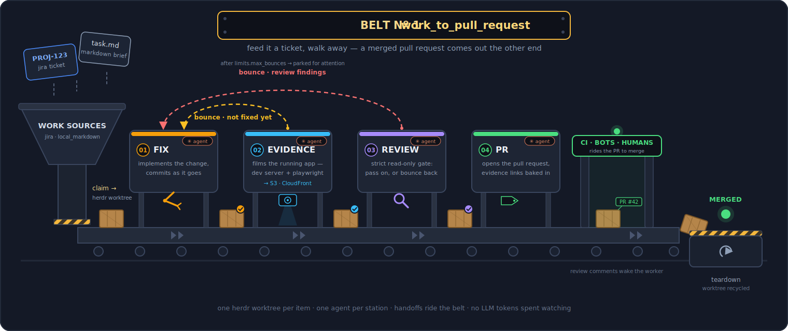
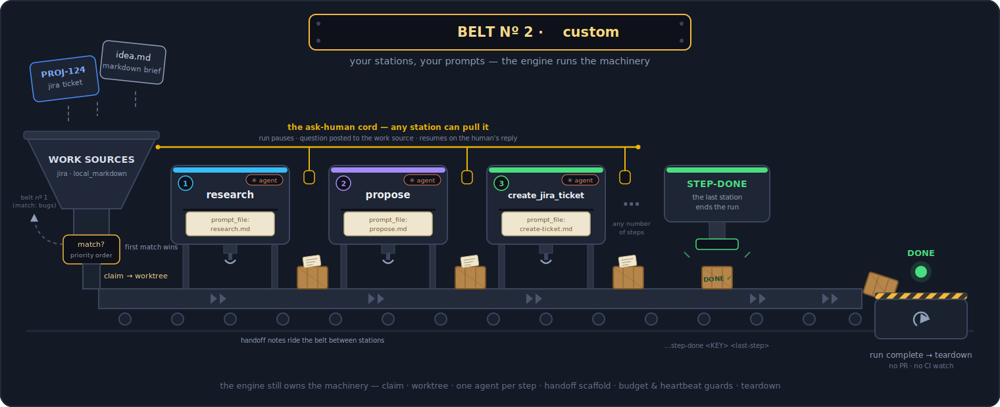

<div align="center">

# 🏭 herdr-factory

**The autonomous work → pull-request factory.**

Point it at a Jira board, a GitHub repo's issues, or a folder of task briefs. Walk away.
Merged PRs come out the other end.

[Install](#install) · [Quick start](#quick-start) ·
[Markdown briefs](#markdown-briefs--work-without-a-ticket) ·
[GitHub issues](#github-issues--label-an-issue-get-a-pr) · [The belts](#the-belts) ·
[Highlights](#highlights) · [Reference](#reference)

</div>



herdr-factory is an autonomous, worktree based, coding-agent factory built on top of [herdr](https://herdr.dev) that fits the workflow your team already has:

- **Plugs into your existing development process.** Jira tickets or GitHub issues in, GitHub
  pull requests out — through your normal CI and code review.
- **Full agent sessions, fully visible.** Every step is a real interactive session in a herdr
  pane — not a hidden sub-agent — so you can watch the work and steer it precisely when needed.
- **Local only.** No data leaves your machine: work queue, run history, logs, and even the
  opt-in telemetry stay on it. (herdr can also host the same factory on a remote machine — same
  guarantees, different hardware.)
- **Opinionated _and_ customizable.** `work_to_pull_request` is the complete ticket → merged-PR
  pipeline; `custom` belts run whatever workflow you define.
- **Works with all your favourite agent harnesses.** Claude Code, opencode, pi, codex, … — if it
  runs in a terminal pane, the factory can drive it.

## Install

One command, macOS or Linux:

```sh
curl -fsSL https://raw.githubusercontent.com/razajamil/herdr-factory/main/install.sh | sh
```

The installer is self-contained and idempotent: it ships everything the factory
itself needs (including its own Node runtime) and keeps it up to date.

**You provide the tools the factory drives** — the same ones you'd use by hand:

| Tool                         | Used for                                                                                         |
| ---------------------------- | ------------------------------------------------------------------------------------------------ |
| [`herdr`](https://herdr.dev) | worktrees, workspaces, panes, and agent lifecycle — the factory floor                            |
| your agent's CLI             | the workers — `claude`, `opencode`, `pi`, `codex`, … (factory-spawned panes default to `claude`) |
| `gh` (authenticated)         | PR discovery, CI/review polling                                                                  |
| `git`                        | branch cleanup, heartbeats                                                                       |

Run `herdr-factory doctor` (or `doctor --deep`) any time — it checks everything above, plus the
supervisor, server, database, and each repo's config, sources, and evidence bucket.

<details>
<summary>Private repo / custom clone URL / uninstall</summary>

```sh
# clone over a read-only deploy key (writes the key + ssh config for you)
curl -fsSL <url>/install.sh | HERDR_DEPLOY_KEY=~/.ssh/factory_deploy HERDR_SSH_HOST=github.com sh

# override the clone source or branch
curl -fsSL <url>/install.sh | HERDR_REPO_URL=git@github.com:you/herdr-factory.git sh

# uninstall (keeps your config + state; prints how to remove those too)
curl -fsSL <url>/install.sh | sh -s -- --uninstall
```

</details>

## Quick start

The factory ships with a full TUI for configuration and monitoring — run `herdr-factory` with no
arguments to open it (live dashboard · config editor · doctor). Everything below can be done from
there; the steps show the underlying files.

### 1. Add your Jira credentials

Per-repo, in `~/.config/herdr-factory/repos/my-app/env` (`chmod 600`) — the folder name is what
you'll pass to `--repo`:

```sh
JIRA_EMAIL=you@org.com
JIRA_API_TOKEN=...          # id.atlassian.com → Security → API tokens
```

(Jira is the walkthrough; a [GitHub Issues source](#github-issues--label-an-issue-get-a-pr)
needs no credentials at all beyond your already-authenticated `gh` CLI — add a `GITHUB_TOKEN`
line to the same file only if you want it to use a dedicated token instead.)

### 2. Point it at a repo and a board

`~/.config/herdr-factory/repos/my-app/config.yml`:

```yaml
# yaml-language-server: $schema=../../config.schema.json
repo:
  path: ~/dev/my-app # the main checkout; worktrees fork from origin/main by default

work_sources:
  - type: jira
    jira:
      base_url: https://your-org.atlassian.net
      project: APP
      board: "42"
      # label: agent    (default) — tickets carrying this label are eligible
      # status:         (defaults) — todo: To Do · in_development: In Progress · review: In Review

belt:
  - name: tickets-to-prs
    belt_type: work_to_pull_request
    source: jira
    agents: { fix: {}, review: {}, pr: {} } # no layout yet → the factory spawns each step's pane
```

Everything else — branch naming, budgets, concurrency — has sensible defaults. The first line is a
modeline: your editor's YAML language server validates the file against the factory's own schema
as you type. (`examples/example-repo/` has a fully annotated config, and running plain
`herdr-factory` opens a TUI with a built-in config editor.)

### 3. Feed it a ticket

Label a ticket `agent`, move it to **To Do**, and walk away. The factory claims it (→ _In
Progress_), spins up a herdr worktree, and runs it through the belt: **fix** implements and
commits, **review** gates with fresh eyes (bouncing it back to fix with findings if it isn't
right), **pr** pushes, opens the PR (→ _In Review_), and drives CI green — then the factory
watches the PR until it merges and recycles the worktree. The ticket's description, comments, and
image/video attachments are all handed to the agent as its spec.

### 4. Watch it work

```sh
herdr-factory                        # the TUI: live dashboard · config editor · doctor
herdr-factory --repo my-app status   # what's in flight, at a glance
herdr-factory --repo my-app logs     # tail the dispatcher log
```

## Markdown briefs — work without a ticket

A `local_markdown` source turns any folder of `*.md` files into a work queue: each file (or
subdirectory of files, for multi-file briefs with assets) is one work item, keyed by its name.
Drop a brief in and the factory picks it up on the next tick; the folder itself is never
modified. Two recipes — both can live in the same `config.yml`, alongside the Jira belt:

**An idea inbox that files the Jira tickets for you.** A `custom` belt researches each idea
inside a worktree and creates the tickets — which your `tickets-to-prs` belt then claims and
ships. The factory generates its own work:

```yaml
work_sources:
  - type: local_markdown
    name: ideas
    local_markdown:
      folder: ~/factory/ideas

belt:
  - name: ideas-to-tickets
    belt_type: custom
    source: ideas
    workspace_name: "research/{{work_id}}-{{work_slug}}"
    steps:
      - {
          name: research,
          prompt_file: prompts/research.md,
          prompt_file_source: config,
        }
      - {
          name: propose,
          prompt_file: prompts/propose.md,
          prompt_file_source: config,
        }
      - {
          name: create_jira_ticket,
          prompt_file: prompts/create-ticket.md,
          prompt_file_source: config,
        }
```

The step prompts are yours, in `repos/my-app/prompts/`
(`examples/example-repo/prompts/work_generation/` has working ones); the run ends when the last
step signals done — no PR, no CI watch. `echo "Explore dark mode" > ~/factory/ideas/dark-mode.md`
comes back as a researched proposal, filed as tickets on your board.

**A spike lane — brief in, PR out, no ticket ceremony.** The same `work_to_pull_request` belt,
fed from a folder:

```yaml
work_sources:
  - type: local_markdown
    name: spikes
    local_markdown:
      folder: ~/factory/spikes

belt:
  - name: spikes-to-prs
    belt_type: work_to_pull_request
    source: spikes
    workspace_name: "spike/{{work_id}}-{{work_slug}}"
    agents: { fix: {}, review: {}, pr: {} }
```

```sh
echo "Try virtualizing the results table — does it fix the scroll jank?" > ~/factory/spikes/virtual-table.md
```

The full fix → review → pr pipeline runs on the brief and hands you a reviewed PR.

## GitHub issues — label an issue, get a PR

A `github_issues` source turns a repo's own issue tracker into the work queue — no Jira, no
extra credentials (it uses your authenticated `gh` CLI's token unless you set `GITHUB_TOKEN`):

```yaml
work_sources:
  - type: github_issues
    github_issues: {} # polls the PR repo's open issues labelled `herdr`; all fields optional

belt:
  - name: issues-to-prs
    belt_type: work_to_pull_request
    source: github_issues
    agents: { fix: {}, review: {}, pr: {} }
```

Label an issue `herdr` (the `trigger_label`) and the factory claims it — swapping the label for
`herdr:in-development` and **consuming the trigger**, so re-adding `herdr` later is how you retry
a run. The agents get the issue body, the whole comment thread, and any embedded
images/screen-recordings as the spec; the PR carries a `Fixes #n` line so the merge auto-closes
the issue (the factory closes it as completed anyway, as a backstop). A failed run leaves the
issue open, labelled `herdr:aborted`, for retriage; questions and attention notes arrive as
issue comments — reply in a new comment and the run resumes.

## The belts

A **belt** pairs a work source with an ordered pipeline of agent steps. Two belt types ship today.

### `work_to_pull_request` — feed it a ticket, get a merged PR

Pictured at the top. The engine owns the stations _and_ ships their prompts:

- **fix** — implements the change and commits as it goes (a commit-HEAD heartbeat catches stalls).
- **evidence** _(opt-in)_ — derives a test plan from the work item's acceptance criteria, then films
  the running app to prove each one. It follows the repo's own skills/runbooks for the dev-server
  workflow **and** the login/test account so it exercises the flow as the right persona, drives
  `playwright-cli` for before/after screenshots and video, publishes the captures to S3/CloudFront,
  and records a per-criterion verdict table (with the public URLs) in its handoff. If the evidence
  doesn't prove a criterion it **bounces the run back to fix** with findings. A flaky app that keeps
  re-capturing past `max_capture_attempts` parks for attention — but only as a backstop against a
  stuck agent: if the evidence step then genuinely finishes and signals `step-done`, the run un-parks
  and advances (evidence is non-gating — the cap never vetoes completed evidence). This station runs only when
  your herdr layout provides its pane (`tab` + `pane` in config) — without one the belt is simply
  fix → review → pr.
- **review** — a strict read-only gate with fresh eyes: it never edits or commits, it either
  passes the work forward or **bounces back to fix**. Keeping all rework in fix is deliberate.
- **pr** — pushes the branch, opens the PR with the evidence URLs embedded, and drives the
  automated round (CI green, bot comments addressed).

The run then enters the **reviewing watch**: one batched GitHub GraphQL query per tick covers
every watched PR, and whenever the review signature changes — new unresolved threads, newly
failing checks — a resolver agent is woken in the worktree to address them. Merge → teardown
(worktree removed, branch deleted; re-claiming the same ticket later gets a fresh branch and a
fresh PR). Closed without merge, or `watch_hours` (default 7) exceeded → parked for
[attention](#highlights).

Bounces are per-target-step counted; past `max_bounces` (default 6, per-belt override, `0`
disables bouncing) the run parks for attention instead of oscillating. Each station's engine
prompt can be augmented with your own `prompt_file` — see [Prompts](#prompts).

### `custom` — your stations, your prompts



Your own ordered `steps[]`, fully agent-driven — e.g. `research → propose → create_jira_ticket`.
Each step's `prompt_file` **is** the whole step body; the engine adds only a handover scaffold
(where you are in the belt, the prior step's handoff, how to signal done or ask a human). The run
ends when the **last** step signals `step-done` — no PR machinery, no CI watch. Per step you can
set `budget_seconds` and a `heartbeat` (both off/default-safe), and the same worktree, handoff,
and ask-human machinery applies.

### Multiple belts

A repo runs **as many belts as you like, all ticking in parallel** — several belts on the same
source, belts across different sources, `work_to_pull_request` and `custom` types side by side. A
belt can even **generate work for another belt**: below, a `custom` belt turns a folder of Markdown
ideas into Jira tickets, and the `work_to_pull_request` belt beside it claims and ships them — while
a third `custom` belt runs experiments from its own Markdown folder, entirely independently.

![Top-down view of three conveyor belts running in parallel on one factory floor. On the left, a custom belt reads Markdown ideas and runs research → propose → file_ticket to generate Jira tickets; those tickets loop across to the middle belt — a work_to_pull_request belt on the Jira source running fix → review → pr to a merged pull request. On the right, a separate custom belt reads a Markdown experiments folder and runs its own steps. A labelled arrow shows the ticket-generator belt feeding work into the Jira belt.](docs/images/multiple-belts.svg)

When more than one belt draws from the **same** source, claim order decides who gets each item:
belts are walked in `priority` order (lower first) and the first belt whose `match` predicate
accepts an item claims it — **first match wins**, and a belt with no `match` accepts everything from
its source. `match` is a `.ts` file in the repo's config folder whose default export is
`(ctx) => boolean` (sync or async), with `ctx = { item, source: { name, type } }` — the item
carries `labels` uniformly plus source-native routing metadata (Jira's status + raw fields, a
GitHub issue's number/author/body, a markdown brief's front-matter). Route bugs to one belt and
stories to another, programmatically.

## Highlights

- **Zero tokens on the factory floor.** Polling Jira or GitHub, claiming, watching PRs, liveness
  checks, retries — all deterministic code (native `fetch`, `gh`, `herdr`). Agents run only inside
  the steps, and the PR resolver wakes only when the review state actually changes.
- **The ask-human cord.** A blocked or unsure agent runs `ask-human`: the factory posts the
  question through the work source (a Jira or GitHub issue comment, or an inbox file for
  markdown sources), parks
  the run as `waiting_for_human` — **freeing its concurrency slot** — polls for the reply with
  backoff, then writes the answer into the worktree and resumes the same step automatically.
- **Bounce-back rework.** Evidence and review send flawed work _backward_ with written findings
  instead of patching around it; the fix agent re-runs against the feedback file. The
  `max_bounces` backstop keeps a disagreement loop from running forever.
- **Attention is a workflow, not a dead end.** When something needs a person — budget exceeded,
  stalled commits, a closed PR, a pane that never appeared — the run parks: desktop notification,
  the pane relabelled `⚠ ATTENTION`, the reason (with a ready-made resume command) posted to the
  work source, and an hourly re-notify so it can't go stale silently. `resume <KEY>` puts it right
  back where it was, with fresh clocks. Parked runs keep their worktree but hold no claim slot.
- **Crash-safe by construction.** All state is on-disk SQLite and the reconciler is idempotent —
  a tick can be killed anywhere and the next one converges. The server is a coordinator, not a
  source of truth: every command falls back to running in-process when it's down, so a worker's
  `step-done` lands even mid-restart. Workers live in herdr and survive factory restarts. Source
  status write-backs are persisted intents, retried until the source confirms.
- **Built to scale.** Active runs reconcile in parallel under per-run locks; Jira and GitHub
  traffic flows through token buckets (GitHub's is a process-wide budget) with
  `Retry-After`-honoring retries; all watched PRs share one batched
  GraphQL query per tick; claim admission smooths big-backlog cold starts; every subprocess and
  HTTP call is hard-timeout-bounded, with a wedged-tick watchdog behind it all.
- **Self-driving operations.** One resident server ticks every repo; a stateless scheduled
  supervisor restarts it if it's down, wedged, or outdated; auto-update ships new code (and new
  Node runtimes) within ~a minute of a push, draining gracefully before restart.
- **A control room.** Running `herdr-factory` with no arguments opens a full-screen TUI —
  live dashboard, a schema-validated config editor, and doctor. The server also exposes a local
  HTTP API (`127.0.0.1:8765`) with an OpenAPI spec at `/doc` and Swagger UI at `/ui`.
- **Observable.** Set `HERDR_FACTORY_TELEMETRY=1` for OpenTelemetry traces and metrics; a local
  Grafana stack ships via `docker-compose.telemetry.yml` (see [`docs/TELEMETRY.md`](docs/TELEMETRY.md)).

---

# Reference

Deep engine internals (reconciler phases, locking, the outbox, rate limits, invariants) live in
[`docs/ARCHITECTURE.md`](docs/ARCHITECTURE.md).

## How it works

```
launchd / systemd timer ─every 60s─> herdr-factory ensure-up    (stateless one-shot supervisor)
                                          │ auto-update, then (re)start if down / wedged / outdated
                                          ▼
            herdr-factory serve    (one resident process: ticks every repo + HTTP API on 127.0.0.1:8765)
            │ Phase 0: flush pending source status write-backs (the outbox)
            │ Phase A: advance every active run one idempotent step (parallel, per-run locks)
            │ Phase B: claim eligible work — belts in priority order, first match wins, up to the cap
            ▼
todo ─claim─> worktree ─> step₁ → … → stepₙ ─┬─ work_to_pull_request: → reviewing ─merged─> teardown
              one agent per step;             │    (batched PR watch; resolver woken on new comments/CI)
              handoff notes in between        ├─ ask-human → waiting_for_human → same step resumes
                                              └─ custom: last step-done ─────────────────> teardown
```

Ticks are the level-triggered backbone (external polling, watchdogs, self-healing); a worker's
`step-done`/`bounce`/`ask-human` is an edge-triggered nudge that reconciles that run immediately
instead of waiting for the next tick.

## Configuration

Everything repo-specific lives in `~/.config/herdr-factory/repos/<name>/`:

- `config.yml` — the file described below (`<name>` is what you pass to `--repo`).
- `env` — per-source credentials, `chmod 600`: `JIRA_EMAIL` + `JIRA_API_TOKEN` for a `jira`
  source; `GITHUB_TOKEN` for `github_issues` (optional — without it the factory uses your
  `gh` CLI's token); `local_markdown` needs none. Strictly per-repo; there
  is no global secrets file.
- `guidelines-prompt.md` _(optional)_ — appended to every step prompt of every belt.
- Any `match` predicates and `config`-sourced prompt files referenced by `config.yml`.

The server discovers every folder under `repos/` that contains a `config.yml`; onboarding a repo
is pure data (`herdr-factory reload` picks it up without a restart).

### `repo`

- `path` — the **main** checkout (not a linked worktree; validated at load). `~`/`$HOME` expand.
- `base_ref` — what worktrees fork from (default `origin/main`).
- `github` — `owner/name` (default: derived from the origin remote).

### `limits` (all optional)

| Key                          | Default | Meaning                                                         |
| ---------------------------- | ------- | --------------------------------------------------------------- |
| `max_active`                 | 3       | cap on concurrently **working** runs; parked runs hold no slot  |
| `watch_hours`                | 7       | how long the PR watch rides before parking for attention        |
| `attention_renotify_seconds` | 3600    | re-notify cadence for parked runs                               |
| `develop_budget_seconds`     | 5400    | fix-step budget                                                 |
| `evidence_budget_seconds`    | 2400    | evidence-step budget                                            |
| `review_budget_seconds`      | 1800    | review-step budget                                              |
| `pr_budget_seconds`          | 3600    | pr-step budget                                                  |
| `step_budget_seconds`        | 3600    | default budget for a custom step                                |
| `stall_seconds`              | 2700    | no new commits for this long → attention (heartbeat steps only) |
| `max_bounces`                | 6       | bounces to any one step before attention; `0` disables bouncing |
| `max_capture_attempts`       | 5       | evidence capture attempts per pass before attention (flaky-capture cap) |
| `tick_interval_seconds`      | 60      | reconcile cadence per repo                                      |
| `reconcile_concurrency`      | 8       | active runs reconciled in parallel per tick                     |
| `max_claims_per_tick`        | 10      | new-claim admission per tick (cold-start smoothing)             |
| `layout_wait_seconds`        | 600     | how long to wait for a configured pane before attention         |

### `work_sources` (≥ 1)

Each entry: a `type`, an optional `name` (default = the type; must be unique per repo — belts
reference it), and a type block:

- **`jira`** — `base_url`, `project`, `board`, `label` (default `agent`), and a `status` map:
  `todo` (default `To Do`), `in_development` (default `In Progress`), `review` (default
  `In Review`). The status of record lives in Jira; the factory deliberately never writes a
  terminal status (merged/closed is owned by Jira's GitHub integration). Ticket description,
  comments, and image/video attachments are materialized into the worktree for the agents.
- **`local_markdown`** — `folder`: a directory where each top-level `*.md` file _or_ top-level
  subdirectory containing at least one top-level `*.md` is one work item (key = filename stem /
  dir name; names starting `__` are skipped as still-being-drafted). Title/type come from YAML
  front-matter, else the first H1, else the filename. Lifecycle is tracked in the factory's own
  DB — **the folder is never modified**. A file materializes as `task.md`; a directory is copied
  whole as `task/`, so multi-file briefs (spec + assets) work.
- **`github_issues`** — polls a repo's open issues carrying `trigger_label` (default `herdr`),
  oldest first; the status of record stays on GitHub, projected as labels. Fields (all optional):
  `repo` (`owner/name`; default = the repo PRs are opened against), `trigger_label`,
  `state_labels` (`in_development`/`in_review`/`aborted`, defaults `herdr:in-development` /
  `herdr:in-review` / `herdr:aborted`; created on demand), `close_on`
  (`merged`/`done`/`aborted`, defaults `true`/`true`/`false`), `type_labels` (issue label →
  work type; GitHub's native issue type wins when present) + `default_type` (default `Feature`),
  `max_pages` (pages of 100 per poll, default 1). Lifecycle: claiming swaps in the
  in-development label and **consumes the trigger label** — re-adding it is the retry; success
  strips the state labels and closes the issue as completed (a backstop over the PR's `Fixes #n`
  auto-close — it never reopens); an aborted run leaves the issue **open** with the aborted
  label unless `close_on.aborted` (then closed as not-planned). The issue body, all human
  comments, and embedded images/videos are materialized for the agents; ask-human questions are
  posted as issue comments (reply in a **new** comment).

  ```yaml
  work_sources:
    - type: github_issues
      github_issues:
        repo: my-org/my-app # optional — defaults to the PR repo
        trigger_label: herdr
  ```

### `belt` (≥ 1)

Common fields: `name` (unique), `belt_type`, `source` (a `work_sources` name), `priority`
(default 100, lower = matched first), optional `match` (see [Multiple belts](#multiple-belts)),
optional `max_bounces` override, and optional `workspace_name` — the branch/worktree name
template, default `{{semantic_work_prefix}}/{{work_id}}-{{work_full_slug}}`. It must contain
`{{work_id}}`; other vars: `{{work_slug}}` (≤20), `{{work_full_slug}}` (≤50), `{{work_type}}`,
`{{semantic_work_prefix}}` (fix/chore/feature). A short unique suffix is always appended, so
re-claiming a previously-merged item gets a fresh branch and PR.

**`belt_type: work_to_pull_request`** — an `agents` block with one entry per station:

```yaml
agents:
  fix:
    {
      tab: fix,
      pane: agent,
      prompt_file: .herdr/fix-notes.md,
      prompt_file_source: repo,
    }
  evidence: { tab: evidence, pane: agent } # evidence runs ONLY when given a tab+pane
  review: { tab: review, pane: agent }
  pr: {} # no tab/pane → the factory spawns this pane itself
```

`fix`/`review`/`pr` are required (an empty `{}` is fine); `evidence` is **opt-in** — it verifies
fix's work through an agent your layout provides, so without a `tab`+`pane` the station is skipped
and the belt is fix → review → pr. Each agent's optional `prompt_file` (+ required
`prompt_file_source`) _augments_ the engine's built-in prompt for that station.

**`belt_type: custom`** — an ordered `steps` list:

```yaml
steps:
  - {
      name: research,
      prompt_file: prompts/research.md,
      prompt_file_source: config,
    }
  - {
      name: propose,
      prompt_file: prompts/propose.md,
      prompt_file_source: config,
      budget_seconds: 1800,
    }
```

Each step: `name` (lowercase slug), **required** `prompt_file` + `prompt_file_source` (the whole
step body), optional `tab`/`pane`, `budget_seconds` (default `limits.step_budget_seconds`), and
`heartbeat` (commit-stall detection, default off). Custom steps don't declare evidence or bounce
targets (yet).

### `evidence` (optional, repo-wide)

Where the evidence station publishes captures — omit the block and it still captures, assesses,
and can bounce; it just publishes nothing:

```yaml
evidence:
  bucket: my-evidence-bucket
  region: us-east-1
  cloudfront_domain: d123abc.cloudfront.net # bare host or URL; used to build the public links
  key_prefix: my-app # optional
  profile: my-aws-profile # optional named profile
  github_username: raza # optional; default = `gh` login at upload time
```

Non-secret pointers only: AWS credentials come from the ambient credential chain (`AWS_*` env,
SSO, `~/.aws`, or the named `profile`) — never stored in config or handed to an agent. Objects
land under `herdr-factory/<github_username>/<key_prefix>/<key>/<run>-<timestamp>/`.
`doctor --deep` verifies the setup with a real S3 write probe.

### Layout panes

Any step (w2pr agent or custom step) may name a `tab` + `pane` (both or neither):

- **With them**, the dispatcher waits for _your_ layout to bring that pane up with an idle agent,
  then sends the step's prompt there. It never spawns its own pane for that step — so your
  auto-provisioned setup (dev servers, agents, editors) can settle first. It's agent-agnostic:
  the pane can run Claude Code, opencode, pi, codex — anything that reports idle. If the pane
  isn't up within `limits.layout_wait_seconds`, the run parks for attention.
- **Without them**, the factory spawns a dedicated agent pane for the step (`claude` today) —
  zero layout setup required.

The [workspace-manager herdr plugin](https://github.com/razajamil/herdr-plugin-workspace-manager)
makes per-repo layouts reusable — and since each belt names its worktrees distinctively
(`workspace_name`), a layout can key off the worktree name to provision the right panes.

### Prompts

A step's body is the engine's built-in prompt (w2pr, per source type under `src/prompts/`),
optionally augmented by your `prompt_file` — or your `prompt_file` alone (custom).
`prompt_file_source` says where it's read from: `config` = the repo's config folder (checked at
load); `repo` = the target repo's checkout, read from the run's **worktree at render time**, so
prompts can live version-controlled next to the code.

Around the body the engine always adds: a handover scaffold (which belt and step this is, the
full step sequence, the prior step's handoff note and pane/session pointer for on-demand
questions, the ask-human protocol, the bounce protocol where applicable, and the finish protocol —
write your handoff, then run step-done), your repo's `guidelines-prompt.md`, and token
substitution. Available tokens:

`@@KEY@@ @@REPO@@ @@BELT@@ @@STEPS@@ @@STEP@@ @@TYPE@@ @@SUMMARY@@ @@BRANCH@@ @@WORKTREE@@
@@MEMORY_DIR@@ @@WORK_DOC@@ @@WORK_DOC_KIND@@ @@HANDOFF_IN@@ @@HANDOFF_OUT@@ @@PRIOR_PANE@@
@@PRIOR_SESSION@@ @@STEP_DONE_CMD@@ @@BOUNCE_CMD@@ @@BOUNCE_TARGET@@ @@EVIDENCE_DIR@@
@@EVIDENCE_UPLOAD_CMD@@ @@CLI@@`

Everything a run reads and writes lives in `.memory/herdr-factory/` inside its worktree: the
rendered prompts, handoff notes, the work doc (`ticket.json`, or `task.md`/`task/`), attachments,
bounce feedback, human questions and replies, and captured evidence.

### Editor schema

`config.yml`'s first line — `# yaml-language-server: $schema=../../config.schema.json` — points
the YAML language server at a JSON Schema generated from the engine's own zod schema (so it can't
drift): autocomplete, required fields, enums, and unknown-key errors (catching the classic
`agents`-on-a-`custom`-belt mixup). `herdr-factory install` writes it to
`~/.config/herdr-factory/config.schema.json`; regenerate after an upgrade with
`herdr-factory schema`. A committed copy at the repo root serves the in-repo example (`npm run
schema`; a test guards it against drift). Cross-field rules — belt `source` refs, unique names,
tab/pane both-or-neither, `{{work_id}}` presence, file existence — are validated at load with
readable errors.

## Commands

```
# inspect & operate a repo
herdr-factory --repo <name> status | eligible | runs [--all] | timeline <KEY> | logs [n] | tick
herdr-factory --repo <name> claim <KEY> [--belt <name>]
herdr-factory --repo <name> teardown <KEY> [--source <name>]
herdr-factory --repo <name> resume <KEY> [--source <name>]          # un-park an `attention` run

# agent → dispatcher signals (rendered into every step prompt; you rarely type these)
herdr-factory --repo <name> step-done <KEY> <step> [--source <name>]
herdr-factory --repo <name> bounce <KEY> <toStep> --reason|--reason-file … [--source <name>]
herdr-factory --repo <name> ask-human <KEY> <step> --question|--question-file … [--source <name>]
herdr-factory --repo <name> evidence-upload <KEY> [--source <name>]
herdr-factory capture-lock acquire|release [owner]                  # machine-global capture mutex

# the machine-wide server + supervisor (no --repo)
herdr-factory serve | ensure-up [--restart] | restart | reload | update | provision-node
herdr-factory install | uninstall | start | stop
herdr-factory schema [--stdout]
herdr-factory doctor [--deep] [--repo <name>]
```

The mutating/nudge commands (`tick`, `claim`, `teardown`, `resume`, `step-done`, `ask-human`,
`bounce`) route through the running server when it's up — a warm, in-process reconcile — and fall
back to executing directly against the DB when it isn't; reads (`status`, `eligible`, `runs`,
`timeline`, `logs`) always go straight to the DB. `--source` disambiguates a key active in more
than one source; `claim --belt` is required only when the repo has more than one belt.

`serve` binds `127.0.0.1:8765` (override with `HERDR_FACTORY_PORT`) with the OpenAPI spec at
`/doc` and Swagger UI at `/ui`. `update` pulls the latest code (hard reset to the branch's
upstream) and restarts onto it — the supervisor does the same automatically every ~60s.

## The TUI

Plain `herdr-factory` (no arguments) opens a full-screen terminal UI built on
[opentui](https://github.com/anomalyco/opentui). `Tab`/`Shift+Tab` switch the three tabs, number
keys jump to a numbered section, arrows move within it, `Esc` pops back out, `q` quits.

- **Dashboard** — live runs from the server's API: `↑↓` navigate, `↵` opens a run's event
  timeline, `t` tick, `c` claim an eligible item, `x` teardown, `r` refresh (each action behind a
  confirmation).
- **Config** — a repo list and a full `config.yml` editor: edits the YAML surgically (comments
  and the schema modeline preserved), validates against the engine schema, `^S` saves, `[`/`]`
  reorder list entries. Credentials appear as masked, replace-only `secrets (env)` fields —
  declared per source type (`JIRA_EMAIL`/`JIRA_API_TOKEN` for jira, `GITHUB_TOKEN` for
  github_issues) — written separately to the `env` file (`chmod 600`).
- **Doctor** — the same checks as the CLI: `r` re-runs, `d` toggles deep mode (live herdr/gh/S3
  probes).

The TUI renders through opentui's native core, which needs FFI — the launcher adds the flags and
resolves the same vendored Node the engine uses, so there's nothing to set up.

## Files on disk

```
~/.local/share/herdr-factory/    the code checkout (managed by install.sh + auto-update)
~/.config/herdr-factory/         config.schema.json · repos/<name>/{config.yml, env, guidelines-prompt.md, …}
~/.local/state/herdr-factory/    herdr-factory.db · runtime/<node>/ · node-path · server.json
                                 logs/ (supervisor + server) · <repo>/logs/<date>.log (per-repo)
<worktree>/.memory/herdr-factory/   per-run working memory: prompts · handoffs · work doc · evidence
```

## Environment variables

| Variable                    | Effect                                                      |
| --------------------------- | ----------------------------------------------------------- |
| `HERDR_FACTORY_PORT`        | server port (default 8765)                                  |
| `HERDR_FACTORY_CONFIG_DIR`  | config root (default `~/.config/herdr-factory`)             |
| `HERDR_FACTORY_STATE_ROOT`  | state root (default `~/.local/state/herdr-factory`)         |
| `HERDR_FACTORY_AUTO_UPDATE` | `0` disables the supervised auto-update                     |
| `HERDR_FACTORY_TELEMETRY`   | `1` enables OpenTelemetry (plus the standard `OTEL_*` vars) |
| `HERDR_BIN_PATH`            | path to the `herdr` binary (default: `herdr` on PATH)       |

## Security note

Factory-spawned workers launch with `--dangerously-skip-permissions` (hardcoded as `CLAUDE_FLAGS`
in `src/core/step.ts`) so the loop runs unattended. Each worker is confined to its own throwaway
worktree, but can run commands, push branches, and open PRs without prompting. Agents in
_your_-layout panes are whatever you launched them as. To tighten, change `CLAUDE_FLAGS`.

## Platform

- **macOS** — supervisor via a `launchd` LaunchAgent (`com.herdr-factory.server`).
- **Linux** — supervisor via a systemd `--user` timer (`herdr-factory.timer`; the installer
  enables lingering so it runs headless). glibc and musl (Alpine), x64 and arm64 — the installer
  verifies the vendored Node starts and names the missing system package if not.
- **Windows** — not yet; the service seam is one scheduled `ensure-up` command.

## Development

```sh
git clone git@github.com:razajamil/herdr-factory.git && cd herdr-factory
pnpm install                 # Node ≥ 26 (.node-version pins 26.4.0)
npm test                     # vitest
npm run typecheck
npm run schema               # regenerate the committed config.schema.json
```

The engine is TypeScript run directly via Node's native type-stripping (no build step), state in
the built-in `node:sqlite` (no native modules). Design and invariants:
[`docs/ARCHITECTURE.md`](docs/ARCHITECTURE.md) · telemetry: [`docs/TELEMETRY.md`](docs/TELEMETRY.md).
