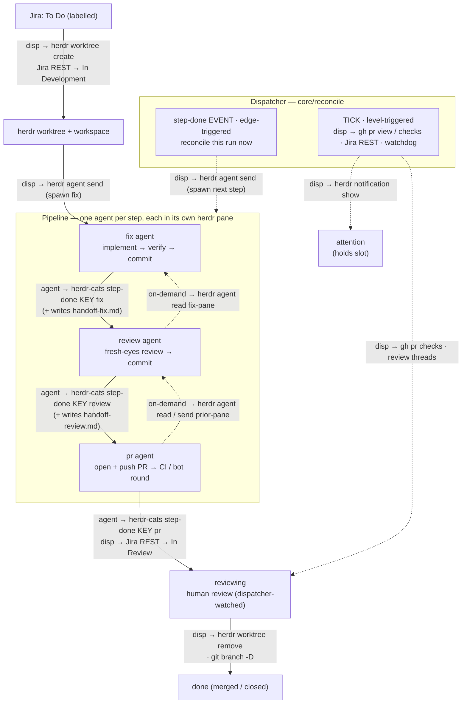

# herdr-cats — Architecture

Autonomous Jira → PR loop that herds Claude worker agents ("cats") across one or
more repos, on top of [herdr](https://herdr.dev) worktrees. A single idempotent
reconciler (`tick`), driven by `launchd`, finds eligible Jira tickets, spins up
one herdr worktree + Claude worker per ticket, watches the PR, and tears the
worktree down on merge/close.

This document is the canonical design of the TypeScript implementation
(run via `tsx`, no build step) backed by SQLite.

---

## 1. Principles

1. **herdr owns the terminal world; herdr-cats orchestrates it.** All
   workspace / worktree / tab / pane / layout / agent lifecycle is performed by
   the `herdr` CLI. herdr-cats never reimplements pane splitting, layout
   application, terminal multiplexing, raw `git worktree add`, or spawning
   `claude` as a bare child process. See [§4](#4-herdr-ownership-boundary).
2. **SQLite is the single source of truth for runtime state**, designed as the
   data contract for a future web UI — including a rich **event timeline**, not
   just current state. Config is never in SQLite.
3. **The reconciler is pure and testable.** It depends on injected interfaces
   (`Store`, `HerdrClient`, `JiraClient`, …, `now()`), so it runs against fakes
   and an in-memory DB in tests.
4. **Repo-specifics are decoupled into per-repo config**, not code. The engine
   is generic; onboarding a repo is pure data.
5. **Stop/restart safe.** State is on disk (SQLite); every action is idempotent;
   `launchctl bootout` never kills in-flight workers (they live in herdr).

---

## 2. Stack

| Concern | Choice |
|---|---|
| Language / runtime | TypeScript on Node 22, run via **`tsx`** (no build step) |
| CLI | **commander** |
| State store | **better-sqlite3** (synchronous — ideal for a short-lived tick) |
| Config | **`yaml`** + **`zod`** (parse + validate → types) |
| Subprocess (herdr/gh/git) | **`node:child_process`** `execFile` (arg arrays, no shell) |
| HTTP (Jira REST) | native **`fetch`** |
| Tests | **vitest** (dev-only) |
| External CLIs | **herdr**, **gh**, **git** |

Runtime dep footprint: `commander`, `better-sqlite3`, `yaml`, `zod` (+ `tsx` to
run). Everything else is Node built-ins or the external CLIs.

---

## 3. Layered architecture

```
                 ┌───────────────────────── cli.ts (commander) ──────────────┐
                 │  --repo selector · command dispatch · --json output         │
                 └───────────────┬───────────────────────────┬───────────────┘
                                 ▼                           ▼
        ┌──────────────── core/ (PURE, testable) ────────────────┐     launchd.ts
        │  reconcile · watch · worker(brief) · branch · phases     │  (plist + ctl)
        │  depends only on interfaces ↓↓↓                          │
        └───────┬───────────────────────────────┬─────────────────┘
                ▼                                 ▼
      ┌──── db/ store (SQLite) ─┐       ┌──── clients/ (thin glue) ───────┐
      │ runs · events · locks  │       │ HerdrClient  JiraClient          │
      │ repos · migrations     │       │ GitHubClient GitClient  exec()   │
      └────────────────────────┘       └───────────┬──────────────────────┘
                                                    ▼
                                       herdr · gh · git · fetch(Jira REST)
```

**Dependency rule:** `core` imports *interfaces*; `cli` constructs the concrete
implementations and injects them. Tests substitute fakes + `:memory:` SQLite.

### Repo layout

```
herdr-cats/
  package.json  tsconfig.json  README.md  docs/ARCHITECTURE.md
  bin/herdr-cats          cwd-robust shell launcher → `node --import tsx src/cli.ts`
                          (resolves its own dir through symlinks; symlinked into ~/.local/bin)
  src/
    cli.ts                commander program; builds deps, dispatches, structured log
    config.ts             env + repos/<name>/config.yml → zod → typed Config
    types.ts              shared domain types
    db/{index,migrate,store}.ts
    clients/{exec,herdr,jira,github,git}.ts
    core/{deps,branch,step,watch,reconcile}.ts
    launchd.ts
  examples/example-repo/{config.yml, fix.md, review.md, pr.md, guidelines-prompt.md}
  test/                   vitest
```

Config/state live OUTSIDE any repo:
`~/.config/herdr-cats/{env, repos/<name>/{config.yml, guidelines-prompt.md}}` and
`~/.local/state/herdr-cats/{herdr-cats.db, <repo>/logs/}`.

---

## 4. herdr ownership boundary

This is a load-bearing principle, not an aside. herdr already implements
worktrees, workspaces, tabs, panes, layouts, and agent lifecycle — **we do not
rebuild any of it.** `HerdrClient` is a *thin typed wrapper*: every method shells
out to `herdr …` and parses its JSON; it contains zero terminal/worktree logic.

**herdr owns (via the CLI — never reimplemented):**

- worktree **create / open / remove** (incl. deleting the checkout dir + git
  worktree registration)
- workspace **close / get / list**
- tab **create / list**
- pane **split / run / send-text / send-keys / list / read**
- agent **start / list / status / send / rename / read / wait**
- desktop **notifications**

**The fix layout** (a tab/pane per pipeline agent) is applied by the external
**workspace-manager herdr plugin** on `worktree.created`. herdr-cats does **not** apply
layouts — it relies on the plugin and simply *targets* the resulting panes: one per
agent, from `agents.{fix,review,pr}.tab` / `.pane` in config. If a targeted pane is
absent it degrades gracefully (see [§8](#8-step-agent-model)).

**herdr-cats performs git/filesystem ops ONLY for things outside herdr's model:**

- `git branch -D <branch>` on teardown — the one remnant herdr leaves (herdr
  models worktrees, not branches)
- read/maintenance git: `show-ref`, `remote get-url`, `rev-parse HEAD` (the worker
  heartbeat), defensive `worktree prune`
- everything non-terminal: Jira REST, GitHub via `gh`, SQLite, config, the
  reconciler logic

If a future need looks like "manage a pane/tab/worktree/agent," it belongs in
`HerdrClient` as another CLI call — not as reimplemented logic.

---

## 5. Clients

Thin, typed wrappers. Types encode the real `herdr --json` shapes
reverse-engineered during the bash prototype.

- **`exec.ts`** — `run(cmd,args,{cwd,input,allowFail})`, `runJson<T>()` over
  `execFile` (promisified; arg arrays → no shell injection).
- **`herdr.ts`** —
  - `worktreeCreateOrOpen(repoCwd, branch, baseRef) → {workspaceId, worktreePath, paneId}`
    (parses `.result.workspace.workspace_id` / `.worktree.checkout_path` /
    `.result.root_pane.pane_id`; **only from the main checkout** — herdr refuses
    linked worktrees)
  - `worktreeRemove(workspaceId)` — removes workspace + dir + git registration
  - `agents() → Agent[]` (`.result.agents`; status field is `agent_status` ∈
    `idle|working|done|blocked|unknown`)
  - `agentStart({workspaceId, cwd, argv}) → paneId` where
    **`argv = ["claude", ...flags, prompt]`** (first token is the executable)
  - `paneByLabel(ws, tabLabel, paneLabel)`, `paneHasClaude(pane)`,
    `paneRun(pane, cmd)`, `agentSend(pane, text)`, `paneSendKeys(pane, "Enter")`,
    `agentRename(pane, "cat:KEY")`, `notify(title, body)`
- **`jira.ts`** (fetch + basic auth) — `listEligible()` via the Agile board
  endpoint `/rest/agile/1.0/board/<id>/issue?jql=…` (keeps board scoping);
  `getIssue`, `currentStatus`, `transition(key, target)` (case-insensitive
  `.to.name` match, no-op if already there), `downloadImages(key, dir)` (image/*
  only, capped; site-host `content` URL + basic auth).
- **`github.ts`** (`gh` via execFile) — `prForBranch(repo, branch)`,
  `reviewSignature(repo, n) → {unresolved, failing, sig}` (graphql review threads
  + `statusCheckRollup`).
- **`git.ts`** — `branchExists`, `branchDelete`, `originUrl`, `worktreePrune`,
  `headSha` (the worker progress heartbeat).

---

## 6. State — SQLite (better-sqlite3)

One global DB `~/.local/state/herdr-cats/herdr-cats.db`. `db/index.ts` sets
`PRAGMA journal_mode=WAL; PRAGMA busy_timeout=5000;` then runs migrations
(`schema_version` + ordered SQL). Per-repo ticks write concurrently to the one
DB; WAL + busy_timeout + the per-repo single-instance lock keep that safe.

```sql
CREATE TABLE repos(name TEXT PRIMARY KEY, repo_path TEXT, base_ref TEXT, github TEXT,
  last_tick_at INTEGER, enabled INTEGER DEFAULT 1);

CREATE TABLE runs(                       -- ONE attempt at a ticket (history kept)
  id INTEGER PRIMARY KEY AUTOINCREMENT, repo TEXT NOT NULL, ticket_key TEXT NOT NULL,
  summary TEXT, issue_type TEXT, branch TEXT, phase TEXT NOT NULL,
  workspace_id TEXT, pane_id TEXT, worktree_path TEXT, pr_number INTEGER,
  watch_deadline INTEGER, last_thread_sig TEXT,
  -- worker_done/review_done/review_pane/progress_* (migrations v2-v3) are superseded
  -- by run_steps and left in place for history only.
  attention_reason TEXT, outcome TEXT,   -- merged|closed|abandoned|timeout|NULL
  created_at INTEGER, updated_at INTEGER, ended_at INTEGER);
CREATE INDEX idx_runs_active ON runs(repo) WHERE ended_at IS NULL;

CREATE TABLE run_steps(                  -- one row per pipeline agent (migration v4)
  id INTEGER PRIMARY KEY AUTOINCREMENT, run_id INTEGER NOT NULL,
  step TEXT NOT NULL,                    -- fix | review | pr
  pane_id TEXT, session_id TEXT,         -- on-demand cross-agent query handles
  progress_sig TEXT, progress_at INTEGER,   -- per-step commit heartbeat
  done INTEGER NOT NULL DEFAULT 0, started_at INTEGER, done_at INTEGER);
CREATE INDEX idx_run_steps ON run_steps(run_id, step);

CREATE TABLE events(                     -- the timeline (web-UI gold)
  id INTEGER PRIMARY KEY AUTOINCREMENT, run_id INTEGER, repo TEXT, ticket_key TEXT,
  ts INTEGER NOT NULL, type TEXT NOT NULL, detail TEXT);  -- detail = JSON
CREATE INDEX idx_events_run ON events(run_id, ts);

CREATE TABLE locks(name TEXT PRIMARY KEY, owner TEXT, acquired_at INTEGER, expires_at INTEGER);
CREATE TABLE schema_version(version INTEGER);
```

`db/store.ts` (synchronous): `countActive(repo)`, `activeRuns(repo)`,
`activeRunForTicket(repo,key)`, `createRun`, `updateRun(id,patch)`,
`endRun(id,outcome)`, `recordEvent(runId,repo,key,type,detail?)`,
`acquireLock/releaseLock(name,owner,ttl)`, `upsertRepo`, `touchTick`.

**Active = `ended_at IS NULL`** (this is what the concurrency cap counts).
`attention` keeps `ended_at` NULL so it still holds a slot until a human/teardown
resolves it. History is never deleted (we set `ended_at`), so the web UI can show
attempts, outcomes, and durations.

**event types:** `claimed · transition · worktree_created · step_spawned · step_done ·
pr_opened · resolver_woken · merged · closed · torn_down · attention · error`
(plus legacy `worker_*` / `review_*` kept for old-run history).

---

## 7. The reconciler — multi-agent pipeline

`core/reconcile.ts` → `reconcileRepo(deps)`: **Phase A** advances every active run one
idempotent step; **Phase B** claims eligible Jira tickets up to `maxActive`. Per-run
errors are caught → recorded as an `error` event → the tick continues; a per-repo
single-instance lock prevents overlapping ticks.

### The pipeline

A ticket flows through a sequence of **single-responsibility agents**, each a separate
herdr agent in its own tab/pane, dispatched and gated by the reconciler:

| Phase | Agent | Does | Hands off |
|---|---|---|---|
| `fixing` | **fix** | read ticket + images → implement → lint/type/tests → commit | `handoff-fix.md` + `step-done fix` |
| `auto_review` | **review** | fresh-eyes review of the diff → make changes → commit | `handoff-review.md` + `step-done review` |
| `pr_round` | **pr** | open + push the PR → drive the automated round (CI green + bot comments) | `step-done pr` → human review |

The agents come from the required `agents.{fix,review,pr}` config (each
`{tab, pane, prompt_file}`); `core/step.ts` holds the ordered `STEPS` descriptors that
sequence them and a generic `reconcileStep` gates each. After `pr_round`, the run enters
the `reviewing` human-review watch (unchanged: watches the PR, wakes a resolver).



Every edge is labelled with the command(s) that propagate state across it, by actor:

- **`agent →`** — run by the step agent in its pane. The single `herdr-cats step-done
  KEY <step>` call is *all* an agent issues to advance the pipeline (it also writes its
  handoff note first); the dispatcher does everything else.
- **`disp →`** — run by the dispatcher (`core/reconcile`) over the herdr socket
  (`herdr worktree …`, `herdr agent send`, `herdr notification show`), `gh`, and `git`,
  plus Jira REST for the status transitions (not a CLI).
- **`on-demand →`** — optional cross-agent context pulls a later agent may make.

Solid edges are the deterministic forward flow; dashed edges are orchestration + queries.

### Handoff between steps

A step never inherits the prior step's chat context — that would bloat tokens and,
for `review`, destroy the fresh-eyes value. Context crosses a boundary two ways:

- **Structured handoff doc (default).** The outgoing agent writes
  `.memory/herdr-cats/handoff-<step>.md`: what it did, key decisions and *why*,
  what's uncertain, what the next step should verify. Deliberately lossy — keeps the
  signal, drops the transcript noise. This is the next agent's primary input.
- **On-demand pointer to the prior session.** The dispatcher hands the next agent the
  prior step's **pane id + session id** (herdr exposes `agent_session.value` per pane via
  `agent list`; captured into `run_steps.session_id`). When the doc isn't enough, the next
  agent escalates cheapest-first — see [§8](#8-step-agent-model).

The git worktree is the shared medium: commits flow forward automatically; the
handoff doc + session pointer carry the *intent* the commits don't.

### Orchestration — hybrid tick + event

A single global poll fits a many-handoff pipeline poorly: internal handoffs need no
polling (the dispatcher has everything the instant a step signals), so folding N of
them into a 60 s tick injects N× latency for nothing. The target splits transitions
by what they actually need:

- **Tick (level-triggered) — robustness backbone.** External-state polling
  (PR / CI / Jira — no cheap event source locally), per-step watchdogs / timeouts /
  liveness, and the self-healing reconcile pass that re-derives truth and catches a
  dropped signal. *More* valuable here than before: more steps = more signals = more
  chances to miss one.
- **Event nudge (edge-triggered) — latency.** A `step-done <step>` signal triggers an
  immediate reconcile of that run, dispatching the next agent without waiting a tick.
  The tick stays the backstop if a nudge is lost.

### How it's wired

- **State (§6):** a run tracks a *sequence* of panes (earlier ones stay alive for
  querying) in `run_steps`, not a single `pane_id`. `run.pane_id` is kept pointed at the
  *latest* step's pane (the `reviewing` resolver reuses it). Teardown (herdr `worktree
  remove`) reaps all of a run's panes at once.
- **Liveness:** the commit-HEAD heartbeat applies to `fix` / `pr` (they commit) but not
  `review` (`STEPS[].heartbeat`); each step also has its own budget
  (`develop_/review_/pr_budget_seconds`).
- **Coordination:** on-demand `agent read` / `agent send` is agent-to-agent traffic
  *outside* the tick, so the dispatcher is no longer the sole coordinator and the DB
  timeline no longer captures every inter-agent interaction.

### Trade-offs (why this isn't an obvious win)

- **Lossy handoffs + feedback loops.** CI failures and review comments loop *back* to
  code-fixing, so a clean linear `fix → review → pr` relay fights the work's real,
  iterative shape; on-demand query softens the lossy part, the loops remain.
- **Cost & accountability.** ~3 panes / sessions per ticket vs. 1; no single agent
  owns the outcome end-to-end (diffusion of responsibility).
- **Why keep the dispatcher in charge anyway:** the `pr` step does *not* re-implement
  CI watching as an idle LLM — the **tick** still owns external watching
  (deterministic, cheap). Separation is reserved for steps with genuine fresh-eyes /
  specialization value (review), not "one agent per verb."

---

## 8. Step-agent model

Each step is a Claude agent (`core/step.ts`) dispatched **by the reconciler, never by
another agent**, through the shared `dispatchToLayout(tab, pane, prompt, …)` helper. Per
step (`spawnStep`):

1. **Dispatch** into the step's configured `tab`/`pane` (`agents.<step>`): wait bounded
   for that pane's idle claude → `agent send`; else `pane run "claude …"`; else
   `agent start` a dedicated pane. Rename `<step>:<KEY>`; record the pane on the
   `run_steps` row (and as `run.pane_id`, the latest active pane).
2. **Prompt** — `renderStepPrompt` substitutes tokens (`@@KEY@@`, `@@HANDOFF_IN@@`,
   `@@PRIOR_PANE@@`, `@@STEP_DONE_CMD@@`, …) into the step's `prompt_file` contents,
   appends `guidelines-prompt.md`, and appends a standard footer that points the agent at
   its inputs and tells it to write its handoff note + signal `step-done`. The rendered
   prompt is written to `.memory/herdr-cats/prompt-<step>.md`; the agent is told to read it.
3. **Handoff out** — before signalling, the agent writes
   `.memory/herdr-cats/handoff-<step>.md` (did / why / uncertain / verify-next).
4. **Signal** — `herdr-cats --repo <name> step-done <KEY> <step>` sets the step's `done`
   flag + records a `step_done` event, then **event-nudges**: it grabs the per-repo tick
   lock and reconciles the run immediately (dispatching the next agent) if no tick is
   mid-flight; otherwise the next tick advances it.

### On-demand context — the handoff+query protocol

The next agent defaults to the handoff doc and escalates only when it's insufficient,
cheapest-first, using herdr's agent-awareness:

| Need | Mechanism | Cost / caveat |
|---|---|---|
| factual detail ("what did you try for X?") | `herdr agent read <prior-pane> --source recent`, or read the session transcript by its id | cheap; works even if the prior agent has exited |
| intent ("*why* not handle Y?") | `agent send <prior-pane> "<q>"` → `agent wait --status idle` → `agent read` | needs the prior agent still alive; slow; prone to post-hoc confabulation |

The example prompts tune this per step: **review** leans on the handoff note + session id
for *factual* lookups only (to protect its independence); **pr** queries more freely since
it must describe and defend work it didn't do. Prior agents stay alive until run teardown,
so live Q&A is available — at the cost of up to 3 panes/sessions per run.

### Per-step liveness

The tick's watchdog (`reconcileStep`) gates each step on `step-done`, with safety nets:
the commit-HEAD **stall** heartbeat (`fix` / `pr` only — `review` may not commit) and a
per-step **budget** (`develop_/review_/pr_budget_seconds`). Past the budget while the
agent isn't actively `working`, or stalled past `stall_seconds`, the run → `attention`; a
dead pane is re-spawned idempotently. Same shape as the single-worker safety nets before.

The capture lock stays **machine-global** (one dev-server / browser across all
repos), acquired with a TTL via the CLI.

---

## 9. Teardown

herdr-first, with the single git-domain remnant:

```
1. herdr worktree remove --workspace <id> --force   → workspace + checkout dir + git registration
2. git branch -D <branch>                            → the only remnant herdr leaves
```

Verified empirically: current herdr `worktree remove` removes the workspace, the
directory, and the git worktree registration; it leaves only the local branch
(standard `git worktree remove` behavior — herdr doesn't model branches). So
`rm -rf <dir>`, `git worktree prune`, and a separate `workspace close` are
**defensive-only fallbacks** (run only if herdr somehow leaves remnants), not the
primary path. Deleting the local branch lets a re-claim of the same ticket start
fresh off the base ref instead of reattaching old commits. The remote/PR branch
is GitHub's domain (merge auto-delete or left as-is). (Under the §7/§8 proposal,
teardown reaps **all** of a run's step panes, not just one.)

---

## 10. Config

- **Global secrets** — `~/.config/herdr-cats/env` (chmod 600):
  `JIRA_BASE_URL`, `JIRA_EMAIL`, `JIRA_API_TOKEN`. One Atlassian account, all repos.
- **Per-repo** — `~/.config/herdr-cats/repos/<name>/`:
  - `config.yml` — parsed with `yaml`, validated with `zod` → typed `Config`:
    - `repo` — `path` / `base_ref` / `github`
    - `workspace_name` — branch-name template for each cat (the worktree +
      workspace derive from it). Vars: `{{ticket_id}}`, `{{ticket_short_slug}}`
      (≤20 chars), `{{ticket_slug}}` (≤50), `{{ticket_type}}`, `{{ticket_prefix}}`
      (`fix`/`chore`/`feature`, by issue type). The rendered name is sanitised to
      a git-safe ref; zod requires the template to contain `{{ticket_id}}` (else
      cats would collide on one branch). Default when unset:
      `{{ticket_prefix}}/{{ticket_id}}-{{ticket_slug}}` (rendered by `core/branch.ts`).
    - `jira` — `project` / `board` / `label` / 3 `status` names
    - `agents` — **required**, one block each for `fix` / `review` / `pr`, every field
      required (no defaults): `tab` / `pane` (the herdr layout pane that agent runs in) +
      `prompt_file` (path relative to the repo config dir; its contents, with tokens
      substituted, become that agent's prompt). Per-repo bootstrap/resolve guidance lives
      inside these prompt files.
    - `limits` — `max_active` / `watch_hours` / `develop_budget_seconds` (fix) /
      `review_budget_seconds` / `pr_budget_seconds` / `stall_seconds` /
      `tick_interval_seconds`
  - `guidelines-prompt.md` — optional; appended verbatim to every agent prompt.
- `config.ts` asserts `repo.path` is a **main checkout** (not a linked worktree),
  since herdr can't create worktrees from one.

Onboarding a repo is pure data: drop a `repos/<name>/` folder, define its herdr
layout (workspace-manager plugin), `herdr-cats --repo <name> install`.

---

## 11. CLI surface (commander)

```
herdr-cats --repo <name> tick | status | eligible | claim <KEY> | teardown <KEY>
herdr-cats --repo <name> step-done <KEY> <fix|review|pr>   # an agent → dispatcher (CLI → DB, event-nudges)
herdr-cats --repo <name> install | uninstall | start | stop | logs [N]
herdr-cats --repo <name> runs [--all] | timeline <KEY>   # read the DB
herdr-cats capture-lock acquire|release <owner>     # machine-global, no --repo
herdr-cats doctor                                   # herdr socket / gh / jira / db / claude checks
herdr-cats help
```

`status` is a dashboard, not just a count: an **ACTIVE** section (each cat's
ledger phase + **live** herdr worker status + PR + summary) and a **FINISHED**
section (each completed cat's outcome, newest first), under a
`Cats: N running (cap M) · K finished` header. `runs`/`timeline` read the same DB.

Each command builds `Deps` (open DB, construct clients from config) and calls
core. `--repo` is a global option; repo-scoped commands assert it.

---

## 12. launchd

One job per repo, `com.herdr-cats.<repo>`. `launchd.ts` generates the plist and
drives `launchctl bootstrap/bootout`.

- `ProgramArguments = [node, "--import", "tsx", "<abs>/src/cli.ts", "--repo", "<name>", "tick"]`
- `EnvironmentVariables`: captured `PATH` + `HOME` (no experimental flags —
  better-sqlite3 needs none). Secrets are **not** in the plist; the tick
  re-reads the env file.
- `StartInterval` from config; per-repo stdout/err logs. launchd won't run two
  copies of a job concurrently (backs up the tick's own lock).

---

## 13. Testing

vitest. Store tested against `:memory:` SQLite (run lifecycle, active counting,
lock TTL). `core/reconcile` tested with fake clients + in-memory store + an
injected `now()` → deterministic phase-machine assertions. Every bug from the
bash prototype is encoded as a regression test (see §14). Clients get thin
contract tests; a live read-only smoke via `doctor`/`eligible`.

---

## 14. Invariants to preserve

Hard-won from the bash prototype — encode as types/tests/asserts:

- `agentStart` argv: first token is the `claude` executable. Track the worker by
  its **exact `pane_id`** (the layout spawns extra agents).
- herdr `worktree create` only from the **main checkout** → asserted in config.
- **Teardown = `herdr worktree remove --workspace --force` (herdr owns
  workspace+dir+registration) + `git branch -D <branch>` (the sole git remnant).**
  `rm -rf` / `prune` / `workspace close` are defensive-only fallbacks.
- Jira transition match is **case-insensitive** on `.to.name`; no-op if already
  in target.
- worktree-create / agent-list JSON shapes are typed once in `herdr.ts`.
- attachment `content` is site-host → basic-auth download; image/* + size cap.
- developing → reviewing gates on **`worker_done`**, not flappy status;
  `developBudget` is the stuck-worker safety net.
- single-instance per-repo tick lock; WAL + `busy_timeout` for the shared DB.

---

## 15. Build milestones

| M | Deliverable | Gate |
|---|---|---|
| M0 | scaffold (package.json, tsconfig, tsx, commander `help`, dirs) | `herdr-cats help` runs |
| M1 | `db/` + `store` + migrations | vitest store suite green (`:memory:`) |
| M2 | `config.ts` (yaml + zod) | loads real reckon-frontend config.yml; rejects a bad one |
| M3 | clients (herdr/jira/github/git) | read-only live: `eligible`, `getIssue`, `agents`, `prForBranch` match known shapes |
| M4 | core reconcile/worker/watch | vitest phase-machine suite green |
| M5 | cli wiring all commands | `status`/`eligible`/`runs` read-only against reckon-frontend |
| M6 | launchd + guarded single-ticket run | one real ticket end-to-end (watched), then `install` |

The bash loop is already decommissioned, so there is no parallel-run/double-claim
risk: build, validate read-only, do one guarded single-ticket run, then install.

**Status:** M0–M6 complete. The §7/§8 multi-agent pipeline (fix → review → pr agents,
handoff docs, on-demand session query, hybrid tick+event) is **implemented and
unit-tested**; the single-worker lifecycle was previously validated end-to-end, and the
pipeline still needs a live end-to-end run against herdr before re-installing
unsupervised.

---

## 16. Web UI (future)

The SQLite schema is the contract; a future UI is a *reader*. Active dashboard =
`runs WHERE ended_at IS NULL`; history + metrics (time-to-PR, success rate,
time-in-review) derive from `runs` + `events`; per-ticket timeline = `events`
joined to `run`. Options: point **Datasette** at the DB for an instant read-only
view; later a `herdr-cats serve` JSON API or a Next.js app reading via
better-sqlite3.
