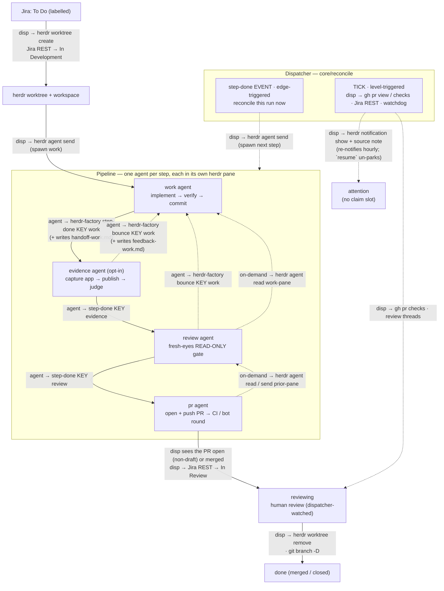

# herdr-factory — Architecture

Autonomous work → PR factory that runs Claude worker agents across one or
more repos, on top of [herdr](https://herdr.dev) worktrees. A single idempotent
reconciler (`reconcileRepo`, looped by the resident **`serve`** daemon — one process
that ticks every configured repo and exposes a local HTTP API), pulls eligible work
from the repo's **work sources**, claims each item onto a **belt** (priority order,
first `match` wins), spins up one herdr worktree + one worker agent per belt step, and —
for a `work_to_pull_request` belt — watches the PR and tears the worktree down on
merge/close. The server is kept alive by a **stateless `ensure-up` supervisor** run on
a schedule (a launchd job on macOS, a systemd `--user` timer on Linux) — see
[§12](#12-server--supervision).

**Work sources** are the pluggable front of the engine (`work_sources`, ≥1 per repo): *where*
work is pulled, with no pipeline attached. Four types ship today — `jira` (poll a board; status
of record lives in Jira), `local_markdown` (a folder of `*.md` briefs; lifecycle tracked
internally in SQLite), `github_issues` (poll a repo's open issues by trigger label; status
of record lives on GitHub as labels + open/closed state), and `sentry` (poll a project's issues
by a config query — no trigger label; lifecycle tracked internally in SQLite, and Sentry issues
are never mutated for lifecycle). A source is just a `type` + an optional unique `name`
(default = the type) + its backend block.

**Belts** are the pipelines (`belt`, ≥1 per repo): *what* to do with the work. A belt pairs a
`source` with an ordered list of steps and carries the `workspace_name` branch template, a
`priority`, and an optional programmatic `match` predicate (a `.ts` default export
`(ctx) => boolean`, sync or async, with `ctx = { item, source: { name, type } }`; no `match` ⇒
accept all) — at claim time belts are walked in priority order and the first that accepts an
item claims it (**first match wins**). A belt is one ordered `steps[]` list; each step references a
registered **step primitive** by `type`, and the belt's lifecycle is **derived** from what its steps
declare — there is no `belt_type`:

- Five primitives ship (`src/steps/registry.ts`) — **`work`** (implement + commit), **`evidence`**
  (opt-in visual proof; can bounce), **`review`** (read-only gate; can bounce), **`pr`** (open the PR
  + ride CI), and the generic **`custom`** (a user step whose `prompt_file` is the whole body).
- The canonical **`work_to_pull_request`** belt is `steps: [work, evidence, review, pr]`: because its
  `pr` step *produces* a pull request, the belt gets the PR-watch/merge lifecycle (`reviewing` phase,
  resolver) + the `in_review` write-back (see [§7](#7-the-reconciler--multi-agent-pipeline)). A belt
  with no PR-producing step (e.g. all `custom` steps) just runs its steps and ends when the **last**
  signals `step-done` — no PR, no `reviewing`.
- Composition is validated at load: each primitive declares typed `consumes`/`produces`, and a belt
  whose step needs an input nothing upstream (source or an earlier step) produces is rejected — so a
  hand-built belt is as reliable as the shipped one.

A run records its `belt` + active `step`; phases are `claiming | running | waiting_for_human |
reviewing | tearing_down | done | attention` (`waiting_for_human` is the ask-human park,
`attention` the operator park). `repo` and `limits` stay repo-global; everything downstream of
"here is an eligible item" — the worktree, the step gate, the handoff, the watch — is
source-agnostic.

> **Reliability & scale layer.** A six-part hardening for the 50–100
> active-run regime, described inline throughout: **(1)** hard timeouts on every external call +
> a wedged-tick watchdog (`/health` reports per-repo `lastTickAt`/`tickStale`; `ensure-up`
> restarts on staleness — §5, §12); **(2)** herdr-unreachable ≠ pane-dead, with two-strike absence
> confirmation before any respawn (§5, §8); **(3)** a **transition outbox** — source status
> write-backs are persisted intents retried until delivered (a `stale` outcome — the item is gone —
> is delivered too, and flags the run for the run-locked stale policy instead of retrying forever),
> with a claim guard against known-stale eligibility (§6, §7); **(4)** an **attention workflow** —
> `resume` un-parks runs, parked runs stop holding claim slots, escalations write back to the work
> source and re-notify
> (§8, §11); **(5)** parallel Phase A + **per-run locks** + heartbeat-extended locks (§7, §12);
> **(6)** rate limiting — a Jira token bucket + a process-wide GitHub REST budget, both with
> Retry-After-honoring retries, one batched GitHub
> GraphQL query per tick for all watched PRs, human-reply poll backoff, and per-tick claim
> admission (§5, §7). Migrations v10–v13 (v14 added the stale two-phase columns — §15).

This document is the canonical design of the TypeScript implementation
(run directly by Node's built-in type stripping, no build step) backed by SQLite.

---

## 1. Principles

1. **herdr owns the terminal world; herdr-factory orchestrates it.** All
   workspace / worktree / tab / pane / agent lifecycle is performed by the
   `herdr` CLI. herdr-factory never reimplements pane splitting, terminal
   multiplexing, raw `git worktree add`, or spawning `claude` as a bare child
   process. It *does* orchestrate **layout application** — deciding a tab/pane
   plan and issuing the herdr commands that build it — but every split/spawn
   itself is herdr's. See [§4](#4-herdr-ownership-boundary).
2. **SQLite is the single source of truth for runtime state**, designed as the
   data contract for a future web UI — including a rich **event timeline**, not
   just current state. Config is never in SQLite.
3. **The reconciler is pure and testable.** It depends on injected interfaces
   (`Store`, `HerdrClient`, `WorkSource`, …, `now()`), so it runs against fakes
   and an in-memory DB in tests.
4. **Repo-specifics are decoupled into per-repo config**, not code. The engine
   is generic; onboarding a repo is pure data.
5. **Stop/restart safe.** State is on disk (SQLite); every action is idempotent;
   stopping the server never kills in-flight workers (they live in herdr). The DB —
   not the server — is the source of truth, so **the server is a coordinator, not a
   single point of failure**: every CLI command runs in-process when no server is up
   (see [§12](#12-server--supervision)), so a worker's `step-done` lands even mid-restart.

---

## 2. Stack

| Concern | Choice |
|---|---|
| Language / runtime | TypeScript on Node ≥26 (`.node-version` pins the exact build — **vendored** into `<state>/runtime/` in managed installs), run via **native type stripping** (no build step) |
| CLI | **commander** |
| State store | **node:sqlite** (`DatabaseSync` — Node built-in, synchronous; no native module) |
| Config | **`yaml`** + **`zod`** (parse + validate → types) |
| Subprocess (herdr/gh/git) | **`node:child_process`** `execFile` (arg arrays, no shell; **hard timeout on every call** — default 60s, kills the child) |
| Local API server | **Hono** on **`@hono/node-server`** (resident `serve`, 127.0.0.1); **`@hono/zod-openapi`** validates requests + generates the OpenAPI doc, **`@hono/swagger-ui`** at `/ui`; native **`fetch`** clients |
| HTTP (Jira + GitHub REST) | **`clients/http.ts`** — an **Effect**-based pipeline over native `fetch`: interruption-wired timeouts, shared (chainable) token buckets, and `Schedule` retries (exponential + jitter) honoring `Retry-After` |
| Effects / concurrency | **`effect`** — the HTTP retry/rate-limit pipeline, bounded-concurrency Phase A (`Effect.forEach`), and the OpenTelemetry runtime (`@effect/opentelemetry`) |
| Evidence publish | a **publisher seam** (`evidence.publisher`, default `s3`) behind `EvidencePublisher`: **`s3`** — **`@aws-sdk`** (`client-s3` + `lib-storage` multipart; ambient credential chain, no `aws` CLI); **`local`** — copy into the resident server's serve dir; **`command`** — a user executable (`execFile`) that uploads + prints URLs |
| TUI | **`@opentui/core`** (native renderer — Node ≥26 with FFI; the launcher adds the flags) |
| Tests | **vitest** (dev-only) |
| External CLIs | **herdr**, **gh**, **git** (+ **claude**, launched inside herdr panes) |

Runtime dep footprint: `commander`, `yaml`, `zod`, `hono` + `@hono/node-server` +
`@hono/zod-openapi` + `@hono/swagger-ui`, `effect` (+ the OpenTelemetry exporters, `mime-types`,
and the AWS SDK for evidence upload) — all pure-JS. SQLite is Node's built-in `node:sqlite` — the
engine has no native module (`@opentui/core`'s prebuilt native renderer is TUI-only, resolved per
platform by pnpm). Everything else is Node built-ins or the external CLIs; the `.ts` sources run
unbuilt via Node's native type stripping (which is also why the code avoids TS **constructor
parameter properties** — strip-only mode rejects them at runtime even though `tsc` and vitest
accept them). In a managed install Node itself is **vendored**: `install.sh` / the self-updater
download the `.node-version`-pinned build into `<state>/runtime/<ver>` (SHA-256-verified against
`SHASUMS256.txt`) and flip an atomic `current` symlink — no system Node, no version manager.

---

## 3. Layered architecture

```
  launchd / systemd timer ─60s─► ensure-up ──spawns / health-checks──► serve.ts (resident daemon)
  (one job: watchers/service.ts)                                      │  Hono API @127.0.0.1
                                                                      │  + per-repo tick loops
  herdr-factory <cmd> ──► cli/index.ts ──POST /repos/:repo/… (else in-process)─┤
  (--repo · dispatch · --json)        via server/client.ts             │
                            serve + cli both build/inject Deps (build-deps.ts)
                                                                      ▼
        ┌──────────────── core/ (PURE, testable) ────────────────┐
        │  reconcile · watch · step · branch · phases              │
        │  depends only on interfaces ↓↓↓                          │
        └───────┬───────────────────────────────┬─────────────────┘
                ▼                                 ▼
      ┌──── db/ store (SQLite) ─┐       ┌──── clients/ (thin glue) ───────┐
      │ runs · events · locks  │       │ HerdrClient  JiraClient          │
      │ repos · migrations     │       │ GithubIssuesClient GitHubClient  │
      └────────────────────────┘       │ GitClient  exec()                │
                                       └───────────┬──────────────────────┘
                                                    ▼
                                 herdr · gh · git · fetch(Jira + GitHub REST)
```

**Dependency rule:** `core` imports *interfaces*; `cli` **and** `server` construct the concrete
implementations (via `build-deps.ts`) and inject them. The CLI routes mutating commands to a
running `server` and falls back to the same in-process path when none is up (`server/client.ts`).
Tests substitute fakes + `:memory:` SQLite.

### Repo layout

```
herdr-factory/
  package.json  tsconfig.json  README.md  docs/ARCHITECTURE.md  install.sh
  bin/herdr-factory          cwd-robust launcher → `node src/cli/index.ts` (resolves its own dir through
                          symlinks; Node >= 26 — active, else the baked node-path; no args → the TUI)
  bin/herdr-factory-tui      TUI launcher: same Node resolution + --experimental-ffi (opentui's renderer)
  herdr-plugin.toml          herdr plugin manifest — registers the layout hook (worktree.created/workspace.*)
  .node-version              exact Node pin (26.x) — drives the vendored-runtime provisioning
  src/
    cli/index.ts          commander program; routes via server (else in-process), dispatches
    cli/layout-hook.ts    lean herdr-event entry (the worktree.created layout hook) — kept out of index.ts
    build-deps.ts         buildDeps(repo) — shared by the server + every command's local path
    resolve.ts            pure resolveSourceName / resolveActiveRun (throw, not exit; CLI+server)
    config.ts             env map (repos/<name>/env: loadEnvMap/saveEnvValues) + repos/<name>/config.yml
                          → zod → typed Config (work_sources[] — union assembled from the source
                          registry — + belt[]); listConfiguredRepos + server path/port helpers + the
                          editor JSON Schema
    doctor.ts             the doctor checks: managed / you-provide / per-repo (--deep = live probes)
    types.ts              shared domain types (incl. Phase, WorkState, WorkItem)
    version.ts            VERSION = package version + git HEAD sha (a new commit changes it, so
                          ensure-up restarts an outdated serve — stamped into /health + server.json)
    server/
      serve.ts            resident `serve`: multi-repo tick loops + binds Hono via @hono/node-server
      app.ts              OpenAPIHono: routes → handlers, OpenAPI doc (/doc) + Swagger UI (/ui)
      schemas.ts          zod request/response schemas + createRoute defs (validation + the doc)
      client.ts           CLI side: readServerInfo / pingHealth / serverFetch / viaServerOrLocal
    watchers/
      service.ts          platform dispatch: darwin → launchd.ts · linux → systemd.ts (+ servicePath():
                          the baked PATH the doctor resolves you-provide tools against)
      launchd.ts          the macOS LaunchAgent (com.herdr-factory.server) running `ensure-up`
      systemd.ts          the Linux systemd --user service + timer (herdr-factory.timer)
      supervisor.ts       stateless `ensure-up` / killServer (health-check + detached serve spawn)
      updater.ts          selfUpdate: git fetch + hard-reset to the channel target (HERDR_CHANNEL:
                          main=upstream / stable=newest release tag); dirty-checkout guard (skip +
                          notify); records each attempt to update-status.json for doctor/TUI;
                          re-provisions Node / re-installs deps when .node-version / the lockfile change
      provision.ts        vendored-Node download + SHA-256 verify + atomic `current` flip
    db/{index,migrate,store,tx}.ts
    clients/{exec,http,herdr,jira,jira-source,local-markdown-source,
             github-issues,github-issues-source,github-budget,github,git,sentry,sentry-source}.ts
    sources/registry.ts      the source REGISTRY: one descriptor per type (zod configSchema /
      + sources/<type>/descriptor.ts   resolveConfig / create / secrets manifest / TUI fields) —
                             the single edit surface for adding source N+1 (checklist in its header)
    core/{deps,branch,step,watch,reconcile}.ts
    core/{layout,layout-match,layout-hook}.ts   layout subsystem: plan+runner / pure matching / herdr event hook (§4)
    runtime/effect.ts        the shared Effect ManagedRuntime (also hosts the OTel layer)
    telemetry/…              OpenTelemetry spans/metrics (no-op unless HERDR_FACTORY_TELEMETRY)
    tui/…                    the opentui TUI (Dashboard · Config editor · Doctor)
    prompts/{work,evidence,review,pr}.md + prompts/resolver.md   step-primitive prompts (work.md
                          source-neutral) + the PR-watch resolver (tokenized + source-overridable, rendered by core/watch.ts)
    prompts/jira/work.md + prompts/github_issues/{work,pr}.md   per-source-type overrides
    prompt-packs.ts          the repo-level prompt-resolution chain (repo-checkout ▸ config-folder ▸ shipped);
                          import-free leaf shared by config.ts (load) · core/step.ts (render) · core/watch.ts (resolver)
    steps/registry.ts + steps/<name>/descriptor.ts   the STEP_DESCRIPTORS registry (work/evidence/review/pr/custom)
    products/registry.ts · signals/registry.ts       PRODUCT_CAPABILITIES + SIGNAL_DESCRIPTORS registries
  examples/example-repo/{config.yml, guidelines-prompt.md, match-bugs.ts, prompts/…}
  test/                   vitest
```

Code/config/state live OUTSIDE any repo: the managed code checkout at
`~/.local/share/herdr-factory/` (install.sh + auto-update own it);
`~/.config/herdr-factory/{config.schema.json, repos/<name>/{config.yml, env, guidelines-prompt.md, prompts/}}`;
`~/.local/state/herdr-factory/{herdr-factory.db, runtime/<node>/, node-path, server.json, logs/, <repo>/logs/}`.

---

## 4. herdr ownership boundary

This is a load-bearing principle, not an aside. herdr already implements
worktrees, workspaces, tabs, panes, layouts, and agent lifecycle — **we do not
rebuild any of it.** `HerdrClient` is a *thin typed wrapper*: every method shells
out to `herdr …` and parses its JSON; it contains zero terminal/worktree logic.

**herdr owns (via the CLI — never reimplemented):**

- worktree **create / open / remove** (incl. deleting the checkout dir + git
  worktree registration)
- workspace **close / get / list**
- tab **create / list**
- pane **split / run / send-text / send-keys / list / read**
- agent **start / list / status / send / focus / rename / read / wait**
- pane **list / current** (incl. the `focused` flag — which pane the user is viewing)
- desktop **notifications**

**Layouts** — the tab/pane arrangement a worktree comes up with — are applied by **herdr-factory
itself** (absorbed from the workspace-manager plugin). It registers as a herdr plugin
(`herdr-plugin.toml`) and handles `worktree.created` / `workspace.created` / `workspace.focused`; on
the event it matches the new worktree's repo root to a repo config, picks the layout (a
factory-claimed worktree uses its owning run's belt; a hand-created one walks the repo's belts), and
*builds* it by issuing herdr `tab create` / `pane split` / `pane run` — herdr still performs every
split and spawn. The hook is idempotent (a per-checkout-path filesystem claim + a fresh 1-tab/1-pane
guard + a per-workspace "decided" cache) and sits behind a **lean entry** (`src/cli/layout-hook.ts`,
routed by `bin/herdr-factory`) that lazy-loads the heavy graph, so the constantly-firing focus event
stays cheap. Modules: `src/core/layout-match.ts` (pure matching), `layout.ts` (plan + runner),
`layout-hook.ts` (the event handler).

A belt step then simply *targets* a resulting pane via its own `tab`/`pane` (from its `steps[]`
entry). herdr-factory **waits** for a targeted pane to come up (re-arming an expired
`layout_wait_seconds` window a bounded number of times, then escalating to `attention` —
[§8](#8-step-agent-model)) and only spawns a pane itself for steps that have **no** tab/pane
configured — except `evidence`, which never spawns its own: with no tab/pane that step is
skipped entirely (see [§8](#8-step-agent-model)).

**herdr-factory performs git/filesystem ops ONLY for things outside herdr's model:**

- `git branch -D <branch>` on teardown — the one remnant herdr leaves (herdr
  models worktrees, not branches)
- read/maintenance git: `show-ref`, `remote get-url`, `rev-parse HEAD` (the worker
  heartbeat), defensive `worktree prune`
- everything non-terminal: Jira + GitHub REST, GitHub via `gh`, SQLite, config, the
  reconciler logic

If a future need looks like "manage a pane/tab/worktree/agent," it belongs in
`HerdrClient` as another CLI call — not as reimplemented logic.

---

## 5. Clients

Thin, typed wrappers. Types encode the real `herdr --json` shapes
reverse-engineered during the bash prototype.

- **`exec.ts`** — `run(cmd,args,{cwd,allowFail,timeoutMs,env})`, `runJson<T>()` over
  `execFile` (promisified; arg arrays → no shell injection). `env` overrides the child's
  environment (default: inherit the parent's) — used by `doctor` to resolve the you-provide tools
  against the **service's** PATH rather than the checking process's (§11). **Every subprocess is time-bounded**
  (default 60s; herdr worktree ops pass 180s) via execFile's native `timeout` — which actually
  kills the child, unlike a promise race. A timeout throws `ExecTimeoutError` **even under
  `allowFail`**: `allowFail` means "a non-zero exit is expected data"; a timeout is
  infrastructure failure the caller must see. This is the load-bearing guarantee that a hung
  `herdr`/`gh`/`git` can never wedge the tick loop.
- **`http.ts`** — the Effect-based outbound HTTP pipeline for backend clients (Jira + GitHub
  issues). Per-attempt timeouts are interruption-wired (`Effect.tryPromise`'s AbortSignal fires
  on fiber interruption, so `Effect.timeout` genuinely cancels the in-flight fetch); non-2xx
  becomes a typed `HttpStatusError` carrying status + parsed `Retry-After` (`parseRetryAfter`
  also synthesizes the wait from GitHub's `x-ratelimit-remaining`/`x-ratelimit-reset` pair when
  the header is absent). `httpWithPolicy` layers shared **`TokenBucket`s** (a token per attempt;
  `HttpPolicy.buckets` chains several — e.g. a per-minute AND a per-hour mutation cap — with the
  wait recorded as `herdr_factory.rate_limit.wait_ms`, and each response's
  `x-ratelimit-remaining` as `herdr_factory.rate_limit.remaining`) and an Effect `Schedule`
  retry — exponential + jitter for 429/5xx/timeout/network, honoring a server-sent `Retry-After`
  (capped 60s, or lower via `HttpPolicy.maxRetryAfterMs` for callers with their own durable
  retry loop) before the schedule's own delay; 4xx fails fast unless the policy's `isRetryable`
  override widens it (GitHub's 403+Retry-After secondary limits). `HttpRequest.redirect:
  "manual"` surfaces 3xx as typed status errors instead of transparently following them —
  load-bearing for the GitHub issue calls (a transferred issue answers 301; default stays
  `"follow"`).
- **`herdr.ts`** —
  - `worktreeCreateOrOpen(repoCwd, branch, baseRef) → {workspaceId, worktreePath, paneId}`
    (parses `.result.workspace.workspace_id` / `.worktree.checkout_path` /
    `.result.root_pane.pane_id`; **only from the main checkout** — herdr refuses
    linked worktrees)
  - `worktreeRemove(workspaceId)` — removes workspace + dir + git registration
  - `agents() → Agent[]` (`.result.agents`; status field is `agent_status` ∈
    `idle|working|done|blocked|unknown`). **Throws `HerdrUnreachableError`** when herdr can't be
    queried — an empty list is a real "no agents", never a masked failure (masking is what used
    to make one herdr hiccup look like mass pane death → duplicate-agent respawns). The result is
    **memoized ~5s** (one `herdr agent list` answers a whole tick's liveness questions instead of
    O(active runs) subprocess spawns); `paneAlive`/`paneState` accept `{fresh:true}` to bypass
    the memo, and `agentStart` invalidates it.
  - `agentStart({workspaceId, cwd, argv}) → paneId` where
    **`argv = [command, ...flags, prompt]`** (first token is the executable — the configured
    `agent.command`, default `claude`; the `herdr agent start <name>` kind is derived from
    argv[0]'s basename via `agentKindForArgv`, so a non-claude harness is detected). The harness is
    the resolved [`agent:` config](../README.md#agent-optional) (step over belt over repo over
    the default `claude --dangerously-skip-permissions`), threaded through `StepConfig.agent`.
  - `paneByLabel(ws, tabLabel, paneLabel)`, `paneAlive(pane)` (any agent present),
    `paneRun(pane, cmd)`, `agentSend(pane, text)`, `paneSendKeys(pane, "Enter")`,
    `agentRename(pane, "<step>:KEY")`, `notify(title, body)`
  - `agentFocus(pane)` (bring a pane + its tab to the front) and `focusedPane() →
    {paneId, workspaceId, tabId, label}` (the one globally-focused pane, from `pane list`'s
    `focused` flag — herdr exposes no focus-change event to subscribe to, so it's polled)
- **Work sources** — the polymorphic front of the engine. The core depends only on the
  `WorkSource` interface (in `core/deps.ts`) and the canonical `WorkState` lifecycle
  (`todo → in_development → in_review → merged|aborted|done` — `done` is the custom-belt
  terminal). The interface's doc block is a numbered **charter** (INV-1..11: re-claim
  convergence, idempotent retry-safe transitions, zero-network unmapped states, idempotent
  best-effort materialize, durable idempotent askHuman, marker-based self-authorship, key
  safety, bring-your-own rate limits, durable source names, single-factory claiming,
  canonical-key echo), enforced as a
  parametrized contract suite over every shipped source (`test/work-source-contract.test.ts` —
  §13). Nine methods plus a declarative spec:
  - `readonly spec: WorkSourceSpec` — declared ownership/capabilities: `statusOfRecord`
    (`external` | `internal`), `mappedStates`, `replyChannel` (`comments` | `file`), optional
    `terminalAutomation` note. Consumed by `doctor` and the contract suite ONLY — the
    reconciler never branches on it, so it can't drift into a second state machine.
  - `listEligible() → MatchItem[]` (a bounded batch of todo items, in claim order)
  - `describe(key) → Ticket` (metadata for the manual `claim`; may accept an alternate
    identifier but returns the CANONICAL key — the engine re-checks active-run dedup against
    the returned key before claiming, INV-11)
  - `transition(key, WorkState) → TransitionResult` — `{kind: applied|noop|stale, detail?}`
    replaces the old boolean. `noop` = already at the target, or the state is unmapped for this
    source (**decided with no network call** — `spec.mappedStates`), or the backend's own
    automation won the race; `stale` = the item is gone (deleted/transferred — retrying cannot
    help): the outbox marks the intent delivered and flags the run for the run-locked stale
    policy (§7). A throw means "retry me". Callers never invoke this fire-and-forget — the
    reconciler routes every transition through the **outbox** (§7). An optional 4th arg
    (`TransitionContext`) carries the merged PR's number+URL, built by the outbox delivery from the
    run + resolved GitHub repo: an internal-ledger source with an external reply channel (`sentry`)
    uses it to drop a "fixed by PR" note at merge. Every other source ignores it, and it may be
    absent (a retried terminal intent for an ended run), so no source may depend on it.
  - `materialize(key, memDir, log)` (write the work doc + any media; idempotent, best-effort)
  - `workDoc(memDirAbs) → WorkDocInfo` (`{path, kind}` — describes what materialize wrote,
    driving the `@@WORK_DOC@@`/`@@WORK_DOC_KIND@@` prompt tokens; this replaced the per-type
    switch that used to live in `step.ts`. Local-fs-only, never throws; async only because
    `instrumentObject` wraps every client method in an async telemetry proxy)
  - `postNote(key, note)` (source-native operator-facing note — a Jira/GitHub comment / local
    marker file; used when a run parks for `attention`; **marker-tagged**, see below)
  - `askHuman(input)` / `pollHumanReply(input)` (the ask-human park: post a source-native
    question, poll for the reply — polls back off 60s→5min per question; a poll throw counts as
    a poll ERROR with the same backoff, escalating after 20 consecutive; both throw
    `StaleItemError` when the item is gone, escalating the run instead of polling a nonexistent
    item forever)
  - `health()` (throws if misconfigured/unreachable — the `doctor` per-source check)
  Every artifact a source writes to its reply channel carries the exported **`HERDR_MARKER`**
  (`"[herdr-factory"`), and reply polling drops marker-bearing comments via `bearsHerdrMarker` —
  **blockquote-aware**, so a human quote-reply that embeds the question as `> ` lines still
  counts as a reply (INV-6). Author-identity filtering is never load-bearing: under gh-CLI
  auth the bot login IS the operator's login.
  A `SourceRuntime` bundles a source's identity (`name`/`type`) with its live `client`;
  `resolveSource` maps a run's `work_source` back to its runtime. `Deps.belts` is the
  priority-ordered `BeltRuntime` list (a belt's resolved config — ordered `steps`, `watchPr` —
  plus its loaded `match` predicate); `resolveBelt` maps a run's `belt` back to its runtime.
- **`sources/registry.ts`** — one `SourceDescriptor` per type: the zod `configSchema` (the full
  `.strict()` source object), `resolveConfig` (snake_case parse → camelCase block), `create`
  (build the live client), the `secrets` manifest, and the TUI `defaultBlock`/`fields`.
  `config.ts` assembles the `work_sources` discriminated union from the descriptors,
  `build-deps` constructs clients via `descriptorFor(type).create(ctx)`, and `doctor`'s secrets
  check + the TUI's type enum / field / credential rows are all descriptor-driven
  (`WorkSourceConfig` is just `{name, type, cfg: unknown}` — `cfg` is opaque to everything but
  the type's own descriptor). The registry header documents the whole **adding-source-N+1
  checklist**: the `WorkSource` impl in `src/clients/`, a descriptor in
  `src/sources/<type>/`, one literal in the `SourceType` union (`src/types.ts`), one
  `SOURCE_DESCRIPTORS` entry, `npm run schema`, and a contract-suite harness — plus optional
  per-type prompt overrides and a `MatchItem` convenience interface + type guard. Zero other
  core edits. Secrets are a raw per-repo **env map** (`loadEnvMap`/`saveEnvValues` in
  `config.ts`, same chmod-600 `repos/<name>/env` file as before): the engine never interprets
  keys — each descriptor's manifest declares what matters (`JIRA_EMAIL` + `JIRA_API_TOKEN`
  required for `jira`; `GITHUB_TOKEN` optional for `github_issues`, falling back to
  `gh auth token`).
- **`jira.ts`** (basic auth over `clients/http.ts`) — the low-level Jira REST client:
  `listEligible()` via the Agile board endpoint `/rest/agile/1.0/board/<id>/issue?jql=…`;
  `getIssue`, `currentStatus`, `transition(key, statusName)` (case-insensitive `.to.name` match,
  no-op if already there), `downloadAttachments` (image/* and video/*, count + per-type size
  capped). **All calls share one `TokenBucket` (5 req/s sustained, burst 10)** and the
  Retry-After-honoring retry policy, with hard timeouts (30s JSON, 120s media). Writes (comment /
  transition POST) retry at most once: a 429 was definitively not processed; a lost 5xx write may
  have landed, and a rare duplicate comment beats a retry storm of writes. **`jira-source.ts`**
  adapts it to `WorkSource`: it holds the configured status map and maps canonical→Jira status —
  `aborted` is always **unmapped**, and `merged`/`done` are unmapped **unless** the source sets the
  optional `status.done` (opt-in: a merged PR then moves the ticket there at teardown). While a
  terminal is unmapped, `transition` answers `noop` **before any network call** and teardown stays
  Jira-silent (its GitHub integration owns closure). `materialize` writes `ticket.json` + attachments. `postNote` is marker-tagged and
  `pollHumanReply` drops **every** marker-bearing comment (questions AND notes — an unmarked
  attention note posted while a question was pending used to poison the reply loop), per INV-6.
- **`local-markdown-source.ts`** — a folder of work items (top-level only; dot-prefixed and
  `__`-prefixed names skipped — `__` marks work still being prepared). Each item is a single `*.md` file **or** a top-level subdirectory holding ≥1 top-level
  `*.md` (only that level is checked; a `<key>.md` file wins a collision with a `<key>/` dir).
  herdr-factory owns the status of record in the `work_items` table (the source is never modified).
  Key = filename stem / dir name; title/type from optional YAML front-matter, else the first H1 /
  humanized name and `"task"` (a directory seeds these from its primary md — `README.md` if present,
  else the first `*.md`). `listEligible` returns items whose `work_items.status` is absent/`todo`
  AND have no active run (a backstop over the run-table dedup); `transition` upserts
  `work_items.status`; `materialize` snapshots a file to `task.md` or copies a directory whole to
  `task/`; `health` stats the folder.
- **`github-issues-source.ts`** (+ **`github-issues.ts`**, **`github-budget.ts`**) — the
  `github_issues` source. GitHub is the **status of record** (spec `external`; `work_items`
  never touched), projected onto the issue: eligible = open + the belt's pickup label (`belt.label`,
  the trigger — passed into `listEligible`) + not a PR + no in-flight state label, listed
  **oldest-first**; `in_development` swaps in its state label then **consumes the trigger label
  last** (a partial swap keeps the item filtered, never double-claimed; re-adding the trigger is the
  retry affordance); `in_review` swaps
  labels; `merged`/`done` strip state labels and close the issue as `completed` per `close_on` —
  the idempotent backstop over the PR's `Fixes #n` auto-close (which only fires on
  default-branch merges and can be disabled repo-wide); it never reopens. `aborted` strips
  in-flight labels, adds the aborted label, and leaves the issue **open** (a visible,
  retriageable failure artifact) unless `close_on.aborted` (then `not_planned`). Every mapped
  transition is an idempotent GET → diff → apply; a human closing the issue pre-merge is a
  cancel signal (→ `stale` — except a `completed` close seen at `in_review`, which is almost
  always `Fixes #n` auto-close racing a fast merge → `noop`; the PR watch owns that signal).
  `github-issues.ts` is a raw REST client on the `http.ts` pipeline
  (deliberately NOT the gh CLI — typed statuses are load-bearing) with `redirect: "manual"`: a
  transferred issue answers **301** (which a followed redirect would silently chase into the
  new repo, auth + method preserved — mutating the issue there), a deleted one **410**, an
  inaccessible one **404** — all mapped to `stale`/`StaleItemError` via `classifyGone`. Auth is
  `GITHUB_TOKEN` else the gh CLI's token (`gh auth token`, refreshed once on a 401).
  `github-budget.ts` holds the **process-wide** budget buckets (module singletons — every repo
  runtime spends the same authenticated user's budget): reads 5/s sustained; mutations chain a
  per-minute (~60/min under GitHub's 80/min secondary cap) AND a per-hour (500/hr) bucket.
  `materialize` renders `task.md` — sanitized title/body + every non-herdr comment + a
  `Closing reference:` line the pr prompt copies into the PR body verbatim — plus the raw
  `issue.json` sidecar and `attachments/` (media downloaded **immediately** from `body_html`'s
  JWT-signed URLs, the only form that resolves on private repos; capped 12 files / 50MB).
  `askHuman` is idempotent per question (it scans for the question marker before posting); the
  reply filter is blockquote-aware with **no author filtering** (gh-CLI shared identity).
  `health()` checks repo reachability, issues enabled, push permission, and that the trigger
  label exists. `repo` is optional (defaults to the PR repo; the descriptor's `create()` throws
  at startup when neither resolves).
- **`sentry-source.ts`** (+ **`sentry.ts`**) — the `sentry` source. Status of record is INTERNAL
  (spec `internal`, the `work_items` ledger, like local_markdown), so Sentry issues are NEVER moved
  for lifecycle — INV-1 convergence is satisfied by the ledger, not by mutating Sentry. Eligibility
  is a config filter (organization + projects + environment + a Sentry search `query`) with NO
  pickup label, so a `sentry` belt sets no `label` and belts route by `match`/priority. Reply
  channel is `comments` (Sentry issue notes — a stable-in-practice but `publish_status=PRIVATE`
  endpoint). The one optional Sentry-side write is a config-driven `on_merge` note/resolve at teardown
  (comment | resolve | resolve_in_next_release | none), which consumes the merged PR's number+URL via
  the `TransitionContext` 4th arg to `transition` and is best-effort (a Sentry hiccup never wedges the
  ledger transition). `sentry.ts` is a raw **Bearer-token** REST client on the `http.ts` pipeline —
  NO OAuth; the token (`SENTRY_AUTH_TOKEN`, an Internal-Integration or personal token with
  `event:read`+`event:write`) is read from the repo env. A 401/403 maps to
  `SourceUnauthenticatedError` (the auth gate pauses + auto-resumes the source), a 404/410 to
  `stale`/`StaleItemError`. `materialize` renders the issue + its latest event's
  stacktrace/breadcrumbs/request as `task.md` (+ the raw `issue.json` sidecar). `describe` accepts a
  numeric id or a shortId (returns the canonical numeric id, INV-11); `health()` probes the org + each
  configured project. Sentry rate-limits REST polling, so the client's token bucket is conservative
  and a `sentry` source should carry a higher `poll_interval_seconds`. **Release regression reopen:**
  `materialize` records the release the issue was last seen on into the ledger
  (`work_items.last_release`). A later poll REOPENS a terminal item (merged/done → reset to `todo`,
  the row is updated in place, never deleted) when the same issue recurs on a *different* release
  than the one it was fixed on — "we thought we fixed it, but a later release still hits it." The
  release comes from the issue-detail payload (the LIST endpoint omits it), so for a Sentry-flagged
  regression the source spends one bounded detail fetch (`MAX_REGRESSION_PROBES_PER_POLL`, overflow
  retried next poll); a `regressed` issue with no recorded baseline is reopened on Sentry's flag alone.
- **`github.ts`** (`gh` via execFile) — `prForBranch(repo, branch)` (first-sighting discovery
  only), `prByNumber(repo, n)` (the durable identity once adopted — survives head-branch deletion
  on merge), `reviewSignature(repo, n) → {unresolved, failing, sig}` (graphql review threads +
  `statusCheckRollup`), and **`prSnapshots(repo, numbers[]) → Map<number, PrSnapshot>`** — one
  aliased GraphQL query (chunked at 25) resolving state + review threads + check rollup for
  **every watched PR in a tick**, replacing 3 `gh` subprocess calls per reviewing run per tick
  (~9k req/h at 50 runs — over the REST budget on its own). Its signature hash is bit-identical
  to `reviewSignature`'s, so batched and per-run polling mix freely.
- **`git.ts`** — `branchExists`, `branchDelete`, `originUrl`, `worktreePrune`,
  `headSha` (the worker progress heartbeat).

---

## 6. State — SQLite (node:sqlite)

One global DB `~/.local/state/herdr-factory/herdr-factory.db`, via Node's built-in `node:sqlite`
(`DatabaseSync` — synchronous, no native module; still flagged *experimental*, which the pinned
Node keeps stable for us). `db/index.ts` sets `PRAGMA journal_mode=WAL; PRAGMA busy_timeout=5000;`
then runs migrations (`schema_version` + ordered SQL). `node:sqlite` has no `.transaction()` /
`.pragma()` helper (unlike better-sqlite3), so a small `db/tx.ts` wraps `BEGIN IMMEDIATE`/`COMMIT`/
`ROLLBACK` (used by migrations and `acquireLock`) and PRAGMAs run via `exec`. Per-repo ticks write
concurrently to the one DB; WAL + busy_timeout + the per-repo single-instance lock keep that safe.

```sql
CREATE TABLE repos(name TEXT PRIMARY KEY, repo_path TEXT, base_ref TEXT, github TEXT,
  last_tick_at INTEGER, enabled INTEGER DEFAULT 1);

CREATE TABLE runs(                       -- ONE attempt at a work item (history kept)
  id INTEGER PRIMARY KEY AUTOINCREMENT, repo TEXT NOT NULL,
  work_source TEXT,                      -- which configured source it was claimed from (v6)
  belt TEXT, step TEXT,                  -- which belt processes it + the active step (v7)
  ticket_key TEXT NOT NULL,
  summary TEXT, issue_type TEXT, branch TEXT, phase TEXT NOT NULL,
  workspace_id TEXT, pane_id TEXT, worktree_path TEXT, pr_number INTEGER,
  resolver_active INTEGER NOT NULL DEFAULT 0, -- reviewing run holds a slot only while resolving (v17; replaced watch_deadline)
  last_thread_sig TEXT,
  focus_pending INTEGER NOT NULL DEFAULT 0, -- active step changed; focus shift deferred (v5)
  -- worker_done/review_done/review_pane/progress_* (migrations v2-v3) are superseded
  -- by run_steps and left in place for history only.
  attention_reason TEXT,
  attention_reason_code TEXT,            -- MACHINE reason of the latest attention park (step_budget /
                                         -- layout_wait_timeout / bounce_limit / …) — the key that
                                         -- routes a park to its rescue class (step-done rescue /
                                         -- bounded respawn / human-only). First-class since v28
                                         -- (was JSON-parsed back out of the events log); written by
                                         -- escalateAttention, backfilled from events, event-log
                                         -- fallback kept for one release (old-code drain window).
  attention_notified_at INTEGER,         -- last operator notification for a parked run (v12)
  outcome TEXT,                          -- merged|closed|abandoned|timeout|completed|NULL
  created_at INTEGER, updated_at INTEGER, ended_at INTEGER);
CREATE INDEX idx_runs_active ON runs(repo) WHERE ended_at IS NULL;
CREATE UNIQUE INDEX idx_runs_active_ticket ON runs(repo, work_source, ticket_key)
  WHERE ended_at IS NULL;                -- ONE active run per item — the claim-race arbiter (v25)

CREATE TABLE run_steps(                  -- one row per pipeline agent (migration v4)
  id INTEGER PRIMARY KEY AUTOINCREMENT, run_id INTEGER NOT NULL,
  step TEXT NOT NULL,                    -- belt step name (work/evidence/review/pr/custom)
  pane_id TEXT, session_id TEXT,         -- on-demand cross-agent query handles
  progress_sig TEXT, progress_at INTEGER,   -- per-step commit heartbeat (heartbeat steps only)
  baseline_sig TEXT, baseline_frozen_at INTEGER, -- the read-only guard's enforcement baseline (v28;
                                         -- de-aliased from progress_sig, which read-only steps used
                                         -- to borrow): tracks live HEAD — absorbing the prior step's
                                         -- trailing handoff commits (RWR-18204) — until the step's
                                         -- own agent is first observed working, then freezes; a HEAD
                                         -- move past the freeze parks `read_only_violation`.
  done INTEGER NOT NULL DEFAULT 0, started_at INTEGER, done_at INTEGER,
  bounces INTEGER NOT NULL DEFAULT 0,    -- SUPERSEDED (with capture_attempts) by guard_counters (v21),
  absent_at INTEGER,                     -- left unread. absent_at: pane first CONFIRMED absent (v10)
  pass INTEGER NOT NULL DEFAULT 1,       -- which ENTRY into the step this state belongs to (v23):
                                         -- 1 on first entry, +1 per re-entry (bounce rewind /
                                         -- forward re-advance); crash respawns + human resumes
                                         -- CONTINUE a pass. Stamped into the pass's prompt commands
                                         -- (--pass N) so stale signals are rejectable.
  dispatched_at INTEGER);                -- when THIS pass's prompt reached an agent; null = the
CREATE UNIQUE INDEX idx_run_steps ON run_steps(run_id, step);   -- pass still needs its dispatch (v24).
                                         -- UNIQUE since v25: exactly one row per (run, step) — the
                                         -- atomic ON CONFLICT upsert's target (markStepDone runs
                                         -- outside the run lock, so the DB must referee racers).
                                         -- pane_id can't carry this (it's KEPT across re-entries as
                                         -- the reuse handle), so the spawn branch keys on this —
                                         -- an undispatched pass retries under the bounded layout
                                         -- wait instead of tripping the budget watchdog.

CREATE TABLE guard_counters(             -- capped-guard counters keyed (run, step, guard) (v21) —
  run_id INTEGER NOT NULL REFERENCES runs(id), step TEXT NOT NULL, guard TEXT NOT NULL,
  count INTEGER NOT NULL DEFAULT 0, updated_at INTEGER NOT NULL,   -- 'bounce_cap' (on the target step)
  PRIMARY KEY(run_id, step, guard));     -- + 'capture_cap' + 'layout_wait' (the bounded respawn
                                         -- budget); capped guards on a step don't collide

CREATE TABLE events(                     -- the timeline (web-UI gold)
  id INTEGER PRIMARY KEY AUTOINCREMENT, run_id INTEGER, repo TEXT, ticket_key TEXT,
  ts INTEGER NOT NULL, type TEXT NOT NULL, detail TEXT);  -- detail = JSON
CREATE INDEX idx_events_run ON events(run_id, ts);

CREATE TABLE work_items(                 -- internal lifecycle ledger for sources with no
  id INTEGER PRIMARY KEY AUTOINCREMENT,  -- external status of record (local_markdown). (v6)
  repo TEXT NOT NULL, source TEXT NOT NULL, key TEXT NOT NULL,
  title TEXT, item_type TEXT, path TEXT,
  status TEXT NOT NULL CHECK (status IN                    -- 'done' added v7 (custom terminal)
    ('todo','in_development','in_review','merged','aborted','done')),
  created_at INTEGER NOT NULL, updated_at INTEGER NOT NULL, UNIQUE(repo, source, key));
CREATE INDEX idx_work_items ON work_items(repo, source, status);

CREATE TABLE human_questions(            -- ask-human park: one pending question per run (v8)
  id INTEGER PRIMARY KEY AUTOINCREMENT, run_id INTEGER NOT NULL REFERENCES runs(id),
  repo TEXT NOT NULL, work_source TEXT NOT NULL, ticket_key TEXT NOT NULL, step TEXT,
  question TEXT NOT NULL, status TEXT NOT NULL CHECK (status IN ('pending','answered')),
  external_id TEXT, external_created_at TEXT,              -- the source-native object (Jira/GitHub comment)
  answer TEXT, answer_external_id TEXT, answer_author TEXT,
  poll_attempts INTEGER NOT NULL DEFAULT 0,                -- misses drive the poll backoff (v13)
  next_poll_at INTEGER NOT NULL DEFAULT 0,                 -- 60s doubling, 5min cap (v13)
  poll_errors INTEGER NOT NULL DEFAULT 0,                  -- CONSECUTIVE poll throws (reset on
                                                           -- success); escalates past 20 (v14)
  created_at INTEGER NOT NULL, updated_at INTEGER NOT NULL, answered_at INTEGER);
CREATE UNIQUE INDEX idx_human_questions_one_pending_run ON human_questions(run_id) WHERE status='pending';

CREATE TABLE pending_signals(            -- bounce / ask-human as durable per-run INTENTS (v22) —
  id INTEGER PRIMARY KEY AUTOINCREMENT,  -- the outbox pattern applied to the non-monotonic agent
  run_id INTEGER NOT NULL REFERENCES runs(id),  -- signals. Persisted BEFORE the run lock is tried:
  repo TEXT NOT NULL, ticket_key TEXT NOT NULL, -- an apply that loses the lock race (or crashes
  signal TEXT NOT NULL CHECK (signal IN ('bounce','ask_human')), -- mid-way) is consumed by a later
  step TEXT,                             -- reconcile pass instead of being dropped after the agent
  to_step TEXT,                          -- was told to stop. step = the ISSUING step (stale-signal
  payload TEXT NOT NULL,                 -- guard); to_step = a bounce's rework target.
  created_at INTEGER NOT NULL,           -- At most one unconsumed intent per run (supersede-on-
  consumed_at INTEGER,                   -- enqueue). consumed_result: applied | escalated |
  consumed_result TEXT);                 -- superseded | rejected: <why>. step-done is NOT here —
CREATE INDEX idx_pending_signals_unconsumed    -- its done flag is durable before the nudge.
  ON pending_signals(run_id) WHERE consumed_at IS NULL;

CREATE TABLE transition_outbox(          -- source status write-backs as persisted INTENTS (v11)
  id INTEGER PRIMARY KEY AUTOINCREMENT, run_id INTEGER NOT NULL REFERENCES runs(id),
  repo TEXT NOT NULL, work_source TEXT NOT NULL, ticket_key TEXT NOT NULL,
  to_state TEXT NOT NULL CHECK (to_state IN ('todo','in_development','in_review','merged','aborted','done')),
  to_status TEXT NOT NULL DEFAULT '',    -- belt-effect SOURCE-NATIVE status key ('' = canonical mapping
                                         -- for to_state). to_state stays the canonical ANCHOR (its
                                         -- CHECK untouched — WorkState vocab is unchanged); the source
                                         -- delivers to_status when set (v27). See §7 effects.
  attempts INTEGER NOT NULL DEFAULT 0, next_attempt_at INTEGER NOT NULL,  -- exponential backoff
  last_error TEXT, created_at INTEGER NOT NULL, updated_at INTEGER NOT NULL,
  delivered_at INTEGER,                  -- set once the source confirms (or reports a no-op)
  stale_at INTEGER,                      -- delivery found the item GONE; stamped lock-free (v14)
  stale_handled_at INTEGER,              -- the run-locked stale policy consumed it (v14)
  UNIQUE(run_id, to_state, to_status));  -- enqueue idempotent across ticks; a custom status and a
                                         -- canonical transition at the same anchor are distinct (v27)

CREATE TABLE evidence_uploads(           -- LEGACY since v30: evidence publishes live on the intent
                                         -- ledger as the `evidence_publish` kind (v30 converted
                                         -- every pending row + closed the old ones; reads stay a
                                         -- union for one release, then this table drops in a
                                         -- contract migration). Original design (v16) — the
  id INTEGER PRIMARY KEY AUTOINCREMENT,  -- upload analog of transition_outbox (durable, retried).
  run_id INTEGER NOT NULL REFERENCES runs(id),  -- publisher-agnostic (s3|local|command): only the
  repo TEXT NOT NULL, ticket_key TEXT NOT NULL, -- delivery fn behind EvidencePublisher differs.
  key_prefix TEXT NOT NULL,              -- persisted so retry URLs stay stable (published up-front)
  evidence_dir TEXT NOT NULL,            -- abs worktree path; gone ⇒ abandon
  attempts INTEGER NOT NULL DEFAULT 0, next_attempt_at INTEGER NOT NULL,  -- backoff + enqueue LEASE
  last_error TEXT, error_kind TEXT,      -- publisher.classifyError: auth|transient|permanent (auth: S3 only; drives SSO light)
  notified_at INTEGER,                   -- SSO/permanent-fail notify throttle (per row, never the run)
  permanent_failed_at INTEGER,           -- terminal: non-retryable config error / dir-gone
  abandoned_at INTEGER,                  -- superseded by a re-capture, or dropped at teardown
  created_at INTEGER NOT NULL, updated_at INTEGER NOT NULL, delivered_at INTEGER,
  UNIQUE(run_id, key_prefix));           -- idempotent enqueue; a bounce re-captures with a fresh prefix
CREATE INDEX idx_evidence_uploads_pending ON evidence_uploads(repo, next_attempt_at)
  WHERE delivered_at IS NULL AND permanent_failed_at IS NULL AND abandoned_at IS NULL;

CREATE TABLE intents(                    -- the INTENT LEDGER (v29): one durable-intent substrate for
  id INTEGER PRIMARY KEY AUTOINCREMENT,  -- the deliver lane. A row is an obligation the engine owes
  repo TEXT NOT NULL, kind TEXT NOT NULL,-- the world, retried/watched until it resolves; behavior
  scope TEXT NOT NULL,                   -- lives in the INTENT_KINDS registry (src/intents/) — the
  run_id INTEGER REFERENCES runs(id),    -- kernel (src/core/ledger.ts) dispatches on it, never on a
  ticket_key TEXT,                       -- kind name. `scope` is the dedup+ordering domain
  dedup_key TEXT NOT NULL DEFAULT '',    -- ('run:<id>' | 'repo'); UNIQUE(kind, scope, dedup_key)
  seq INTEGER NOT NULL DEFAULT 0,        -- makes enqueue idempotent (re-open keeps `seq`, the FIFO
  payload TEXT NOT NULL DEFAULT '{}',    -- slot). Kinds declare ordering (fifo | latest-wins |
  state TEXT NOT NULL DEFAULT '{}',      -- independent), backoff curves, delivery + run reactions.
  status TEXT NOT NULL DEFAULT 'pending' -- 'waiting' rows are the EXTERNAL-TRIGGER capability:
    CHECK (status IN ('pending','waiting','delivered','superseded','failed','abandoned')),
  attempts INTEGER NOT NULL DEFAULT 0, next_attempt_at INTEGER NOT NULL DEFAULT 0,
  lease_until INTEGER,                   -- an inline (CLI) attempt's claim vs the Phase-0 flush
  deadline_at INTEGER,                   -- waiting rows escalate via a handoff when it passes
  last_error TEXT, error_class TEXT CHECK (error_class IN ('auth','transient','permanent','stale')),
  cause_scope TEXT,                      -- cause-scoped due-now requeues ('source:<n>'|'publisher:s3')
  notified_at INTEGER,                   -- per-row operator-notify throttle (the one config knob)
  handoff_at INTEGER, handoff_marker TEXT, -- the two-phase handoff, generalized from the stale
  consumed_at INTEGER, consumed_result TEXT, -- pattern: the LOCK-FREE kernel stamps; the run-locked
  created_at INTEGER NOT NULL, updated_at INTEGER NOT NULL, -- Phase A consumes exactly once.
  resolved_at INTEGER,
  UNIQUE(kind, scope, dedup_key));

CREATE TABLE locks(name TEXT PRIMARY KEY, owner TEXT, acquired_at INTEGER, expires_at INTEGER);
CREATE TABLE schema_version(version INTEGER);
```

**The intent ledger** (v29) is the deliver-lane substrate the legacy outbox tables migrate onto,
kind by kind, leaf-first (evidence uploads → agent signals → the human-question loop →
source transitions LAST, because they gate claiming) — each cutover converts in-flight rows in its
migration and keeps a dual-read for one release. The kernel is two halves split on the codebase's
lock-free/run-locked line: `ledgerFlow` (an `OutboxFlow` beside the legacy flushes — kind
pre-passes, the deadline sweep for `waiting` rows, then the due walk with the per-scope FIFO gate
checked against the DB) and `consumeIntentHandoffs` (top of each run's Phase-A pass — each owed
handoff consumed exactly once via the kind's `consume()`, whose verdict, including any attention
escalation, the reconciler applies; kinds never park runs themselves). `status='waiting'` +
`POST /repos/:repo/intents/:id/fulfil` is the genuinely new capability: a first-class "wait for an
external trigger" (webhook, CI callback, remote approval) with deadline escalation — shipped as the
`external_wait` kind, the only externally-enqueuable one (hand-made engine-owned intents would
bypass the reconciler's ordering/monotonicity rules).

`db/store.ts` (synchronous): `countActive(repo)` / `countOccupying(repo)` (active minus parked —
what the claim cap counts) / `countOccupyingBySource(repo)` (the same posture grouped by
`work_source` — the per-source `max_active_workspaces` accounting), `activeRuns(repo)`, `activeRunForTicket(repo,source,key)` (the
Phase-B dedup, **source-scoped** so two sources can carry the same key), `activeRunsForKey(repo,key)`
(key-only, across sources — for the manual CLI; the caller errors on >1 match),
`createRun({…,workSource,belt})`, `updateRun(id,patch)`, `endRun(id,outcome)`, `recordEvent(…)`,
locks: `acquireLock/extendLock/releaseLock` (extend = the heartbeat; owner-checked),
`upsertRepo`, `touchTick`/`lastTickAt` (the wedged-tick watchdog signal), the run-step rows
(`getRunStep`/`upsertRunStep`/`markStepDone`, the generalized guard counters
`bumpGuardCounter`/`guardCounter`/`resetGuardCounter`), the transition outbox
(`enqueueTransition`, `dueTransitions`, `undeliveredTransitionBefore` — in-order-per-run guard,
`markTransitionDelivered`, `recordTransitionAttempt` — 60s-doubling backoff capped 1h,
`pendingTransitionForKey` — the claim guard, and the stale two-phase:
`markTransitionStale`/`unhandledStaleIntentForRun`/`markTransitionStaleHandled`), the
**evidence-upload outbox** (`enqueueEvidenceUpload`, `dueEvidenceUploads` — `next_attempt_at`-leased
so the CLI's inline attempt and the Phase-0 flush never double-claim a row, `recordEvidenceAttempt`
— backoff + `error_kind`, `markEvidenceDelivered`/`markEvidencePermanentFailed`,
`undeliveredEvidenceUploadsForRun`), the human
questions (`createHumanQuestion`/`pendingHumanQuestionForRun`/`answerHumanQuestion`/
`recordHumanPollMiss`/`recordHumanPollError`), the **pending agent signals**
(`enqueuePendingSignal` — supersedes any unconsumed intent for the run, `unconsumedPendingSignalForRun`,
`markPendingSignalConsumed`, `getPendingSignal`),
and the `work_items` ledger: `getWorkItem`, `listWorkItems(repo,source,status?)`,
`setWorkItemStatus(repo,source,key,status,meta?)` (idempotent, tolerant any→any, returns false
if already there).

**Migration v6** adds `runs.work_source` (nullable — an unresolvable source must surface loudly,
not be masked by a default) and backfills existing rows to `'jira'` in the same transaction, then
creates `work_items`. Because the only pre-existing source was Jira, in-flight runs survive the
upgrade **iff the configured Jira source keeps the default name `jira`** (see §10/§14). `runs`
stays the dedup source of truth; `work_items.status` is the best-effort lifecycle label that gates
which markdown files are eligible.

**Active = `ended_at IS NULL`; the concurrency cap counts `countOccupying`** — active runs whose
phase is NOT `attention`/`waiting_for_human`. Parked runs keep `ended_at` NULL (they hold their
worktree, stay deduped, and still poll for a PR merge) but **no longer hold a claim slot**: a
pile of runs waiting on humans must not starve the belt of new claims. History is never deleted
(we set `ended_at`), so the web UI can show attempts, outcomes, and durations.

**event types:** `claimed · transition · worktree_created · step_spawned · step_done ·
layout_wait_retry · bounced · signal_queued · signal_rejected ·
capture_attempt · evidence_uploaded · evidence_upload_failed · stale · human_question · human_reply ·
focus_applied · pr_opened · resolver_woken · merged · closed · torn_down · belt_reassigned ·
belt_deleted · attention · resumed · error`
(plus legacy `worker_*` / `review_*` kept for old-run history). `belt_reassigned` / `belt_deleted`
are repo-scoped (run-id-less) audit events from the belt rename/delete admin (§9).

---

## 7. The reconciler — multi-agent pipeline

`core/reconcile.ts` → `reconcileRepo(deps)`: **Phase 0** flushes the **transition outbox** —
every due, undelivered source status write-back is retried (in per-run id order, stopping a
run's chain at its first failure), so write-backs converge even at capacity and for
already-ended runs. Delivery is **lock-free**: `applied`/`noop` mark the intent delivered; a
**`stale`** result (the item is gone at the source) also marks it delivered but only *stamps*
`stale_at` + records a `stale` event — the run itself is never mutated here (that would race the
run-locked step machinery; ended/tearing-down runs are closed out silently on the spot). The
run-locked half consumes an unhandled stale intent **exactly once** at the top of each run's
Phase-A pass (`stale_handled_at`): an `in_development` stale — the claim write-back found the
item deleted/closed, i.e. "don't do this work" — aborts the run promptly; a mid-flight stale
(e.g. `in_review` — a PR may be up) parks it for `attention` with **no source note** (the item
the note would go to is what's gone). Phase 0 then also flushes the **evidence-upload outbox**
(`flushEvidenceUploads`, same due/backoff/lease machinery): every undelivered evidence upload is
retried through the run's `EvidencePublisher` (`s3`|`local`|`command`, selected from
`evidence.publisher`) until the backend accepts it, so an AWS SSO session expiring mid-run — or any
transient backend outage — no longer ships a PR with broken evidence links (the `evidence-upload`
CLI publishes the URLs + attempts inline up-front, then enqueues the bytes here). The flush is
publisher-agnostic: it drives `publisher.publish` / `publisher.classifyError`, and the SSO
auto-resume is gated on the publisher exposing `probeLiveness` — only `s3` does, so `local`/`command`
(no `auth` kind, never auth-stuck) skip it entirely. For `s3`, a persistent auth failure notifies the
human to `aws sso login`; and when a row is auth-stuck the flush cheaply probes creds once (gated on a
stuck row — the happy path never probes) and, the moment they're live again, resets every auth-stuck
row due-now (`retryEvidenceUploadsForRepo`, mirroring the source-auth `retryTransitionsForSource`) so
the same pass uploads it instead of waiting out the up-to-1h backoff — no manual retry, no waiting.
A non-retryable error or a vanished capture dir is marked permanently failed —
there's no source-stale two-phase, as evidence has no "gone at source". **Phase A** advances every active run one idempotent step, **in parallel
with bounded concurrency** (`limits.reconcile_concurrency`, default 8, via `Effect.forEach` —
most of a run's reconcile is subprocess/network wait, so pass wall-clock stays roughly flat as
the active-run count grows). Each run is reconciled **under its own `run:<id>` lock**; a run
currently held by an event nudge is simply skipped this pass. Before the pass, one **batched
GitHub GraphQL query** fetches state + review signature for every watched PR
(reviewing/attention) into a per-tick `TickCtx` — per-run `gh` polling remains only as the
fallback (nudge callers, batch failure). Run resolution is unchanged: each run's
`work_source`/`belt` resolve once at the top of `reconcileRun` (a run whose source/belt was
removed escalates to `attention`; a `tearing_down` run still finishes local cleanup).
**Phase B** walks belts in **priority order** and claims eligible work up to the cap — a belt marked
`active: false` is skipped *before* its source is polled (no poll, no poll-window stamp, no claims),
so an inactive belt is a zero-cost pause: it takes on no new work while its already-claimed runs keep
reconciling in Phase A untouched (the flag gates claiming only). It claims eligible work — which
counts **working** runs only (`countOccupying`; parked runs hold no slot) and admits at most
`limits.max_claims_per_tick` (default 10) new claims per pass, smoothing a big-backlog cold
start (each claim ≈ a worktree checkout + ~5 source calls) over successive ticks. A **per-source
concurrency cap** rides alongside the global one: each source contributes at most its own
`max_active_workspaces` (default **2**) occupying runs, summed across every belt that pulls from it
(`countOccupyingBySource` seeds the remaining-slots accounting, decremented as claims land — before
the try, like the global slot, so a claim failure still counts). Claiming stops for a source the
moment it hits its cap (checked *before* the source is polled, so an exhausted source isn't polled
needlessly), so a busy high-priority source can't monopolize the repo-wide cap and starve the
others — the global `limits.max_active_workspaces` stays the ceiling on total worked workspaces.
Each source's
`listEligible` poll is **rate-gated by its `pollIntervalSeconds`** (the resolved per-source
`poll_interval_seconds` ?? `limits.source_poll_interval_seconds` ?? `tick_interval_seconds`): the
gate engages only when that interval **exceeds** the tick (so the default polls every tick,
unchanged), and between polls the source contributes **no** eligible items — so its backlog drains
at `max_claims_per_tick` per *poll window*, not per tick (**drain-per-window**). The last-poll time
is held per `(source, label)` in-memory on the long-lived per-repo runtime (`SourceRuntime.lastPolledAt`),
stamped on the *attempt* so a paused/erroring source still backs off to its interval; a fresh
process (a one-shot `tick`) starts empty and polls immediately. An item with
an **undelivered status write-back is skipped** — its "eligible" listing is known-stale (this is
what prevents a merged run whose transition never landed from being claimed and re-done). One
source's backend hiccup is caught per-source and never starves the others. Per-run errors are
caught → recorded as an `error` event → the tick continues; the per-repo tick lock prevents
overlapping passes. Each claim stamps `run.work_source`/`run.belt` and renders the branch from
the belt's `workspace_name`. Status transitions (`in_development` on claim, `in_review` when the
PR opens, terminal at teardown) are **enqueued as outbox intents and attempted immediately** —
the healthy path is unchanged (status moves the same tick), but a failure is retried with
exponential backoff (60s doubling, 1h cap) until the source confirms, instead of the old
logged-then-dropped "deferred".

**Effects — configurable task progression.** Those three transitions are the engine *defaults*; a
belt's optional `effects` block declares more (see README). Every source transition — default or
belt-configured — routes through one `fireEffect(trigger, defaultTo?)` seam: it looks up the belt's
effect for the trigger (entering a step / producing a product / a teardown outcome), else the engine
default, and enqueues it on the outbox. An effect may target a **source-native custom status**
(`to_status`) beyond the six canonical `WorkState`s — the engine's vocabulary stays canonical and
the *source* maps the extra name (jira `status.<key>`, github_issues `state_labels.<key>`) onto its
backend, so `WorkState` and the outbox CHECK are untouched. Effects are **forward-only/monotonic**:
each carries a rank (its canonical anchor's rank, minus ½ for a custom status, which sits just before
its anchor stage), and `fireEffect` refuses one whose rank is below the run's highest already-enqueued
rank — so a bounce re-entry or forward re-advance can never walk the source backward (the outbox's
re-open-on-enqueue would otherwise re-deliver an earlier transition). Internal-ledger sources
(`local_markdown`, `sentry`) keep the canonical states only in v1; a custom-status effect on them is
rejected at config-load.

### The pipeline (work_to_pull_request)

An item flows through a sequence of **single-responsibility agents**, each a separate
herdr agent in its own tab/pane, dispatched and gated by the reconciler. The run's phase is
`running` throughout; `run.step` names the active station:

| Step | Does | Hands off |
|---|---|---|
| **work** | read the work doc + attachments → implement → lint/type/tests → commit | `handoff-work.md` + `step-done work` |
| **evidence** *(opt-in)* | derive a test plan from acceptance criteria → run the app via the repo's dev-server/credentials skills (right persona) → capture before/after screenshots+video (`capture-attempt` signals each try) → publish via `evidence.publisher` (s3/local/command) → per-criterion verdict: pass forward or **bounce to work** | `handoff-evidence.md` + `step-done` / `bounce` |
| **review** | fresh-eyes **read-only** gate — never edits or commits (enforced: a commit parks the run): pass forward, or **bounce to work** with findings | `handoff-review.md` + `step-done` / `bounce` |
| **pr** | push + open the PR (evidence URLs embedded) → drive the automated round (CI green + bot comments) | `step-done pr` → human review |

The steps come from the run's **belt**: each `steps[]` entry names a primitive `type`, resolved
against its `StepDescriptor` (`src/steps/registry.ts`) onto a generic `StepConfig` — budget,
heartbeat, bounce-targets, read-only, and typed consumes/produces — so `core/step.ts`/`reconcileStep`
stay declaration-driven (they branch on the resolved `StepConfig`, never a step name). The step ref
supplies each station's layout pane + optional augmenting `prompt_file`. **`evidence` is opt-in**:
its descriptor is `requiresLayout`, so it materializes only when its step ref sets `tab`+`pane` —
otherwise the pipeline is work → review → pr; it never spawns its own pane. A **bounce**
(`bounce <KEY> work --reason-file … --step review --pass N`, the target resolved to the earliest
earlier step that consumes
`bounce_feedback`) rewinds `run.step`, writes the findings to `feedback-work.md` in the worktree,
clears the target's *and* the intermediate steps' completion
so they re-run, and counts toward `max_bounces` (default 6; per-belt override; `0` disables —
past the cap the run parks for `attention`). Every (re-)entry into a step opens a new **pass**
(`run_steps.pass`): the target's pass bumps on the bounce rewind, an intermediate's on the forward
re-advance, and each pass's re-rendered prompt stamps its `step-done`/`bounce` commands with
`--pass N` (+ the bounce's issuing `--step`). A signal carrying a stale stamp — a duplicated CLI
call, a server+fallback double-apply, an agent re-running a remembered command from a previous
pass — is **rejected** instead of completing (or rewinding) a pass it doesn't belong to; a
`step-done` naming a non-active step is likewise rejected loudly (or acknowledged as a no-op when
that step is already done) rather than recorded and silently wiped by the next entry's re-base.
When a rework pass completes, its `feedback-<step>.md` is archived as
`feedback-<step>-addressed-pass<N>.md`, so a later pass's re-render can't resurrect
already-addressed findings. The bounce re-dispatch goes through `spawnStep` — the single dispatch
path — so the target's prompt is re-rendered (rework banner first, fresh pass stamp) and its own
live pane re-prompted, layout and dedicated panes alike (a dedicated-pane step is re-prompted, not
duplicated). The evidence step separately signals each capture try
via `capture-attempt`; past `max_capture_attempts` (default 5, reset per fresh pass into the step)
the run parks for `attention` — a flaky app that can't be captured cleanly surfaces instead of
looping. That park is a backstop, not a gate: it's raised by a step-execution watchdog (the capture
cap or the per-step budget/stall), and if the parked step's agent goes on to reach a **terminal
signal**, the run follows it — a `step-done` un-parks and advances (`reconcileAttention`), and a
**bounce** from the parked step un-parks and rewinds the same way (`bounceStep` accepts a
watchdog-parked bouncer) — an agent that reaches a terminal is by definition not looping, so
neither completed evidence nor a completed send-it-back verdict is ever vetoed. The
**layout-pane wait** is the one watchdog that trips *before* the step's agent exists (no pane ⇒ no
agent ⇒ its `step-done` can never arrive), so a `layout_wait_timeout` park is instead rescued by
**re-attempting the spawn**: the guard's bounded respawn budget (`autoRespawnLimit`, 3) re-arms an
expired wait window in place — and auto-un-parks + re-dispatches an already-parked run — until the
budget is exhausted, after which the park is a genuine human park (a successful dispatch or a human
`resume` refunds the budget). A
source-stale / PR-closed / bounce-limit / human / config park stays put for a human. The `pr` step hands off to
the `reviewing` human-review watch (watches the PR, wakes a resolver) **the moment it opens a
review-ready PR — it need not signal `step-done`**: once the PR exists the run's job is to watch it,
so a `pr` agent that keeps working, blocks on a question, or is abandoned can't strand a mergeable PR
(a **draft** PR keeps the `step-done` gate until it's marked ready; a **merged** PR always hands
off). A merge is caught even while the run is parked in `attention` or `waiting_for_human` (both poll
the adopted PR) — it tears the run down with outcome `merged`. A **custom** belt runs the same
machinery over user-defined steps with no PR watch — its last `step-done` tears the run down with
outcome `completed`.



Every edge is labelled with the command(s) that propagate state across it, by actor:

- **`agent →`** — run by the step agent in its pane. The `herdr-factory step-done KEY <step>` /
  `bounce` / `ask-human` calls are *all* an agent issues to steer the pipeline (it also writes
  its handoff note first); the dispatcher does everything else.
- **`disp →`** — run by the dispatcher (`core/reconcile`) over the herdr socket
  (`herdr worktree …`, `herdr agent send`, `herdr notification show`), `gh`, and `git`,
  plus Jira REST for the status transitions (not a CLI).
- **`on-demand →`** — optional cross-agent context pulls a later agent may make.

Solid edges are the deterministic forward flow; dashed edges are orchestration + queries.

### Handoff between steps

A step never inherits the prior step's chat context — that would bloat tokens and,
for `review`, destroy the fresh-eyes value. Context crosses a boundary two ways:

- **Structured handoff doc (default).** The outgoing agent writes
  `.memory/herdr-factory/handoff-<step>.md`: what it did, key decisions and *why*,
  what's uncertain, what the next step should verify. Deliberately lossy — keeps the
  signal, drops the transcript noise. This is the next agent's primary input.
- **On-demand pointer to the prior session.** The dispatcher hands the next agent the
  prior step's **pane id + session id** (herdr exposes `agent_session.value` per pane via
  `agent list`; captured into `run_steps.session_id`). When the doc isn't enough, the next
  agent escalates cheapest-first — see [§8](#8-step-agent-model).

The git worktree is the shared medium: commits flow forward automatically; the
handoff doc + session pointer carry the *intent* the commits don't.

### Orchestration — hybrid tick + event

A single global poll fits a many-handoff pipeline poorly: internal handoffs need no
polling (the dispatcher has everything the instant a step signals), so folding N of
them into a 60 s tick injects N× latency for nothing. The target splits transitions
by what they actually need:

- **Tick (level-triggered) — robustness backbone.** External-state polling
  (PR / CI / Jira — no cheap event source locally; new-work polling can additionally be gated to a
  slower per-source `poll_interval_seconds`, decoupling a rate-limited board's poll cadence from the
  tick — the Phase B poll gate in §7), per-step watchdogs / timeouts /
  liveness, and the self-healing reconcile pass that re-derives truth and catches a
  dropped signal. *More* valuable here than before: more steps = more signals = more
  chances to miss one.
- **Event nudge (edge-triggered) — latency.** A `step-done <step>` signal triggers an
  immediate reconcile of that run, dispatching the next agent without waiting a tick.
  The tick stays the backstop if a nudge is lost. Nudges serialize on the **per-run lock**
  (`run:<id>`), not the repo-wide tick lock — so they land immediately even while a long tick is
  mid-pass, only contending with work on their own run (in which case the flag is already down
  and the pass advances it anyway). The non-monotonic nudges — `bounce` (rewinds `run.step` +
  re-dispatches), `ask-human` (flips the phase), `resume` (un-parks) — use the waiting variant
  (`withRunLockWaiting`, ~15s bounded) because a concurrent reconcile from a stale snapshot would
  fight the mutation. **bounce and ask-human are additionally DURABLE**: the signal is persisted
  as a `pending_signals` intent *before* the lock is attempted, so a lock that stays contended
  past the bounded wait (a slow herdr subprocess can hold a run's reconcile for minutes) queues
  the signal instead of dropping it — the agent is told "recorded; applies on the next pass", and
  `reconcileRun` consumes any unconsumed intent at the top of each pass (`consumePendingSignal`,
  under the same run lock). A bounce intent whose issuing step is no longer the run's active step
  is rejected as stale rather than applied to the wrong step. This mirrors the transition outbox:
  the healthy path is unchanged (apply-on-the-spot), and only delivery *assurance* moved to the
  tick. `step-done` needs none of this — its done flag is durable before the nudge fires.

### How it's wired

- **State (§6):** a run tracks a *sequence* of panes (earlier ones stay alive for
  querying) in `run_steps`, not a single `pane_id`. `run.pane_id` is kept pointed at the
  *latest* step's pane (the `reviewing` resolver reuses it). Teardown (herdr `worktree
  remove`) reaps all of a run's panes at once.
- **Liveness:** the commit-HEAD heartbeat applies to `work` / `pr` (they commit) but not
  `evidence` / `review` (derived from the primitive's guards; a `custom` step opts in); each step
  also has its own budget (the step ref's `budget_seconds`, else the primitive's default — `work`
  5400 / `evidence` 2400 / `review` 1800 / `pr` 3600 — else `step_budget_seconds`).
- **Coordination:** on-demand `agent read` / `agent send` is agent-to-agent traffic
  *outside* the tick, so the dispatcher is no longer the sole coordinator and the DB
  timeline no longer captures every inter-agent interaction.
- **Focus follows the active step.** `spawnStep` sets `run.focus_pending` instead of focusing
  a pane outright. On every reconcile pass `applyPendingFocus` brings the active step's pane to
  the front **only if** the user is currently viewing *this* worktree (the globally-focused
  pane — from `herdr pane list` — is in this run's workspace) **and** is on one of its pipeline
  panes, then clears the flag. Otherwise the shift is deferred and retried on later ticks, so a
  transition in an unfocused worktree is applied when the user navigates to it — never stealing
  focus from another worktree, never yanking the user off an unrelated (editor/scratch) pane.
  herdr has no focus-change event, so the focused pane is polled — but only when a focus is
  actually pending (the common case reads one boolean and stops). A single tick handles this
  (no second timer): the same-worktree transition focuses within the tick that advanced it;
  only the deferred case waits a tick.

### Trade-offs (why this isn't an obvious win)

- **Lossy handoffs + feedback loops.** CI failures and review comments loop *back* to
  code-fixing, so a clean linear relay fights the work's real, iterative shape. The
  evidence/review → work **bounce** now models the biggest loop explicitly, and on-demand query
  softens the lossy handoffs; the CI/comment loops remain in `pr` and `reviewing`.
- **Cost & accountability.** ~3–4 panes / sessions per ticket vs. 1; no single agent
  owns the outcome end-to-end (diffusion of responsibility).
- **Why keep the dispatcher in charge anyway:** the `pr` step does *not* re-implement
  CI watching as an idle LLM — the **tick** still owns external watching
  (deterministic, cheap). Separation is reserved for steps with genuine fresh-eyes /
  specialization value (review), not "one agent per verb."

---

## 8. Step-agent model

Each step is an agent (`core/step.ts`) dispatched **by the reconciler, never by
another agent**, through the shared `dispatchToLayout(tab, pane, prompt, …)` helper. Per
step (`spawnStep`):

1. **Dispatch** — two modes, by whether the step has a configured `tab`/`pane` (from the step's
   `steps[]` entry, resolved onto its `StepConfig`):
   - **Configured** (a pane the belt's layout built — see [§4](#4-herdr-ownership-boundary)): find
     that pane and require an agent
     that is present **and idle** (agent-agnostic — claude *or* opencode), then `agent send`
     the prompt + Enter. If the pane isn't up yet or its agent is still busy starting up,
     `spawnStep` returns `waiting` — the run stays in its phase and retries on later ticks
     (the wait is bounded by `layout_wait_seconds`, measured from the `run_steps` row's
     `started_at`). A **re-entry** (bounce rework, forward re-advance) re-prompts the step's own
     pane via its recorded id (the first dispatch renamed it away from the configured label) — and
     defers the same way while that pane is actively `working` (mid-answer to an on-demand
     agent-send question, or human-driven), rather than queueing the prompt into a foreign turn
     and starting the budget clock under someone else's work. An expired window is **re-armed in place** up to the layout-wait guard's
     `autoRespawnLimit` (3) — a transient herdr/layout race must be retried by the engine, not
     handed to a human — and only once that budget is spent does the reconciler escalate to
     `attention`; a run already parked with `layout_wait_timeout` is likewise auto-un-parked and
     re-dispatched while budget remains (see [§7](#7-the-reconciler--multi-agent-pipeline)), so
     such a park needs no `step-done` (its agent never existed) and no human `resume` unless the
     pane is genuinely never coming up. It **never** spawns
     its own pane when a tab/pane is configured — so the user's auto-spawned layout (setup
     commands, dev servers, agent startup) can settle before work begins.
   - **Not configured** (no tab/pane): `agent start` a dedicated claude pane — the only path
     that creates a pane.
   On dispatch: rename `<step>:<KEY>`; record the pane on the `run_steps` row (and as
   `run.pane_id`, the latest active pane) and reset `started_at` (now the per-step budget
   clock); set `run.focus_pending` so the worktree view can follow the active step (§7,
   *Focus follows the active step* — applied later, never stealing focus from another worktree).
2. **Prompt** — the step body is resolved by the step's descriptor: a step with a `basePrompt`
   (`work`/`evidence`/`review`/`pr`) uses that engine base prompt, optionally **augmented** by the
   step ref's `prompt_file` — or **replaced** by it when the ref sets `prompt_mode: replace` (the
   file owns the body, the shipped prose is dropped; only valid on a `basePrompt` step *with* a
   `prompt_file`, enforced at load); a `custom` step (no `basePrompt`) body *is* its (required)
   `prompt_file`. Whichever body is chosen, the scaffold/guidelines/token wrapping is applied on top.
   Each `prompt_file` carries a `prompt_file_source` —
   `config` (the repo's config folder, read + existence-checked at load) or `repo` (the target
   repo checkout, read from the run's **worktree at render time**, so prompts can live
   version-controlled next to the code). The base itself resolves through the **prompt-pack chain**
   (`src/prompt-packs.ts`), highest precedence first: a repo-checkout pack
   (`<worktree>/.herdr/prompts/`, render-time) ▸ a config-folder pack (`repos/<name>/prompts/`,
   load-time) ▸ the engine-shipped `src/prompts/` (always present). The first file found *replaces*
   the shipped base — as opposed to `prompt_file`, which *augments* whichever base wins — and within
   any layer the per-source variant beats the shared one. The repo-checkout layer lives in the
   per-run worktree (absent at config-load), so config-load bakes layers 2–3 into `enginePrompt` and
   the render step (`stepBody`) layers the worktree pack on top; the PR resolver
   (`core/watch.ts`) runs the same chain. The built-in is resolved **per source type**:
   `src/prompts/<type>/<step>.md` if present, else the shared `src/prompts/<step>.md`. The
   shared `work.md` is source-NEUTRAL (`@@WORK_DOC@@`-based, with the rework + ask-human
   guidance); `jira` and `github_issues` override `work` with source-flavored versions, and
   `github_issues` also overrides `pr` (it mandates copying the work doc's
   `Closing reference:` line into the PR body verbatim — the issue-linkage/auto-close hook);
   evidence/review/pr otherwise share the defaults. `renderStepPrompt` then substitutes tokens
   (`@@KEY@@`, `@@WORK_DOC@@`/`@@WORK_DOC_KIND@@` — from the source's own `workDoc()`
   (`ticket.json` for Jira, `task.md`/`task/` for local_markdown, `task.md` for
   github_issues) — `@@HANDOFF_IN@@`, `@@PRIOR_PANE@@`/`@@PRIOR_SESSION@@`,
   `@@STEP_DONE_CMD@@`/`@@BOUNCE_CMD@@`/`@@EVIDENCE_UPLOAD_CMD@@` — each carrying `--source` so
   the signal resolves unambiguously, …), appends `guidelines-prompt.md`, and appends the
   **handover scaffold**: where you are in the belt, the prior step's handoff + session pointer,
   the ask-human protocol, the bounce protocol (when the step declares a bounce), and the
   finish protocol — write your handoff note, then signal `step-done`. The rendered prompt is
   written to `.memory/herdr-factory/prompt-<step>.md`; the agent is told to read it.
   Two dataflow refinements keep a primitive honest in any belt (`productActiveFor` in `step.ts`,
   mirroring the load-time check): **capability-scoped tokens**
   (`@@EVIDENCE_DIR@@`/`@@EVIDENCE_UPLOAD_CMD@@`/`@@CAPTURE_ATTEMPT_CMD@@`) are injected only when
   their product is live upstream — an evidence token reaches `review`/`pr` only if a step *produces*
   `evidence` — and **product-gated clauses** `@@WHEN:<product>@@ … @@END@@` are stripped (prose +
   tokens) when their product is inactive. So a work→review→pr belt's prompts carry no evidence
   references and no dangling tokens. Base prompts name neighbours only through
   `@@HANDOFF_IN@@`/`@@STEPS@@`, never literally, so a primitive composed into a differently-ordered
   belt still reads correctly.
3. **Handoff out** — before signalling, the agent writes
   `.memory/herdr-factory/handoff-<step>.md` (did / why / uncertain / verify-next).
4. **Signal** — `herdr-factory --repo <name> step-done <KEY> <step>` sets the step's `done`
   flag + records a `step_done` event, then **event-nudges**: it grabs that run's `run:<id>`
   lock and reconciles the run immediately (dispatching the next agent) — landing even while a
   long tick is mid-pass on other runs. If this run itself is being reconciled right now, the
   flag is already durable and that pass (or the next) advances it.

### On-demand context — the handoff+query protocol

The next agent defaults to the handoff doc and escalates only when it's insufficient,
cheapest-first, using herdr's agent-awareness:

| Need | Mechanism | Cost / caveat |
|---|---|---|
| factual detail ("what did you try for X?") | `herdr agent read <prior-pane> --source recent`, or read the session transcript by its id | cheap; works even if the prior agent has exited |
| intent ("*why* not handle Y?") | `agent send <prior-pane> "<q>"` → `agent wait --status idle` → `agent read` | needs the prior agent still alive; slow; prone to post-hoc confabulation |

The example prompts tune this per step: **review** leans on the handoff note + session id
for *factual* lookups only (to protect its independence); **pr** queries more freely since
it must describe and defend work it didn't do. Prior agents stay alive until run teardown,
so live Q&A is available — at the cost of up to 3 panes/sessions per run.

### Per-step liveness

The tick's watchdog (`reconcileStep`) gates each step on `step-done`, with safety nets:
the commit-HEAD **stall** heartbeat (`work` / `pr` only — `evidence`/`review` don't commit) and a
per-step **budget** (the ref's `budget_seconds`, else the primitive's default, else
`step_budget_seconds`). Past the budget while the
agent isn't actively `working`, or stalled past `stall_seconds`, the run → `attention`.

**Liveness never acts on uncertainty.** herdr being unreachable (`HerdrUnreachableError`) defers
both the watchdog and the dead-pane check to a later tick — a false "worker: gone" must not park
a healthy run, and a false "pane dead" is worse: the respawn would put a **duplicate agent** into
a worktree whose original agent is still working (and the load respawning adds peaks exactly when
the machine is already struggling). A respawn therefore requires the absence to be **confirmed**:
a fresh (unmemoized) re-read of the agent list, then a **second confirmed absence ≥45s after the
first** (`run_steps.absent_at`; a pane seen alive again clears the mark) — long enough to ride
out a herdr daemon restart, short enough that a genuinely dead pane restarts within ~a tick.
When the confirmed respawn (or a bounce / forward re-entry's re-dispatch) returns **waiting** —
the recorded pane is dead and the configured layout pane isn't resolvable — the pass is marked
undispatched (`dispatched_at` null) with a re-based wait clock, handing the retry to the bounded
layout wait: the run escalates as `layout_wait_timeout` after its windows are spent, instead of
the budget watchdog reading the prior pass's stale clock and parking it as "over budget
(worker: gone)".

**Attention is a workflow, not a dead end.** On escalation, `escalateAttention` flips the phase,
records the event, fires a notification, **relabels the run's active pane** to `⚠ ATTENTION
<KEY>` (herdr's `agent_status` is owned by the agent's own lifecycle hook and can't be set
externally, so the label is the persistent cue), and **posts the reason to the work source**
(`postNote` — a Jira comment / local note, including the ready-made resume command). While
parked, the run **re-notifies every `attention_renotify_seconds`** (default 1h) and — for a
belt with a PR — keeps polling for a merge (which still tears it down). The operator
un-parks it with **`herdr-factory --repo <name> resume <KEY>`**: back to its active step (budget/
heartbeat/absence clocks reset — the stale clocks are usually why it parked — and the capture +
layout-wait respawn budgets refunded; a `bounce_limit` park also refunds the **bounce budget**,
since the human has judged the rework loop worth continuing and the next bounce would otherwise
re-park at cap+1 immediately), to the PR watch
(fresh deadline, cleared thread signature), or to `claiming` (with the first step's wait clock +
respawn budget likewise refreshed), and it reconciles on the same pass. A step resume also
**re-prompts the step's own idle agent** — the commonest watchdog park is an agent that finished
without running `step-done`, which un-parking alone would leave idle until the fresh budget
re-parked it (resume was a dead end for exactly the case it exists to heal); a `working` pane is
left mid-turn, and a dead one is respawned by the liveness path.
Parked runs hold **no claim slot** (§6). Teardown remains the abandon path.

The capture lock stays **machine-global** (one dev-server / browser across all
repos), acquired with a TTL via the CLI.

---

## 9. Teardown

herdr-first, but **verify-and-fall-back** — because `herdr worktree remove` can
deregister the git worktree and then error before closing the workspace (it exits 0
with an error body, and once the git worktree is gone the command can't recover),
which silently leaks the workspace + checkout dir. So:

```
1. herdr worktree remove --workspace <id> --force   → workspace + dir + git registration (primary)
2. if workspaceExists(<id>) still true → herdr workspace close <id>   → close panes + workspace
3. rmrf <worktreePath> (guarded: never the main checkout)             → clear any orphaned dir
4. git worktree prune                                                → drop the stale registration
5. git branch -D <branch>                                            → safe now (worktree deregistered)
```

The fallbacks (steps 2–4) are no longer "defensive-only" — teardown actively verifies
the workspace is gone and closes it directly if not, then clears the dir, so a partial
`worktree remove` self-heals instead of leaking. Deleting the local branch (step 5, after
the worktree is deregistered so it isn't "checked out") lets a re-claim of the same ticket
start fresh off the base ref. The remote/PR branch is GitHub's domain (merge auto-delete or
left as-is).

The terminal status write-back (`merged`/`aborted`/`done`) is **enqueued in the transition
outbox before cleanup** and attempted immediately — teardown never blocks on it, and a failed
write-back keeps retrying on later ticks *after the run has ended* (this, plus the Phase-B
claim guard on pending write-backs, is what stops a torn-down item whose status never moved
from being claimed again).

The herdr-first, verify-and-fall-back worktree removal (steps 1–5) is factored into an exported
`removeRunWorktree(deps, run)` so it lives in exactly one place — teardown calls it, and so does
belt **deletion** (below) to reap a leaked worktree.

### Belt rename / delete cleanup (`core/belt-admin.ts`)

A belt's identity is its `name`, recorded on each run (`runs.belt`, written once at claim). Editing
that name — or removing the belt — would otherwise orphan its in-flight runs (their belt no longer
resolves → parked `belt_missing`). The admin makes both edits clean:

- **rename** → `reassignBelt(repo, from, to)` migrates **every** run (active *and* historical) onto
  the new name. runs.belt's only mutation after claim.
- **delete** → **guarded**: refused (`BeltHasActiveRunsError`) while the belt has any non-ended run
  (including parked `attention`/`waiting_for_human` — they hold a worktree). Once idle,
  `removeRunWorktree` reaps any leaked worktree for its ended runs, then `purgeBeltRuns` deletes the
  belt's run rows and every run-referencing child row (`run_steps` / `run_products` /
  `guard_counters` / `transition_outbox` / `evidence_uploads` / `human_questions` /
  `pending_signals` — so no orphaned outbox intent survives to retry). The **events timeline is
  kept**: with `PRAGMA foreign_keys = ON`, `events.run_id` (which `REFERENCES runs(id)`) is
  **detached to NULL** rather than deleted, so the audit rows survive the runs' deletion.

`applyBeltChanges(deps, {renames, deletes})` is **guard-first, all-or-nothing**: if any deleted belt
is busy it applies nothing and returns the blockers, so a rename never migrates runs a caller is
about to revert. It's driven two ways:

- **TUI save** — the config editor diffs the old→new belt set (`diffBelts`; a rename is inferred
  only when exactly one belt name disappears and one appears with an identical body, else it's a
  safe delete+add). It writes `config.yml`, then routes the change through `POST
  /repos/:repo/belt-apply`, which runs `applyBeltChanges` + the Deps reload **atomically under the
  repo tick lock** (so no reconcile pass sees a run whose renamed belt isn't yet in the swapped-in
  config) — falling back to an in-process apply when no server is up (`viaServerOrLocal`). A blocked
  delete comes back → the editor **reverts the file** (keeping the in-memory draft) with a clear
  message.
- **Hot reload** (`loadRepos`, a hand-edit + `herdr-factory reload`) diffs each repo's old→new belt
  set: a removed belt with in-flight work **refuses that repo's reload** (the old config keeps
  running); an idle removed belt is purged. A **cold** server start has no prior config to diff
  against → lenient (a belt already gone at boot just parks its orphaned runs reactively — the
  machine-wide daemon must never refuse to boot).

---

## 10. Config

- **Per-repo secrets** — `repos/<name>/env` (chmod 600), loaded as a raw **env map**
  (`loadEnvMap(repoDir)` reads only `<repoDir>/env`; `saveEnvValues` merges TUI edits back,
  preserving unrelated keys). The engine never interprets the keys — each source descriptor's
  secrets manifest declares what matters: `JIRA_EMAIL` + `JIRA_API_TOKEN` (required, `jira`) ·
  `GITHUB_TOKEN` (optional, `github_issues` — falls back to the gh CLI's token). Secrets are
  strictly per-repo; there is no shared/global secrets file. *Where* work is polled from (the
  Atlassian site `base_url`, the GitHub `repo`) is per-repo config, not a secret.
- **Per-repo** — `~/.config/herdr-factory/repos/<name>/`:
  - `config.yml` — parsed with `yaml`, validated with `zod` → typed `Config`:
    - `repo` — `path` / `base_ref` / `github` (repo-global). `path` (and any source path) supports
      `~` / `$HOME` expansion (`expandHome`), a safe no-op when already absolute.
    - `limits` — repo-global, shared across every source: `max_active_workspaces` (the cap on
      concurrently **worked** workspaces — one worktree per run; a run holds a slot while
      claiming/running/tearing_down, and while `reviewing` ONLY when its resolver is actively working
      (`resolver_active`); parked `attention`/`waiting_for_human` runs and idle PR-watches hold no
      slot, so neither human-blocked runs nor long-lived PRs-in-review starve the belt. The PR watch
      has no time limit — there is no `watch_hours`.)
      / `attention_renotify_seconds` / `stall_seconds` / `max_bounces`
      / `max_capture_attempts` (evidence capture attempts per pass before `attention`)
      / `step_budget_seconds` (fallback per-step budget — used when a step sets no `budget_seconds`
      and its primitive declares no default; the primitive defaults are `work` 5400 / `evidence` 2400
      / `review` 1800 / `pr` 3600) / `tick_interval_seconds`
      / `source_poll_interval_seconds` (how often a source is polled for new work — defaults to
      `tick_interval_seconds`, i.e. every tick; a per-source `poll_interval_seconds` overrides it;
      `≤ tick` is a no-op — see the Phase B poll gate in §7)
      / `reconcile_concurrency` (Phase-A parallelism, default 8) / `max_claims_per_tick`
      (claim admission, default 10) / `layout_wait_seconds`.
    - `work_sources` — **required, ≥1** (`zod` discriminated union on `type`, assembled from the
      source registry's descriptors — §5; `.strict()`
      members — unknown keys are parse errors). Each entry is identity + backend only, no
      pipeline:
      - `type` — `jira` | `local_markdown` | `github_issues` | `sentry`.
      - `name` — optional identifier, **default = `type`**, must be unique within the repo
        (validated on the *resolved* names, so two unnamed `jira` sources collide). Stored on each
        run's `work_source`. **The pre-existing Jira source must keep the default name `jira`** so
        v6-backfilled in-flight runs resolve.
      - type block: `jira` (`base_url` / `project` / `board` / 3 defaulted `status` names
        `To Do`/`In Progress`/`In Review` + an optional `done` — without `done`, `merged`/`aborted`
        stay unmapped and teardown never transitions Jira; with it, a merged PR moves the ticket to
        `done`) **or** `local_markdown` (`folder`) **or** `github_issues` (`repo` —
        optional, default = the PR repo, throws at startup when neither resolves /
        `state_labels.{in_development,in_review,aborted}`, defaulted `herdr:*` /
        `close_on.{merged,done,aborted}`, defaults `true`/`true`/`false` / `type_labels` map +
        `default_type` (native GitHub issue type wins when present) / `max_pages`, default 1) **or**
        `sentry` (`organization` / `projects` slugs / `environment` / `query` — the config filter,
        there is NO trigger label / `base_url`, default `https://sentry.io` / `stats_period`, default
        `14d` / `on_merge`, default `comment`; auth is a Bearer `SENTRY_AUTH_TOKEN`, no OAuth). The
        **pickup label is per-belt** (`belt.label`), not a source field — one source can feed
        several belts, each claiming a different label. `descriptor.pickupLabel` marks the
        label-driven types (jira, github_issues) so config validation can require/forbid it; the
        label-less types (local_markdown, sentry) forbid a belt `label` and route by `match`/priority.
    - `belt` — **required, ≥1** (`.strict()` members — unknown keys, including the removed
      `belt_type` / `agents`, are parse errors). Common fields:
      - `name` (unique) · `source` (must reference a `work_sources` name) · `priority` (optional,
        default `100`; **lower = matched first**; ties keep config order — stable sort). The `name`
        is the belt's identity (recorded on each run); renaming or removing it is cleaned up by the
        belt admin (§9) — a rename migrates the runs, a delete is guarded + purges.
      - `label` — the belt's pickup label, threaded into `listEligible`/`transition`/`health`.
        **Required** (no default) for a belt on a label-driven source (`descriptor.pickupLabel` set:
        jira, github_issues); **forbidden** for one without (local_markdown). Two belts sharing the
        same `(source, label)` are rejected — they'd contend for identical items; split a source
        across belts with **distinct** labels.
      - `match` — optional path (relative to the repo's config folder) to a `.ts` module whose
        default export is `(ctx) => boolean` (sync or async),
        `ctx = { item, source: { name, type } }`; no `match` ⇒ accept everything the belt's `label`
        surfaces from the source.
      - `workspace_name` — optional branch-name template (worktree + workspace derive from it).
        Vars: `{{work_id}}` (required by zod) `{{work_slug}}` (≤20) `{{work_full_slug}}` (≤50)
        `{{work_type}}` `{{semantic_work_prefix}}` (`fix`/`chore`/`feature`). Default
        `{{semantic_work_prefix}}/{{work_id}}-{{work_full_slug}}`. A short per-run uid
        (`deps.uid()`) is appended to the rendered name so each claim — incl. a re-claim of a
        merged ticket — gets a distinct branch (the pr step's `prForBranch` then can't match a
        stale merged PR on a reused branch name).
      - `max_bounces` — optional per-belt override of `limits.max_bounces`.
      - `steps` — **required, ≥1**, the ordered pipeline. Each entry references a registered step
        primitive by `type` (`work`/`evidence`/`review`/`pr`/`custom` — the enum is generated from
        `STEP_DESCRIPTORS`), with optional `name` (defaults to `type`, unique within the belt),
        `tab`/`pane` (both-or-neither), `budget_seconds`, `heartbeat`, `prompt_file`
        (+ `prompt_file_source`: `config` | `repo`), and `prompt_mode` (`augment` default | `replace`).
        For a primitive with a built-in prompt (`work`/`evidence`/`review`/`pr`) the `prompt_file`
        **augments** the per-type built-in (`src/prompts/<type>/<slug>.md`, else
        `src/prompts/<slug>.md`), or — with `prompt_mode: replace` — **replaces** it outright (the
        file owns the body; rejected at load if there's no `prompt_file` or the step has no built-in);
        a `custom` step ships no built-in, so its `prompt_file` is **required** and is the whole body
        (`prompt_mode` is meaningless there). `evidence` is
        **opt-in** (its descriptor is `requiresLayout` — skipped when it has no `tab`+`pane`, so the
        pipeline is work → review → pr). The belt's lifecycle is DERIVED from its steps' declared
        `produces` (a `pull_request` producer ⇒ the `reviewing` watch + `in_review` write-back) and
        `controls` (a bounce ⇒ the `max_bounces` cap); `evidence`/`review` are `read_only` (enforced:
        a commit parks the run). Composition is validated at load — each primitive declares typed
        `consumes`/`produces`, and a belt whose step needs an input no earlier step or the source
        produces is rejected.
    - `evidence` — optional repo-wide block: where the evidence step publishes captures. A
      **discriminated union on `publisher`** (same idiom as the source types; default `s3`, so a block
      with no `publisher:` key is unchanged), resolved behind the `EvidencePublisher` seam in
      `clients/evidence.ts`: **`s3`** (`bucket` + `region` + `cloudfront_domain` required together,
      optional `profile`; pure `@aws-sdk` multipart via `lib-storage`, ambient creds), **`local`**
      (optional `public_base_url`; copies captures into the resident server's serve dir, served at
      `/evidence/<key>/…`), **`command`** (`command` argv + optional `timeout_seconds`; a user
      executable run with `(captureDir, keyPrefix)` that uploads + prints one URL per file). All three
      share optional `key_prefix` / `github_username` (default: the `gh` login at publish time) and the
      key layout `herdr-factory/<github_username>/<key_prefix>/<key>/<runId>-<timestamp>/`, so the
      "prefix + filename" URL shape is backend-independent. Omit the block and evidence still
      captures/assesses/bounces — it just publishes nothing (`doctor --deep` runs a per-publisher
      round-trip: an S3 write probe, a `local` static-serve fetch, or a `command` dry-run).
  - `guidelines-prompt.md` — optional; appended verbatim to every agent prompt (all sources).
- **Editor schema** — each `config.yml`'s modeline
  (`# yaml-language-server: $schema=../../config.schema.json`) points at a JSON Schema generated
  from this same zod schema (`z.toJSONSchema`, so it can't drift): autocomplete + unknown-key
  errors in any editor. `herdr-factory install`/`schema` write it to
  `<configDir>/config.schema.json`; a committed repo-root copy serves the in-repo example
  (`npm run schema`, drift-guarded by a test). The structural schema can't express the
  cross-field rules — those stay at load time (below).
- `config.ts` asserts `repo.path` is a **main checkout** (not a linked worktree), since herdr can't
  create worktrees from one. The other load-time cross-field checks: unique source/belt/step names,
  every `belt.source` references a configured source, unique `layouts` ids with each belt's
  `default_layout`/`layout_matching` resolving to a defined one, tab/pane both-or-neither, a
  (tab, pane) target unique across one belt's steps (the first dispatch renames the pane to
  `<step>:<KEY>`, so a second step sharing it could never resolve its label and would burn its
  layout wait into a park — one agent pane per step),
  `{{work_id}}` in `workspace_name`, and `match` / `config`-sourced `prompt_file` existence — all
  with readable errors. The work-source *clients* are constructed in `build-deps.ts`'s `buildDeps` via each
  type's registry descriptor (`descriptorFor(type).create(ctx)` — the ctx carries the env map,
  `Store`, and resolved `ghRepo`); `config.ts` stays pure data + prompt resolution.

Onboarding a repo is pure data: drop a `repos/<name>/` folder, optionally define its `layouts`
(built by the factory's own worktree hook — [§4](#4-herdr-ownership-boundary)), and `herdr-factory reload` so the running server discovers it (or
`restart`). There is **no per-repo install** — the supervisor + `serve` are machine-wide and
serve every repo under `repos/` (`listConfiguredRepos`); the one-time `herdr-factory install`
sets up the supervisor itself, not a repo.

---

## 11. CLI surface (commander)

```
# repo-scoped
herdr-factory --repo <name> tick | status | eligible
herdr-factory --repo <name> claim <KEY> [--belt <name>] | teardown <KEY> [--source <name>]
herdr-factory --repo <name> resume <KEY> [--source <name>]        # un-park an `attention` run
herdr-factory --repo <name> step-done <KEY> <step> [--source <name>]  # agent → dispatcher (event-nudges)
herdr-factory --repo <name> ask-human <KEY> <step> --question[-file] …  # agent → park until a human replies
herdr-factory --repo <name> bounce <KEY> <toStep> --reason[-file] …     # agent → send work back for rework
herdr-factory --repo <name> capture-attempt <KEY> [--source <name>]   # evidence agent → count a capture try (flaky-capture cap)
herdr-factory --repo <name> evidence-upload <KEY> [--source <name>]    # publish captured evidence (via evidence.publisher)
herdr-factory --repo <name> runs [--all] | timeline <KEY> | logs [n]   # read the DB / repo log
# machine-wide (no --repo)
herdr-factory serve                       # the resident daemon: tick every repo + Hono API (+ /doc, /ui)
herdr-factory ensure-up [--restart]       # supervisor one-shot: auto-update + (re)start serve if down/wedged/outdated
herdr-factory restart                     # graceful restart of the running server (pick up new code)
herdr-factory update                      # pull latest (hard reset to the channel target) + restart onto it
herdr-factory reload                      # hot-reload config + re-discover repos (no restart)
herdr-factory provision-node              # (re)download the pinned vendored Node runtime
herdr-factory schema [--stdout]           # write the config.yml JSON Schema for editors
herdr-factory install | uninstall | start | stop   # the supervisor service (launchd / systemd)
herdr-factory capture-lock acquire|release <resource> [owner] # machine-global exclusive_resource lock
herdr-factory doctor [--deep] [--repo <name>]      # managed / you-provide / per-repo health (--deep: live probes)
herdr-factory help
```

Plain `herdr-factory` (no arguments) opens the **TUI** (Dashboard · Config editor · Doctor) via
`bin/herdr-factory-tui`. The Dashboard's job table paints a run **amber with a `⚠`** when it carries
a background `problem` — a signal orthogonal to the per-step done/pending cells, so a stuck async
upload shows even while its `evidence` step reads _done_. It's computed server-side per active run
(`/status` `active[].problem`, from `undeliveredEvidenceUploadsForRun` where a failure has been
recorded) so any `/status` reader sees it; the needs-a-human red (attention/failed) still outranks it.

**Server routing.** The mutating + nudge commands (`tick`, `step-done`, `ask-human`, `bounce`,
`resume`, `claim`, `teardown`) route through the running server (`POST /repos/:repo/…`) when it's
up — a warm, in-process reconcile in ~ms — and **fall back to direct in-process execution** when
it isn't (`viaServerOrLocal`). Because the DB is the source of truth and the tick/run locks
coordinate any actor, the fallback is fully correct: a worker's `step-done` lands even while the
server is restarting, and the next tick is the backstop. **Read** commands (`status`/`runs`/`eligible`/`timeline`) stay direct-DB (always correct,
no server needed); the server exposes the same reads as JSON (`GET /repos/:repo/…`) for the future
web UI ([§16](#16-web-ui-future)).

`eligible` lists todo items **across all sources** (each annotated with its `source`). `doctor`
reports three groups: **managed** (node runtime ≥26 — vendored or ambient; **auto-update** — the
channel + its target, amber when the last attempt failed / was skipped for a dirty checkout / left
the box behind its target (from `update-status.json`); supervisor service loaded, server responding,
DB present), **you-provide** (`git` / `herdr` /
`gh` / `claude` on PATH; `--deep` exercises herdr and `gh auth status`), and — with `--repo` —
**per-repo** (config loads + valid, main checkout, origin resolved, per-source `health()`, the
descriptor-declared required secrets present, a local **evidence-upload-outbox** health check
(pending uploads still retrying; an auth-class stuck upload is flagged ✗ with the `aws sso login`
fix — the AWS session expired), and a `--deep` per-publisher round-trip of the evidence backend
(S3 write-probe · `local` static-serve fetch · `command` dry-run)). The you-provide tools are resolved against the **service's** PATH (`service.servicePath()`
reads the PATH baked into the launchd plist / systemd unit — §12), not the checking process's,
falling back to `process.env.PATH` only when no service is installed. So the answer reflects the
environment `serve` actually runs its tools in and is identical whether `doctor` runs from a
terminal (CLI or a terminal-launched TUI) or a GUI-launched TUI — the latter inherits only the bare
`/usr/bin:/bin:…` launchd PATH, under which every you-provide tool except `git` (which has a
`/usr/bin` fallback) would otherwise read as missing while `serve` finds them fine. `claim` takes `--belt` (defaulted when there's a single belt, required
when >1); `teardown`/`step-done`/`ask-human`/`bounce`/`resume` resolve the run by key and take
`--source` to disambiguate when a key is active in more than one source (the agent's rendered
commands always carry `--source`).
`status` is a dashboard: a header listing the configured **sources** (name/type/priority), then an
**ACTIVE** section (each run's `work_source` + ledger phase + **live** herdr agent status + PR +
summary) and a **FINISHED** section (outcome, newest first), under a `Runs: N running (cap M) · K
finished` line, ending with the **server** + **supervisor** state.

`--repo` is a global option; repo-scoped commands assert it. The supervisor commands
(`serve`/`ensure-up`/`restart`/`install`/…) are repo-agnostic — the server discovers every repo
under `~/.config/herdr-factory/repos/`. The shared `buildDeps(repo)` (open DB, construct clients
from config) backs both the server and every command's local path.

---

## 12. Server & supervision

The work lives in **one resident `serve` process** for the whole machine (not one per repo). It
discovers every configured repo (`listConfiguredRepos`), builds a `Deps` per repo, and runs a
per-repo tick loop (each at its own `tick_interval_seconds`, with an immediate first pass) — exactly
what the old per-repo `watch` did, but collapsed into a single process plus a local HTTP surface.

- **Transport.** **Hono** on **`@hono/node-server`**, bound to `127.0.0.1:<port>` (`HERDR_FACTORY_PORT`,
  default `8765`) — TCP, not a unix socket, so the future browser UI can reach it. Routes are defined
  with **`@hono/zod-openapi`** (`createRoute` + zod schemas in `server/schemas.ts`), so every request
  is validated and the same schemas generate the OpenAPI document. On listen it writes
  `~/.local/state/herdr-factory/server.json` (`{pid, port, version, startedAt}`); clients + the
  supervisor read it to find and health-check the server. The **bind itself is the single-instance
  guard** — a second `serve` loses with `EADDRINUSE` (the server emits `error`) and exits.
- **Routes.** `GET /health` (incl. per-repo `lastTickAt` + `tickStale` — the wedged-tick
  watchdog signal) · `POST /reload` (re-discover repos / reload config) · `POST /shutdown`
  (graceful drain) · `POST /repos/:repo/{tick,step-done,ask-human,bounce,resume,claim,teardown}`
  (the mutating CLI paths) · `GET /repos/:repo/{status,runs,eligible,timeline}` (reads for the
  web UI) · `GET /repos/:repo/obligations?key=` ("why is this run waiting and what would move
  it": the run's undelivered outbox intents + pending signal/question, and its armed watches —
  the active step's guards with live clocks/counters and rescue class, the engine-universal
  watches, counted bounce caps — all registry-derived, read-only and lock-free;
  `src/core/obligations.ts`) · the intent-ledger routes (`GET /repos/:repo/intents` ·
  `POST /repos/:repo/intents` — externally-enqueuable kinds only, i.e. `external_wait` ·
  `POST /repos/:repo/intents/{id}/retry` · `POST /repos/:repo/intents/{id}/fulfil` — resolve a
  waiting external-trigger row; the run reacts on its next run-locked pass ·
  `POST /repos/:repo/intents/recover` — cause-scoped due-now requeue), which own intent-ROW
  lifecycle only — `run.phase` keeps exactly one writer (§6, the intent ledger) ·
  `GET /doc` (the generated OpenAPI 3.0 spec) · `GET /ui`
  (Swagger UI). Validation
  failures, unknown routes and thrown errors are all normalised to `{ error }` (a `defaultHook` +
  `notFound`/`onError`) — the shape `server/client.ts` parses. Per-repo work logs to each repo's
  own logger; server-lifecycle events log to stdout/err (captured by the supervisor).
- **Per-repo safety.** An in-flight flag stops a slow tick from stacking; `withTickLock` is the
  cross-process backstop (a stray CLI `tick` can't overlap either). Locks are
  **heartbeat-extended** (`extendLock` every ttl/3 while the holder is alive, owner token unique
  per acquisition): a long-but-healthy tick can never have its lock stolen mid-pass — TTL expiry
  now means the holding process is actually gone (crash, kill, or the watchdog restart below),
  and recovery is one TTL away. Individual runs are additionally guarded by `run:<id>` locks
  (§7), which is what lets nudges land mid-tick. Two repos tick concurrently (interleaved
  awaits) — fine: different repos, WAL DB, per-repo lock.
- **Graceful shutdown** (SIGTERM/SIGINT/`POST /shutdown`): stop accepting, clear timers, let any
  in-flight tick finish (idempotent + on-disk, so a hard kill is safe too), remove `server.json`,
  exit 0.

**Supervision is a stateless scheduled `ensure-up`.** One machine-wide job — a launchd
LaunchAgent `com.herdr-factory.server` on macOS, a systemd `--user` timer `herdr-factory.timer`
on Linux (`watchers/service.ts` dispatches by platform; the installer runs
`loginctl enable-linger` so it survives logout) — runs `herdr-factory ensure-up` every 60s.
`ensure-up` is a **one-shot**: optionally
self-update (see *Updates* below), then read `/health`; if healthy **and** the version matches
**and no repo's tick loop is stale** → no-op; else kill any stale/wedged pid and spawn a detached
`serve`. The kill is graceful-first with a grace period sized to the server's own drain: `POST
/shutdown` + `SIGTERM` (idempotent — same handler), then **SIGKILL only after 18s** — outlasting
the 15s in-flight-tick drain — so a routine update/restart almost never hard-kills a mid-tick
pass (whose heartbeat-extended locks would otherwise sit until TTL expiry, ~5min of skipped
runs on the new server). A process with no tick in flight exits in well under a second.

**The wedged-tick watchdog.** The HTTP layer answering `/health` only proves the *process* is
alive — a tick wedged on a hung subprocess would leave the loop dead while `/health` stayed
green. Each repo's **last completed tick** (`repos.last_tick_at`, touched at the end of every
pass) is the reliable signal: `/health` reports it per repo plus a server-computed `tickStale`
flag (stale = no completed pass for `max(10 × tick_interval, 15min)`, with server start as the
baseline so a fresh boot isn't flagged), and `ensure-up` restarts on staleness exactly like on
an unresponsive server. Item-1 timeouts make this belt-and-braces (every external call is
bounded, so ticks are finite by construction), and the restart is what stops a wedged holder's
lock heartbeat so its locks expire.

- `ProgramArguments`/`ExecStart` = `[<node>, "<abs>/src/cli/index.ts", "ensure-up"]`, where
  `<node>` is `resolvedNodePath(process.execPath)` — in a managed install the **vendored**
  `runtime/current/bin/node`, so a `.node-version` bump takes effect on the next spawn without
  reinstalling the service. Environment = captured `PATH` + `HOME` plus the
  `HERDR_FACTORY_*`/`OTEL_*` allowlist (no experimental flags needed — native type stripping and
  `node:sqlite` are flag-free on Node ≥26). Secrets aren't in the service definition; `serve`
  re-reads the env file per repo. That captured `PATH` is also read back out — `service.servicePath()`
  parses it from the plist/unit — so `doctor` checks tool presence against the environment `serve`
  actually runs in, not the (possibly leaner, GUI-launched) environment the checker inherited (§11).
- **Why a scheduled one-shot, not `KeepAlive` on `serve`.** A one-shot supervisor is itself immune
  to the per-user launchd interval-timer wedging that bit the old resident `watch` after sleep/wake
  (a missed beat is harmless — `serve` self-sustains between runs), it detects a **wedged-but-alive**
  server (which `KeepAlive` can't — it only reacts to process death), and "run a command on a
  schedule" is the portable seam — it's what made the Linux port one new file (`systemd.ts`), and
  Windows Task Scheduler would be the same seam. `install` also
  boots out any legacy per-repo `com.herdr-factory.<repo>` `watch` jobs so an upgrade is clean.
- **Updates are fully unattended.** Each `ensure-up` tick first runs the **supervised updater**
  (`watchers/updater.ts`, on by default — set `HERDR_FACTORY_AUTO_UPDATE=0` to disable): `git fetch`
  + a **hard reset** to the current **channel target**, resolved against the package dir;
  then, when `.node-version` changed, **re-provisions the vendored Node** (download + SHA-256
  verify + atomic `current` flip — a Node bump also forces the dep re-install); and a
  `pnpm`/`npm install` when `package.json`/`pnpm-lock.yaml` changed.
  Best-effort: any git/network failure logs and is skipped, never breaking the tick. When the reset
  lands new code, ensure-up **forces a restart** (the running process's `VERSION` was read at start, so
  it can't rely on the version compare). Independently, `VERSION` = package version + git HEAD sha, so
  *any* code change also trips the version-mismatch restart on the next tick. `herdr-factory restart`
  (= `ensure-up --restart`) forces a restart now; `herdr-factory update` runs the updater + restart on
  demand (and works even when auto-update is disabled). The hard reset discards local edits on the
  daemon machine — *unless the guard below fires* (see §14). Note `HERDR_FACTORY_AUTO_UPDATE` and
  `HERDR_CHANNEL` are captured into the service environment **at install time** (the launchd/systemd
  env allowlist) — change either by re-running `herdr-factory install` with the variable set, or just
  commit/push your code.
- **Channels — `HERDR_CHANNEL=main | stable`.** The channel changes *which commit the reset lands
  on*, nothing else (migrations stay expand/contract; the agent CLI stays additive). `main` (default)
  tracks the branch upstream `@{u}` — today's behavior. `stable` fetches **tags** and resets to the
  newest **release tag** (highest `vX.Y.Z`, compared numerically, pre-releases ignored), so a broken
  `main` commit never reaches a stable box; it stays on that tag until a newer one is pushed. Cutting
  a tag *is* the release process — see [`RELEASING.md`](../RELEASING.md).
- **Dirty-checkout guard.** Before the reset, the updater checks `git status --porcelain`; a checkout
  with uncommitted changes is **not** reset (that would silently discard a hand-patch). The tick
  **skips**, notifies the operator **once** (throttled — the herdr notification surface), and records
  the skip. This is the escape hatch for a hand-patched install: your edits survive update ticks, and
  `doctor` shows why the box is behind. (An *up-to-date* dirty checkout was already safe — the reset
  only runs when there's a new target — so the guard bites exactly the dangerous case.)
- **Surfaced update outcomes.** Every attempt (updated / up-to-date / skipped / failed) is recorded
  to `update-status.json` next to `server.json` (channel, current-vs-target sha, reason, `behind`
  flag). `doctor` and the TUI Doctor tab read it and paint an **amber** `auto-update` line when the
  last attempt **failed** (network / reset / `pnpm` / Node provision), was **skipped** (dirty
  checkout, or `stable` with no tag yet), or the box is **behind its target** — so a failure is
  visible, not buried in the supervisor log. A warn is not a `doctor` exit-code failure.

---

## 13. Testing

vitest. Store tested against `:memory:` SQLite (run lifecycle, active counting,
lock TTL). `core/reconcile` tested with fake clients + in-memory store + an
injected `now()` → deterministic phase-machine assertions. Every bug from the
bash prototype is encoded as a regression test (see §14). Clients get thin
contract tests; a live read-only smoke via `doctor`/`eligible`. The work-source **charter**
(INV-1..11, `core/deps.ts`) runs as a parametrized contract suite over all three shipped
sources (`test/work-source-contract.test.ts` — passing it is what "implements `WorkSource`"
means behaviorally); `test/helpers/github-fake.ts` is the in-memory GitHub REST backend it and
the per-source github tests share. The server client +
fallback are unit-tested (`test/server-client.test.ts`): `readServerInfo`, `pingHealth`,
and `viaServerOrLocal` against an ephemeral `node:http` server — asserting it uses the
server when reachable, falls back to in-process on `NoServerError`, and propagates a
reached-server error rather than masking it with a fallback.

---

## 14. Invariants to preserve

Hard-won from the bash prototype — encode as types/tests/asserts:

- `agentStart` argv: first token is the `claude` executable. Track the worker by
  its **exact `pane_id`** (the layout spawns extra agents).
- herdr `worktree create` only from the **main checkout** → asserted in config.
- **Teardown verifies and falls back** (§9): `herdr worktree remove --workspace --force`,
  then if the workspace still exists `herdr workspace close`, then `rmrf <worktreePath>` +
  `git worktree prune` + `git branch -D <branch>` (in that order — branch delete last, after
  the worktree is deregistered). `worktree remove` can exit 0 yet leak the workspace+dir, so
  the fallbacks are active, not defensive-only. This sequence lives once in
  `removeRunWorktree` (teardown + belt deletion share it).
- **Belt rename/delete is clean, not orphaning** (§9). A rename migrates every run (active +
  historical) onto the new belt name; a delete is refused while the belt has in-flight work and
  otherwise purges the belt's run rows + child rows while **keeping the events timeline** (detach
  `events.run_id` to NULL — never delete an event row, and never delete `runs` while a child row
  still `REFERENCES` it under `foreign_keys = ON`). The apply is **guard-first, all-or-nothing** and
  runs atomically under the repo tick lock with the Deps reload, so no reconcile pass observes a run
  whose renamed belt isn't yet configured. A hot reload enforces the same delete guard; a cold start
  stays lenient (never refuse to boot).
- Jira transition match is **case-insensitive** on `.to.name`; no-op if already
  in target.
- **Work-source parity:** `WorkSource.transition` returns a `TransitionResult` — `noop` for an
  unmapped/already-there state **with no side effect**, and unmapped states
  (`spec.mappedStates`) decided **before any network call** (the contract suite asserts zero
  backend calls). For Jira, `aborted` is always unmapped and `merged`/`done` are unmapped unless the
  source opts in with `status.done` — so teardown stays Jira-silent by default, and `spec.mappedStates`
  reflects the opt-in (it gains `merged`/`done` when `statusDone` is set). `local_markdown.transition` is
  an idempotent, tolerant any→any upsert that never throws on a "non-adjacent" jump. `stale` is
  reserved for "the item is no longer ours — retrying cannot help" (deleted/transferred); a
  plausibly-transient failure must THROW instead (throw = retry me).
- **Source identity:** runs carry `work_source`; the Phase-B dedup is `(repo, source, key)`. The
  v6 backfill stamps pre-upgrade runs `'jira'`, so the pre-existing Jira source MUST keep the
  default name `jira`. A run whose source vanished from config escalates to `attention` (but a
  `tearing_down` run still completes local cleanup). The agent's `step-done` carries `--source`;
  manual CLI mutations by key error on cross-source ambiguity.
- **local_markdown eligibility:** `runs` is the dedup source of truth; a file is listed only when
  its `work_items.status` is absent/`todo` **and** it has no active run. `merged`/`aborted` are
  terminal — such a file is never re-listed even with no active run (the file itself is never
  modified; re-running it means resetting its `work_items` row).
- **`.memory/herdr-factory/` is factory-owned; a freshly CREATED worktree is scrubbed of it.**
  Every source's `materialize` is skip-if-exists (idempotent across claiming ticks), so a memory
  dir committed into the target repo would silently supplant the real work doc for every future
  run. `reconcileClaiming` therefore removes any committed memory dir right after
  `worktreeCreate` (`scrubCommittedMemoryDir`), before the first materialize — and NEVER on the
  `worktreeOpen` re-attach path, whose memory dir is the run's own live state (handoffs,
  feedback, prompts).
- worktree-create / agent-list JSON shapes are typed once in `herdr.ts`.
- attachment `content` is site-host → basic-auth download; image/* + size cap.
- each step gates on its own **`step-done`** signal (the `run_steps.done` flag), not flappy
  agent status; per-step budgets + the commit-HEAD stall heartbeat are the stuck-agent safety
  nets.
- **focus follows the active step only within the focused worktree** — never steals focus
  across worktrees; a transition in an unfocused worktree is deferred via `run.focus_pending`
  and applied when the user navigates back (herdr has no focus event → polled when pending).
- **Every external call is time-bounded.** Subprocesses via execFile's native `timeout`
  (`ExecTimeoutError` throws **even under `allowFail`** — a timeout is infrastructure failure,
  not exit-code data); Jira via `clients/http.ts` (interruption-wired `Effect.timeout`). A tick
  is finite by construction; the `lastTickAt`/`tickStale` watchdog in `/health` + `ensure-up`
  is the backstop for anything that slips through.
- **herdr-unreachable ≠ pane-dead.** `agents()` throws `HerdrUnreachableError` rather than
  returning `[]`; liveness callers treat it as "unknown — defer", never "dead". A respawn
  requires a **fresh** (unmemoized) confirmed absence *twice, ≥45s apart* (`run_steps.absent_at`).
  The failure this prevents — one herdr blip → mass respawn → duplicate agents in live worktrees
  → more load → more blips — is a feedback loop; never weaken this to a single observation.
- **Status write-backs are outbox intents, delivered strictly in-order per run** (a retried
  `in_development` must never land after `in_review` and walk the source backward). Run phases
  never gate on delivery. Phase B must skip items with a pending write-back — their source
  status is known-stale (the merged-work re-claim loop).
- **Stale handling is two-phase.** The lock-free Phase 0 outbox flush only marks a `stale`
  intent delivered + stamps `stale_at` — it never mutates the run (that would race the
  run-locked step machinery); the run-locked Phase A consumes it exactly once
  (`stale_handled_at`): abort on an `in_development` stale, park with no source note mid-flight.
  `askHuman`/`pollHumanReply` throw `StaleItemError` for a gone item so a waiting run escalates
  instead of polling a nonexistent item forever.
- **`describe` echoes the canonical key (INV-11).** It may accept an alternate spelling
  (`#123`), but the engine re-checks active-run dedup against the RETURNED key before claiming —
  otherwise one item can be claimed twice under two spellings.
- **Marker-based self-authorship (INV-6).** Every reply-channel artifact a source writes carries
  `HERDR_MARKER`, and reply polling drops marker-bearing comments via `bearsHerdrMarker` —
  **blockquote-aware**, so a quote-reply embedding the question still counts as a human reply.
  Author-identity filtering is never load-bearing (under gh-CLI auth the bot login IS the
  operator's login).
- **Everything that mutates one run holds its `run:<id>` lock** — the tick's Phase-A pass and
  every nudge (step-done / bounce / ask-human / resume). `ask-human` in particular is a
  non-monotonic phase flip; unserialized it can be overwritten by a stale-snapshot reconcile,
  orphaning the question forever (the bug that motivated the lock).
- **At most one ACTIVE run per (repo, source, key) — enforced by the DB, not just checked.** Both
  claim paths are check-then-create with a network call between the dedup check and the insert
  (Phase B's `listEligible`, the manual claim's `describe()`), and the manual `claim` holds no
  tick lock — so the v25 partial unique index is the arbiter: the race's loser fails its INSERT
  and `claimImpl` treats that as "already claimed" (a warn + skip), never an error. Likewise
  `run_steps` is UNIQUE on (run_id, step) with an atomic ON CONFLICT upsert, because
  `markStepDone` runs outside the run lock.
- **Locks heartbeat while held; owner tokens are unique per acquisition.** TTL expiry means the
  holder process is dead, not slow — never size a TTL to "the longest healthy pass" again. A beat
  that finds its lock stolen (`extendLock` → false — e.g. an event-loop stall starved the
  heartbeat past the TTL) stops beating and goes LOUD (error log + telemetry) instead of silently
  re-asserting: from that moment the pass may be racing the new holder, and stealing the lock
  back mid-someone-else's-pass would be worse.
- **A human-reply resume re-bases the resumed step** (`resumeAfterHumanReply`): it clears any
  `done` recorded while the question was pending and resets the budget/absence clocks — an
  out-of-order step-done must not auto-advance the step the instant the reply lands, and a run
  that waited on a human past its step budget must not re-park on the pre-ask clock. The pass is
  NOT bumped: the agent continues the same pass, so its prompt's baked `--pass` stamp stays valid.
- **The claim cap counts working runs** (`countOccupying`); parked `attention`/
  `waiting_for_human` runs keep their worktree + dedup but hold no slot.
- **`prSnapshots` and `reviewSignature` must hash identically** — `lastThreadSig` continuity is
  what stops the resolver being re-woken for an already-handled review state when batched and
  per-run polling mix.
- **No TS constructor parameter properties.** The CLI runs under Node's strip-only
  type-stripping, which rejects them at runtime; `tsc` and vitest both accept them, so only a
  raw `node src/cli/index.ts` run (or `pnpm schema`) catches the regression.
- single-instance per-repo tick lock; WAL + `busy_timeout` for the shared DB. The resident server
  adds an in-process per-repo in-flight flag on top of the lock; the **port bind** is the server's
  own single-instance guard.
- **The server is never the source of truth.** The DB is. Every CLI command must run correctly with
  no server up (`viaServerOrLocal` falls back to in-process), so a worker's `step-done` lands even
  mid-restart. Errors from a *reached* server propagate (they're not a `NoServerError` → no
  fallback); only unreachability falls back.
- **Runtime requires Node ≥ 26; the engine has no native modules.** The `.ts` sources run via
  native type-stripping and state lives in the built-in `node:sqlite`; nothing in the engine is
  ABI-coupled (opentui's prebuilt native renderer is TUI-only). The CLI is invoked by worker
  agents **from another repo's worktree**, whose `node` on PATH may be older — so both launchers
  use the active `node` when it's ≥ 26, else re-exec with the baked node path
  (`process.execPath` → `<state>/node-path`, `config.nodePathFile` — in a managed install the
  **vendored** `runtime/current/bin/node` provisioned by install.sh / the self-updater); they
  error with guidance only if neither is available. The supervisor service + the `serve` it
  spawns run under `resolvedNodePath`, so a `.node-version` bump takes effect on the next spawn
  without reinstalling the service.
- **Self-update + `VERSION` resolve against the package dir, never the caller's cwd.** A worker
  invokes the CLI from another repo's worktree, so `version.ts` (git HEAD sha → `VERSION`) and
  `watchers/updater.ts` (`git fetch` + hard reset to the channel target — `@{u}` on `main`, the
  newest release tag on `stable`) both run git in the herdr-factory package dir. A successful
  auto-update **forces** a restart — the running process's `VERSION` was read at start, so the version
  compare alone wouldn't catch the freshly-reset code.
- **Migrations are expand/contract; in-flight runs must survive every upgrade.** Auto-update
  restarts `serve` on *every pushed commit*, so a migration always meets a DB with runs mid-flight —
  and, for a few seconds around the restart, a still-draining old-code process writing to the
  migrated schema (any fresh CLI invocation — e.g. a worker's `step-done` falling back in-process —
  runs NEW code and migrates on open). So: **expand first** (add columns with defaults, new tables,
  widened CHECKs — all of v1–v13 are this shape); never drop/rename/re-type anything the previous
  release still writes — **contract only a release after** the last writer is gone. And every
  migration must carry in-flight runs forward (the v6 `work_source` backfill / v7 phase-widening
  precedent), never leave them unreconcilable.
- **The agent-facing CLI surface is a cross-release compatibility contract.** Rendered prompts bake
  the exact `step-done` / `bounce` / `ask-human` / `evidence-upload` command lines (flags included)
  into agents already running in panes — and those agents outlive any number of auto-update
  restarts. Renaming a command or flag strands every in-flight step: the agent's baked command
  errors, and the step can only die by budget → `attention`. Changes must be additive — new flags
  optional, old spellings accepted for at least one release after a rename.

---

## 15. Build milestones

| M | Deliverable | Gate |
|---|---|---|
| M0 | scaffold (package.json, tsconfig, tsx, commander `help`, dirs) | `herdr-factory help` runs |
| M1 | `db/` + `store` + migrations | vitest store suite green (`:memory:`) |
| M2 | `config.ts` (yaml + zod) | loads real reckon-frontend config.yml; rejects a bad one |
| M3 | clients (herdr/jira/github/git) | read-only live: `eligible`, `getIssue`, `agents`, `prForBranch` match known shapes |
| M4 | core reconcile/worker/watch | vitest phase-machine suite green |
| M5 | cli wiring all commands | `status`/`eligible`/`runs` read-only against reckon-frontend |
| M6 | launchd + guarded single-ticket run | one real ticket end-to-end (watched), then `install` |

The bash loop is already decommissioned, so there is no parallel-run/double-claim
risk: build, validate read-only, do one guarded single-ticket run, then install.

**Status:** M0–M6 complete. The §7/§8 multi-agent pipeline (fix → review → pr agents,
handoff docs, on-demand session query, hybrid tick+event) is **implemented, unit-tested, and
validated live end-to-end** on a real ticket (RWR-17269 → merged PR; `fix`=claude,
`review`/`pr`=opencode — confirming agent-agnostic dispatch). Step-focus following (§7, *Focus
follows the active step*) and **multi-source work** (the `WorkSource` abstraction + the
`local_markdown` source + per-source `agents`/`workspace_name`) landed next; the Jira path is
preserved byte-for-byte (see §14). The **most recent change** is the supervision rework ([§12](#12-server--supervision)):
the per-repo `launchd` `watch` jobs are replaced by one resident `serve` (HTTP API + per-repo tick
loops for all repos) kept alive by a stateless scheduled `ensure-up` supervisor, with the CLI
routing through the server and falling back to in-process when it's down.

**Since then** (a packaging + framework pass): the state store moved from `better-sqlite3` to Node's
built-in **`node:sqlite`** (no native module → no ABI/`mise` coupling); the launcher runs **`node`
directly** (mise dropped, a `.node-version` pin instead) and **`pnpm` was made optional** (since
superseded — the installer now vendors Node and runs `pnpm install` itself, see the platform pass
below); **`VERSION` is derived from the git HEAD sha** so any new commit auto-restarts
`serve`; the source tree was split into **`cli/` · `server/` · `watchers/`**; the HTTP layer moved
to **Hono** with **`@hono/zod-openapi`** request validation + a generated OpenAPI doc (`/doc`) and
Swagger UI (`/ui`); and a **supervised auto-updater** (`watchers/updater.ts`) now `git fetch`es +
hard-resets to upstream on each `ensure-up` tick (on by default, `HERDR_FACTORY_AUTO_UPDATE=0` to
disable, plus a manual `herdr-factory update`).

**The belt redesign + evidence** (migrations v7–v9): config split into `work_sources` + `belt`
(priority + `match` routing, `custom` belts, the `agents`/`workspace_name` move off sources onto
belts, `prompt_type` → `prompt_file_source`); the w2pr flow gained the **evidence** station
(opt-in via tab/pane: playwright capture under the shared `capture-lock`, S3/CloudFront publish
via the pure AWS SDK) and the **bounce** rework loop (evidence/review → fix, `max_bounces`
backstop), plus `ask-human` (the `waiting_for_human` park, v8).

**The reliability & scale pass** (the six-part banner at the top; migrations
v10–v13): hard timeouts on every external call + the wedged-tick watchdog; herdr-unreachable
distinguished from pane-death with two-strike respawn confirmation; the transition outbox +
claim guard; the attention workflow (`resume`, parked runs off the claim cap, source write-back,
re-notification); parallel Phase A + per-run locks + heartbeat-extended locks; and rate limiting
(Jira token bucket + Retry-After retries, batched PR GraphQL, human-reply poll backoff, claim
admission). Unit-tested throughout (`test/reconcile.test.ts` covers the outbox, locks, absence
confirmation, attention workflow, batching and backoff; `test/exec-timeout.test.ts` the exec/
staleness primitives) — but not yet soaked at the 50–100-run scale it targets. Watch live runs
before trusting it fully unsupervised.

**The platform & packaging pass.** A zero-prereq **`install.sh`** (needs only
git/curl/tar): vendors the `.node-version`-pinned Node — **≥ 26 now, one runtime for engine +
TUI** — SHA-256-verified into `<state>/runtime/` with an atomic `current` flip, installs pnpm +
deps, links the shims, and registers the supervisor on **macOS (launchd) or Linux (systemd
`--user`, glibc + musl, x64 + arm64)** via the `watchers/service.ts` platform seam; the
self-updater re-provisions Node / re-installs deps as pins change, and restarts drain gracefully
(18s SIGKILL grace outlasting the 15s in-flight-tick drain). Ops grew the full-screen **TUI**
(opentui: Dashboard · Config editor · Doctor) and `doctor --deep` (live herdr/gh/S3 probes).

**Most recent: work-source contract v2 + the source registry + `github_issues`** (migration
v14). The `WorkSource` interface became a numbered **charter** (INV-1..11), enforced by a
parametrized contract suite (`test/work-source-contract.test.ts`): `transition` now returns a
`TransitionResult` (`applied`/`noop`/`stale`) with **two-phase stale handling** in the engine
(the lock-free outbox stamps `stale_at`; the run-locked Phase A aborts/parks — §7); `workDoc()`
moved the work-doc shape onto the source (killing the last per-source-type switch in `step.ts`);
a declarative `spec` plus the shared marker primitives (`HERDR_MARKER`/`bearsHerdrMarker`,
blockquote-aware) landed in `core/deps.ts`; `askHuman`/`pollHumanReply` gained `StaleItemError`
and poll-error escalation (`human_questions.poll_errors`). `MatchItem` opened from a closed
union into a generic base + per-source convenience interfaces and type guards
(`isJiraItem`/`isLocalMarkdownItem`/`isGithubIssuesItem`) for user `match.ts` files. Everything
type-specific consolidated into the **source registry** (`sources/registry.ts` — one descriptor
per type; config/build-deps/doctor/TUI all descriptor-driven; secrets became a raw per-repo
**env map**), on top of which the **`github_issues`** source shipped (§5): trigger-label
polling, a label-projected lifecycle with the close-as-completed backstop, manual-redirect REST
on the shared http pipeline, process-wide GitHub budget buckets, and its own `fix`/`pr` prompts
(the shared `fix.md` went source-neutral; `prompts/local_markdown/fix.md` was superseded by it
and deleted).

---

## 16. Web UI (future)

The SQLite schema is the contract; a future UI is a *reader*. Active dashboard =
`runs WHERE ended_at IS NULL`; history + metrics (time-to-PR, success rate,
time-in-review) derive from `runs` + `events`; per-ticket timeline = `events`
joined to `run`.

The `serve` JSON API ([§12](#12-server--supervision)) is now the foundation: the read endpoints
already exist (`GET /repos/:repo/{status,runs,eligible,timeline}`, `GET /health`), so a browser UI
is a client of the running server rather than a separate DB reader — this was the motivating reason
to adopt the server model. A static SPA can be served from the same Hono server (it already
binds TCP on localhost). Datasette pointed straight at the DB remains an option for an instant
read-only view. Cross-repo aggregation is natural now that one server holds every repo.
