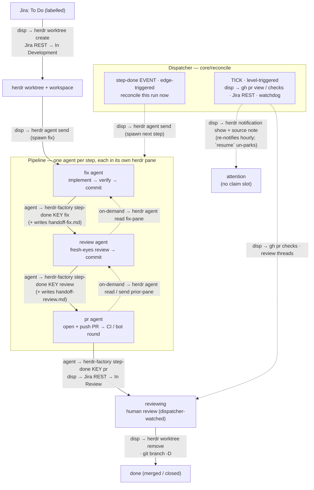

# herdr-factory — Architecture

> **⚠️ Belt redesign (current model — read this first).** The pipeline is no longer a fixed
> per-source `fix → review → pr`. Config now has two top-level lists: **`work_sources`** (backends:
> *where* work is pulled — `jira` / `local_markdown`, with no pipeline) and **`belt`** (*what* to do
> with it). A **belt** pairs a source with an ordered pipeline and has a `belt_type`:
> - **`work_to_pull_request`** — the engine-owned `fix → review → pr` flow + the PR-watch/merge
>   lifecycle (`reviewing` phase, resolver). This is exactly the pipeline the sections below
>   describe; it now lives on a belt and is gated by belt selection.
> - **`custom`** — user-defined ordered `steps[]`, each with its own `prompt_file`, fully
>   agent-driven: the run ends when the **last** step signals `step-done` (no PR, no `reviewing`).
>
> The `agents.{fix,review,pr}` block + `workspace_name` + `priority` moved **off the source and
> onto the belt**. Belt selection is programmatic: at claim time belts are walked in `priority`
> order and the first whose `match` predicate (a `.ts` default export `(ctx)=>boolean`) accepts an
> item claims it (first match wins; no `match` ⇒ accept all). A run records its `belt` + active
> `step` columns. Phases collapsed to `claiming | running | waiting_for_human | reviewing |
> tearing_down | done | attention` (the active step is on `run.step`; `waiting_for_human` is the
> ask-human park); `StepName` is now `string`; `prompt_type` is gone.
> Prompt model: a `work_to_pull_request` step uses the engine-shipped prompt, optionally **augmented**
> by an `agents.<step>.prompt_file`; a `custom` step's body is its (required) `prompt_file`. Each
> `prompt_file` has a `prompt_file_source` — `config` (the repo's config folder, read at load) or
> `repo` (the target repo checkout, read from the run's worktree at render time) — and every step
> gets an injected handover scaffold. Outcomes gained `completed` and WorkState
> gained `done` for custom-belt terminals. Migration v7 adds `runs.belt`/`runs.step` and widens the
> `work_items.status` CHECK. **Where the prose below says "per source pipeline / `agents` /
> `prompt_type` / fix→review→pr is universal," read it as the `work_to_pull_request` belt** — the
> mechanics (worktree, per-step gate, handoff, PR watch) are unchanged; only their configuration
> home and selection moved. The README reflects the new model end-to-end.

> **Reliability & scale layer (most recent pass).** A six-part hardening for the 50–100
> active-run regime, described inline throughout: **(1)** hard timeouts on every external call +
> a wedged-tick watchdog (`/health` reports per-repo `lastTickAt`/`tickStale`; `ensure-up`
> restarts on staleness — §5, §12); **(2)** herdr-unreachable ≠ pane-dead, with two-strike absence
> confirmation before any respawn (§5, §8); **(3)** a **transition outbox** — source status
> write-backs are persisted intents retried until delivered, with a claim guard against
> known-stale eligibility (§6, §7); **(4)** an **attention workflow** — `resume` un-parks runs,
> parked runs stop holding claim slots, escalations write back to the work source and re-notify
> (§8, §11); **(5)** parallel Phase A + **per-run locks** + heartbeat-extended locks (§7, §12);
> **(6)** rate limiting — a Jira token bucket + Retry-After-honoring retries, one batched GitHub
> GraphQL query per tick for all watched PRs, human-reply poll backoff, and per-tick claim
> admission (§5, §7). Migrations v10–v13.

Autonomous work → PR factory that runs Claude worker agents across one or
more repos, on top of [herdr](https://herdr.dev) worktrees. A single idempotent
reconciler (`reconcileRepo`, looped by the resident **`serve`** daemon — one process
that ticks every configured repo and exposes a local HTTP API), pulls eligible work
from one or more **work sources** (a Jira board, a folder of markdown briefs, …) in
priority order, spins up one herdr worktree + Claude worker per item, watches the PR,
and tears the worktree down on merge/close. The server is kept alive by a **stateless
`ensure-up` supervisor** run on a schedule (one launchd job) — see [§12](#12-server--supervision).

**Work sources** are the pluggable front of the engine. Each repo configures an ordered,
priority-ranked list of them (`work_sources`); two types ship today — `jira` (poll a board;
status of record lives in Jira) and `local_markdown` (a folder of `*.md` files; lifecycle
tracked internally in SQLite). Everything downstream of "here is an eligible item" — the
worktree, the fix→review→pr pipeline, the watch — is source-agnostic. `workspace_name` and the
pipeline `agents` are configured **per source**; `repo` and `limits` are repo-global.

This document is the canonical design of the TypeScript implementation
(run directly by Node's built-in type stripping, no build step) backed by SQLite.

---

## 1. Principles

1. **herdr owns the terminal world; herdr-factory orchestrates it.** All
   workspace / worktree / tab / pane / layout / agent lifecycle is performed by
   the `herdr` CLI. herdr-factory never reimplements pane splitting, layout
   application, terminal multiplexing, raw `git worktree add`, or spawning
   `claude` as a bare child process. See [§4](#4-herdr-ownership-boundary).
2. **SQLite is the single source of truth for runtime state**, designed as the
   data contract for a future web UI — including a rich **event timeline**, not
   just current state. Config is never in SQLite.
3. **The reconciler is pure and testable.** It depends on injected interfaces
   (`Store`, `HerdrClient`, `WorkSource`, …, `now()`), so it runs against fakes
   and an in-memory DB in tests.
4. **Repo-specifics are decoupled into per-repo config**, not code. The engine
   is generic; onboarding a repo is pure data.
5. **Stop/restart safe.** State is on disk (SQLite); every action is idempotent;
   stopping the server never kills in-flight workers (they live in herdr). The DB —
   not the server — is the source of truth, so **the server is a coordinator, not a
   single point of failure**: every CLI command runs in-process when no server is up
   (see [§12](#12-server--supervision)), so a worker's `step-done` lands even mid-restart.

---

## 2. Stack

| Concern | Choice |
|---|---|
| Language / runtime | TypeScript on Node ≥24, run via **native type stripping** (no build step) |
| CLI | **commander** |
| State store | **node:sqlite** (`DatabaseSync` — Node built-in, synchronous; no native module) |
| Config | **`yaml`** + **`zod`** (parse + validate → types) |
| Subprocess (herdr/gh/git) | **`node:child_process`** `execFile` (arg arrays, no shell; **hard timeout on every call** — default 60s, kills the child) |
| Local API server | **Hono** on **`@hono/node-server`** (resident `serve`, 127.0.0.1); **`@hono/zod-openapi`** validates requests + generates the OpenAPI doc, **`@hono/swagger-ui`** at `/ui`; native **`fetch`** clients |
| HTTP (Jira REST) | **`clients/http.ts`** — an **Effect**-based pipeline over native `fetch`: interruption-wired timeouts, a shared token bucket, and `Schedule` retries (exponential + jitter) honoring `Retry-After` |
| Effects / concurrency | **`effect`** — the HTTP retry/rate-limit pipeline, bounded-concurrency Phase A (`Effect.forEach`), and the OpenTelemetry runtime (`@effect/opentelemetry`) |
| Tests | **vitest** (dev-only) |
| External CLIs | **herdr**, **gh**, **git** |

Runtime dep footprint: `commander`, `yaml`, `zod`, `hono` + `@hono/node-server` +
`@hono/zod-openapi` + `@hono/swagger-ui`, `effect` (+ the OpenTelemetry exporters and the AWS SDK
for evidence upload) — all pure-JS. SQLite is Node's built-in `node:sqlite` — no native module.
Everything else is Node built-ins or the external CLIs; the `.ts` sources run unbuilt via Node's
native type stripping (which is also why the code avoids TS **constructor parameter properties** —
strip-only mode rejects them at runtime even though `tsc` and vitest accept them).

---

## 3. Layered architecture

```
  launchd · StartInterval ──► ensure-up ──spawns / health-checks──► serve.ts (resident daemon)
  (one job: launchd.ts)                                               │  Hono API @127.0.0.1
                                                                      │  + per-repo tick loops
  herdr-factory <cmd> ──► cli/index.ts ──POST /repos/:repo/… (else in-process)─┤
  (--repo · dispatch · --json)        via server/client.ts             │
                            serve + cli both build/inject Deps (build-deps.ts)
                                                                      ▼
        ┌──────────────── core/ (PURE, testable) ────────────────┐
        │  reconcile · watch · step · branch · phases              │
        │  depends only on interfaces ↓↓↓                          │
        └───────┬───────────────────────────────┬─────────────────┘
                ▼                                 ▼
      ┌──── db/ store (SQLite) ─┐       ┌──── clients/ (thin glue) ───────┐
      │ runs · events · locks  │       │ HerdrClient  JiraClient          │
      │ repos · migrations     │       │ GitHubClient GitClient  exec()   │
      └────────────────────────┘       └───────────┬──────────────────────┘
                                                    ▼
                                       herdr · gh · git · fetch(Jira REST)
```

**Dependency rule:** `core` imports *interfaces*; `cli` **and** `server` construct the concrete
implementations (via `build-deps.ts`) and inject them. The CLI routes mutating commands to a
running `server` and falls back to the same in-process path when none is up (`server/client.ts`).
Tests substitute fakes + `:memory:` SQLite.

### Repo layout

```
herdr-factory/
  package.json  tsconfig.json  README.md  docs/ARCHITECTURE.md
  bin/herdr-factory          cwd-robust launcher → `node src/cli/index.ts` (resolves its own dir through
                          symlinks; runs Node >= 24 — active, else the baked node-path; symlinked into ~/.local/bin)
  .node-version              pins node 24 for this package (read by nvm/fnm/asdf/mise)
  src/
    cli/index.ts          commander program; routes via server (else in-process), dispatches
    build-deps.ts         buildDeps(repo) — shared by the server + every command's local path
    resolve.ts            pure resolveSourceName / resolveActiveRun (throw, not exit; CLI+server)
    config.ts             env + repos/<name>/config.yml → zod → typed Config (work_sources[]);
                          listConfiguredRepos + server path/port helpers
    types.ts              shared domain types (incl. WorkState, WorkItem)
    version.ts            VERSION = package version + git HEAD sha (a new commit changes it, so
                          ensure-up restarts an outdated serve — stamped into /health + server.json)
    server/
      serve.ts            resident `serve`: multi-repo tick loops + binds Hono via @hono/node-server
      app.ts              OpenAPIHono: routes → handlers, OpenAPI doc (/doc) + Swagger UI (/ui)
      schemas.ts          zod request/response schemas + createRoute defs (validation + the doc)
      client.ts           CLI side: readServerInfo / pingHealth / serverFetch / viaServerOrLocal
    watchers/
      launchd.ts          one supervisor job (com.herdr-factory.server) running `ensure-up`
      supervisor.ts       stateless `ensure-up` / `stopServer` (health-check + detached serve spawn)
      updater.ts          selfUpdate: git fetch + hard-reset to upstream (HERDR_FACTORY_AUTO_UPDATE)
    db/{index,migrate,store,tx}.ts
    clients/{exec,http,herdr,jira,jira-source,local-markdown-source,github,git}.ts
    core/{deps,branch,step,watch,reconcile}.ts
    runtime/effect.ts        the shared Effect ManagedRuntime (also hosts the OTel layer)
    telemetry/…              OpenTelemetry spans/metrics (no-op unless HERDR_FACTORY_TELEMETRY)
    prompts/{fix,review,pr}.md + prompts/local_markdown/fix.md  (per-source-type built-ins)
  examples/example-repo/{config.yml, fix.md, review.md, pr.md, guidelines-prompt.md}
  test/                   vitest
```

Config/state live OUTSIDE any repo:
`~/.config/herdr-factory/{env, repos/<name>/{config.yml, guidelines-prompt.md}}` and
`~/.local/state/herdr-factory/{herdr-factory.db, <repo>/logs/}`.

---

## 4. herdr ownership boundary

This is a load-bearing principle, not an aside. herdr already implements
worktrees, workspaces, tabs, panes, layouts, and agent lifecycle — **we do not
rebuild any of it.** `HerdrClient` is a *thin typed wrapper*: every method shells
out to `herdr …` and parses its JSON; it contains zero terminal/worktree logic.

**herdr owns (via the CLI — never reimplemented):**

- worktree **create / open / remove** (incl. deleting the checkout dir + git
  worktree registration)
- workspace **close / get / list**
- tab **create / list**
- pane **split / run / send-text / send-keys / list / read**
- agent **start / list / status / send / focus / rename / read / wait**
- pane **list / current** (incl. the `focused` flag — which pane the user is viewing)
- desktop **notifications**

**The fix layout** (a tab/pane per pipeline agent) is applied by the external
**workspace-manager herdr plugin** on `worktree.created`. herdr-factory does **not** apply
layouts — it relies on the plugin and simply *targets* the resulting panes: one per
agent, from `agents.{fix,review,pr}.tab` / `.pane` in config. herdr-factory **waits** for a
targeted pane to come up (escalating to `attention` after `layout_wait_seconds`) and only
spawns a pane itself for steps that have **no** tab/pane configured (see [§8](#8-step-agent-model)).

**herdr-factory performs git/filesystem ops ONLY for things outside herdr's model:**

- `git branch -D <branch>` on teardown — the one remnant herdr leaves (herdr
  models worktrees, not branches)
- read/maintenance git: `show-ref`, `remote get-url`, `rev-parse HEAD` (the worker
  heartbeat), defensive `worktree prune`
- everything non-terminal: Jira REST, GitHub via `gh`, SQLite, config, the
  reconciler logic

If a future need looks like "manage a pane/tab/worktree/agent," it belongs in
`HerdrClient` as another CLI call — not as reimplemented logic.

---

## 5. Clients

Thin, typed wrappers. Types encode the real `herdr --json` shapes
reverse-engineered during the bash prototype.

- **`exec.ts`** — `run(cmd,args,{cwd,allowFail,timeoutMs})`, `runJson<T>()` over
  `execFile` (promisified; arg arrays → no shell injection). **Every subprocess is time-bounded**
  (default 60s; herdr worktree ops pass 180s) via execFile's native `timeout` — which actually
  kills the child, unlike a promise race. A timeout throws `ExecTimeoutError` **even under
  `allowFail`**: `allowFail` means "a non-zero exit is expected data"; a timeout is
  infrastructure failure the caller must see. This is the load-bearing guarantee that a hung
  `herdr`/`gh`/`git` can never wedge the tick loop.
- **`http.ts`** — the Effect-based outbound HTTP pipeline for backend clients (Jira today).
  Per-attempt timeouts are interruption-wired (`Effect.tryPromise`'s AbortSignal fires on fiber
  interruption, so `Effect.timeout` genuinely cancels the in-flight fetch); non-2xx becomes a
  typed `HttpStatusError` carrying status + parsed `Retry-After`. `httpWithPolicy` layers a
  shared **`TokenBucket`** (take a token per attempt) and an Effect `Schedule` retry —
  exponential + jitter for 429/5xx/timeout/network, honoring a server-sent `Retry-After`
  (capped 60s) before the schedule's own delay; 4xx fails fast.
- **`herdr.ts`** —
  - `worktreeCreateOrOpen(repoCwd, branch, baseRef) → {workspaceId, worktreePath, paneId}`
    (parses `.result.workspace.workspace_id` / `.worktree.checkout_path` /
    `.result.root_pane.pane_id`; **only from the main checkout** — herdr refuses
    linked worktrees)
  - `worktreeRemove(workspaceId)` — removes workspace + dir + git registration
  - `agents() → Agent[]` (`.result.agents`; status field is `agent_status` ∈
    `idle|working|done|blocked|unknown`). **Throws `HerdrUnreachableError`** when herdr can't be
    queried — an empty list is a real "no agents", never a masked failure (masking is what used
    to make one herdr hiccup look like mass pane death → duplicate-agent respawns). The result is
    **memoized ~5s** (one `herdr agent list` answers a whole tick's liveness questions instead of
    O(active runs) subprocess spawns); `paneAlive`/`paneState` accept `{fresh:true}` to bypass
    the memo, and `agentStart` invalidates it.
  - `agentStart({workspaceId, cwd, argv}) → paneId` where
    **`argv = ["claude", ...flags, prompt]`** (first token is the executable)
  - `paneByLabel(ws, tabLabel, paneLabel)`, `paneAlive(pane)` (any agent present),
    `paneRun(pane, cmd)`, `agentSend(pane, text)`, `paneSendKeys(pane, "Enter")`,
    `agentRename(pane, "<step>:KEY")`, `notify(title, body)`
  - `agentFocus(pane)` (bring a pane + its tab to the front) and `focusedPane() →
    {paneId, workspaceId, tabId, label}` (the one globally-focused pane, from `pane list`'s
    `focused` flag — herdr exposes no focus-change event to subscribe to, so it's polled)
- **Work sources** — the polymorphic front of the engine. The core depends only on the
  `WorkSource` interface (in `core/deps.ts`) and the canonical `WorkState` lifecycle
  (`todo → in_development → in_review → merged|aborted`):
  - `listEligible() → Ticket[]` (todo items, in claim order)
  - `describe(key) → Ticket` (metadata for the manual `claim`)
  - `transition(key, WorkState) → boolean` (maps the canonical state onto the backend; returns
    false — a no-op — when already there or the state is unmapped for this source, **with no
    network call** for an unmapped state). Callers never invoke this fire-and-forget anymore —
    the reconciler routes every transition through the **outbox** (§7), which retries failures.
  - `materialize(key, memDir, log)` (write the work doc + any media; idempotent, best-effort)
  - `postNote(key, note)` (source-native operator-facing note — a Jira comment / local marker
    file; used when a run parks for `attention`)
  - `askHuman(input)` / `pollHumanReply(input)` (the ask-human park: post a source-native
    question, poll for the reply — polls back off 60s→5min per question)
  - `health()` (throws if misconfigured/unreachable — the `doctor` per-source check)
  A `SourceRuntime` bundles a source's config identity (`name`/`type`/`priority`/`workspaceName`/
  `agents`) with its live `client`. `Deps.sources` is the priority-ordered list; `resolveSource`
  maps a run's `work_source` back to its runtime.
- **`jira.ts`** (basic auth over `clients/http.ts`) — the low-level Jira REST client:
  `listEligible()` via the Agile board endpoint `/rest/agile/1.0/board/<id>/issue?jql=…`;
  `getIssue`, `currentStatus`, `transition(key, statusName)` (case-insensitive `.to.name` match,
  no-op if already there), `downloadAttachments` (image/* and video/*, count + per-type size
  capped). **All calls share one `TokenBucket` (5 req/s sustained, burst 10)** and the
  Retry-After-honoring retry policy, with hard timeouts (30s JSON, 120s media). Writes (comment /
  transition POST) retry at most once: a 429 was definitively not processed; a lost 5xx write may
  have landed, and a rare duplicate comment beats a retry storm of writes. **`jira-source.ts`**
  adapts it to `WorkSource`: it holds the configured status map and maps canonical→Jira status —
  `merged`/`aborted` are **unmapped** (Jira's terminal state is owned by its GitHub integration),
  so `transition` short-circuits to a no-op **before any network call** and teardown stays
  Jira-silent. `materialize` writes `ticket.json` + attachments.
- **`local-markdown-source.ts`** — a folder of work items (top-level only; dot-prefixed and
  `__`-prefixed names skipped — `__` marks work still being prepared). Each item is a single `*.md` file **or** a top-level subdirectory holding ≥1 top-level
  `*.md` (only that level is checked; a `<key>.md` file wins a collision with a `<key>/` dir).
  herdr-factory owns the status of record in the `work_items` table (the source is never modified).
  Key = filename stem / dir name; title/type from optional YAML front-matter, else the first H1 /
  humanized name and `"task"` (a directory seeds these from its primary md — `README.md` if present,
  else the first `*.md`). `listEligible` returns items whose `work_items.status` is absent/`todo`
  AND have no active run (a backstop over the run-table dedup); `transition` upserts
  `work_items.status`; `materialize` snapshots a file to `task.md` or copies a directory whole to
  `task/`; `health` stats the folder.
- **`github.ts`** (`gh` via execFile) — `prForBranch(repo, branch)` (first-sighting discovery
  only), `prByNumber(repo, n)` (the durable identity once adopted — survives head-branch deletion
  on merge), `reviewSignature(repo, n) → {unresolved, failing, sig}` (graphql review threads +
  `statusCheckRollup`), and **`prSnapshots(repo, numbers[]) → Map<number, PrSnapshot>`** — one
  aliased GraphQL query (chunked at 25) resolving state + review threads + check rollup for
  **every watched PR in a tick**, replacing 3 `gh` subprocess calls per reviewing run per tick
  (~9k req/h at 50 runs — over the REST budget on its own). Its signature hash is bit-identical
  to `reviewSignature`'s, so batched and per-run polling mix freely.
- **`git.ts`** — `branchExists`, `branchDelete`, `originUrl`, `worktreePrune`,
  `headSha` (the worker progress heartbeat).

---

## 6. State — SQLite (node:sqlite)

One global DB `~/.local/state/herdr-factory/herdr-factory.db`, via Node's built-in `node:sqlite`
(`DatabaseSync` — synchronous, no native module; still flagged *experimental*, which the pinned
Node ≥24 keeps stable for us). `db/index.ts` sets `PRAGMA journal_mode=WAL; PRAGMA busy_timeout=5000;`
then runs migrations (`schema_version` + ordered SQL). `node:sqlite` has no `.transaction()` /
`.pragma()` helper (unlike better-sqlite3), so a small `db/tx.ts` wraps `BEGIN IMMEDIATE`/`COMMIT`/
`ROLLBACK` (used by migrations and `acquireLock`) and PRAGMAs run via `exec`. Per-repo ticks write
concurrently to the one DB; WAL + busy_timeout + the per-repo single-instance lock keep that safe.

```sql
CREATE TABLE repos(name TEXT PRIMARY KEY, repo_path TEXT, base_ref TEXT, github TEXT,
  last_tick_at INTEGER, enabled INTEGER DEFAULT 1);

CREATE TABLE runs(                       -- ONE attempt at a work item (history kept)
  id INTEGER PRIMARY KEY AUTOINCREMENT, repo TEXT NOT NULL,
  work_source TEXT,                      -- which configured source it was claimed from (v6)
  belt TEXT, step TEXT,                  -- which belt processes it + the active step (v7)
  ticket_key TEXT NOT NULL,
  summary TEXT, issue_type TEXT, branch TEXT, phase TEXT NOT NULL,
  workspace_id TEXT, pane_id TEXT, worktree_path TEXT, pr_number INTEGER,
  watch_deadline INTEGER, last_thread_sig TEXT,
  focus_pending INTEGER NOT NULL DEFAULT 0, -- active step changed; focus shift deferred (v5)
  -- worker_done/review_done/review_pane/progress_* (migrations v2-v3) are superseded
  -- by run_steps and left in place for history only.
  attention_reason TEXT,
  attention_notified_at INTEGER,         -- last operator notification for a parked run (v12)
  outcome TEXT,                          -- merged|closed|abandoned|timeout|completed|NULL
  created_at INTEGER, updated_at INTEGER, ended_at INTEGER);
CREATE INDEX idx_runs_active ON runs(repo) WHERE ended_at IS NULL;

CREATE TABLE run_steps(                  -- one row per pipeline agent (migration v4)
  id INTEGER PRIMARY KEY AUTOINCREMENT, run_id INTEGER NOT NULL,
  step TEXT NOT NULL,                    -- belt step name (fix/evidence/review/pr for w2pr)
  pane_id TEXT, session_id TEXT,         -- on-demand cross-agent query handles
  progress_sig TEXT, progress_at INTEGER,   -- per-step commit heartbeat
  done INTEGER NOT NULL DEFAULT 0, started_at INTEGER, done_at INTEGER,
  bounces INTEGER NOT NULL DEFAULT 0,    -- times a later step sent work back here (v9)
  absent_at INTEGER);                    -- pane first CONFIRMED absent; two-strike respawn (v10)
CREATE INDEX idx_run_steps ON run_steps(run_id, step);

CREATE TABLE events(                     -- the timeline (web-UI gold)
  id INTEGER PRIMARY KEY AUTOINCREMENT, run_id INTEGER, repo TEXT, ticket_key TEXT,
  ts INTEGER NOT NULL, type TEXT NOT NULL, detail TEXT);  -- detail = JSON
CREATE INDEX idx_events_run ON events(run_id, ts);

CREATE TABLE work_items(                 -- internal lifecycle ledger for sources with no
  id INTEGER PRIMARY KEY AUTOINCREMENT,  -- external status of record (local_markdown). (v6)
  repo TEXT NOT NULL, source TEXT NOT NULL, key TEXT NOT NULL,
  title TEXT, item_type TEXT, path TEXT,
  status TEXT NOT NULL CHECK (status IN                    -- 'done' added v7 (custom terminal)
    ('todo','in_development','in_review','merged','aborted','done')),
  created_at INTEGER NOT NULL, updated_at INTEGER NOT NULL, UNIQUE(repo, source, key));
CREATE INDEX idx_work_items ON work_items(repo, source, status);

CREATE TABLE human_questions(            -- ask-human park: one pending question per run (v8)
  id INTEGER PRIMARY KEY AUTOINCREMENT, run_id INTEGER NOT NULL REFERENCES runs(id),
  repo TEXT NOT NULL, work_source TEXT NOT NULL, ticket_key TEXT NOT NULL, step TEXT,
  question TEXT NOT NULL, status TEXT NOT NULL CHECK (status IN ('pending','answered')),
  external_id TEXT, external_created_at TEXT,              -- the source-native object (Jira comment)
  answer TEXT, answer_external_id TEXT, answer_author TEXT,
  poll_attempts INTEGER NOT NULL DEFAULT 0,                -- misses drive the poll backoff (v13)
  next_poll_at INTEGER NOT NULL DEFAULT 0,                 -- 60s doubling, 5min cap (v13)
  created_at INTEGER NOT NULL, updated_at INTEGER NOT NULL, answered_at INTEGER);
CREATE UNIQUE INDEX idx_human_questions_one_pending_run ON human_questions(run_id) WHERE status='pending';

CREATE TABLE transition_outbox(          -- source status write-backs as persisted INTENTS (v11)
  id INTEGER PRIMARY KEY AUTOINCREMENT, run_id INTEGER NOT NULL REFERENCES runs(id),
  repo TEXT NOT NULL, work_source TEXT NOT NULL, ticket_key TEXT NOT NULL,
  to_state TEXT NOT NULL CHECK (to_state IN ('todo','in_development','in_review','merged','aborted','done')),
  attempts INTEGER NOT NULL DEFAULT 0, next_attempt_at INTEGER NOT NULL,  -- exponential backoff
  last_error TEXT, created_at INTEGER NOT NULL, updated_at INTEGER NOT NULL,
  delivered_at INTEGER,                  -- set once the source confirms (or reports a no-op)
  UNIQUE(run_id, to_state));             -- enqueue is idempotent across retried ticks

CREATE TABLE locks(name TEXT PRIMARY KEY, owner TEXT, acquired_at INTEGER, expires_at INTEGER);
CREATE TABLE schema_version(version INTEGER);
```

`db/store.ts` (synchronous): `countActive(repo)` / `countOccupying(repo)` (active minus parked —
what the claim cap counts), `activeRuns(repo)`, `activeRunForTicket(repo,source,key)` (the
Phase-B dedup, **source-scoped** so two sources can carry the same key), `activeRunsForKey(repo,key)`
(key-only, across sources — for the manual CLI; the caller errors on >1 match),
`createRun({…,workSource,belt})`, `updateRun(id,patch)`, `endRun(id,outcome)`, `recordEvent(…)`,
locks: `acquireLock/extendLock/releaseLock` (extend = the heartbeat; owner-checked),
`upsertRepo`, `touchTick`/`lastTickAt` (the wedged-tick watchdog signal), the run-step rows
(`getRunStep`/`upsertRunStep`/`markStepDone`/`bumpBounces`), the transition outbox
(`enqueueTransition`, `dueTransitions`, `undeliveredTransitionBefore` — in-order-per-run guard,
`markTransitionDelivered`, `recordTransitionAttempt` — 60s-doubling backoff capped 1h,
`pendingTransitionForKey` — the claim guard), the human questions
(`createHumanQuestion`/`pendingHumanQuestionForRun`/`answerHumanQuestion`/`recordHumanPollMiss`),
and the `work_items` ledger: `getWorkItem`, `listWorkItems(repo,source,status?)`,
`setWorkItemStatus(repo,source,key,status,meta?)` (idempotent, tolerant any→any, returns false
if already there).

**Migration v6** adds `runs.work_source` (nullable — an unresolvable source must surface loudly,
not be masked by a default) and backfills existing rows to `'jira'` in the same transaction, then
creates `work_items`. Because the only pre-existing source was Jira, in-flight runs survive the
upgrade **iff the configured Jira source keeps the default name `jira`** (see §10/§14). `runs`
stays the dedup source of truth; `work_items.status` is the best-effort lifecycle label that gates
which markdown files are eligible.

**Active = `ended_at IS NULL`; the concurrency cap counts `countOccupying`** — active runs whose
phase is NOT `attention`/`waiting_for_human`. Parked runs keep `ended_at` NULL (they hold their
worktree, stay deduped, and still poll for a PR merge) but **no longer hold a claim slot**: a
pile of runs waiting on humans must not starve the belt of new claims. History is never deleted
(we set `ended_at`), so the web UI can show attempts, outcomes, and durations.

**event types:** `claimed · transition · worktree_created · step_spawned · step_done · bounced ·
human_question · human_reply · focus_applied · pr_opened · resolver_woken · merged · closed ·
torn_down · attention · resumed · error`
(plus legacy `worker_*` / `review_*` kept for old-run history).

---

## 7. The reconciler — multi-agent pipeline

`core/reconcile.ts` → `reconcileRepo(deps)`: **Phase 0** flushes the **transition outbox** —
every due, undelivered source status write-back is retried (in per-run id order, stopping a
run's chain at its first failure), so write-backs converge even at capacity and for
already-ended runs. **Phase A** advances every active run one idempotent step, **in parallel
with bounded concurrency** (`limits.reconcile_concurrency`, default 8, via `Effect.forEach` —
most of a run's reconcile is subprocess/network wait, so pass wall-clock stays roughly flat as
the active-run count grows). Each run is reconciled **under its own `run:<id>` lock**; a run
currently held by an event nudge is simply skipped this pass. Before the pass, one **batched
GitHub GraphQL query** fetches state + review signature for every watched PR
(reviewing/attention) into a per-tick `TickCtx` — per-run `gh` polling remains only as the
fallback (nudge callers, batch failure). Run resolution is unchanged: each run's
`work_source`/`belt` resolve once at the top of `reconcileRun` (a run whose source/belt was
removed escalates to `attention`; a `tearing_down` run still finishes local cleanup).
**Phase B** walks belts in **priority order** and claims eligible work up to the cap — which
counts **working** runs only (`countOccupying`; parked runs hold no slot) and admits at most
`limits.max_claims_per_tick` (default 10) new claims per pass, smoothing a big-backlog cold
start (each claim ≈ a worktree checkout + ~5 source calls) over successive ticks. An item with
an **undelivered status write-back is skipped** — its "eligible" listing is known-stale (this is
what prevents a merged run whose transition never landed from being claimed and re-done). One
source's backend hiccup is caught per-source and never starves the others. Per-run errors are
caught → recorded as an `error` event → the tick continues; the per-repo tick lock prevents
overlapping passes. Each claim stamps `run.work_source`/`run.belt` and renders the branch from
the belt's `workspace_name`. Status transitions (`in_development` on claim, `in_review` when the
PR opens, terminal at teardown) are **enqueued as outbox intents and attempted immediately** —
the healthy path is unchanged (status moves the same tick), but a failure is retried with
exponential backoff (60s doubling, 1h cap) until the source confirms, instead of the old
logged-then-dropped "deferred".

### The pipeline

A ticket flows through a sequence of **single-responsibility agents**, each a separate
herdr agent in its own tab/pane, dispatched and gated by the reconciler:

| Phase | Agent | Does | Hands off |
|---|---|---|---|
| `fixing` | **fix** | read ticket + images → implement → lint/type/tests → commit | `handoff-fix.md` + `step-done fix` |
| `auto_review` | **review** | fresh-eyes review of the diff → make changes → commit | `handoff-review.md` + `step-done review` |
| `pr_round` | **pr** | open + push the PR → drive the automated round (CI green + bot comments) | `step-done pr` → human review |

The agents come from the run's source's `agents.{fix,review,pr}` config (each
`{tab?, pane?, prompt_type, prompt_file?}` — **per source**, read off the resolved
`SourceRuntime`); `core/step.ts` holds the ordered `STEPS` descriptors that sequence them and a
generic `reconcileStep` gates each. After `pr_round`, the run enters
the `reviewing` human-review watch (unchanged: watches the PR, wakes a resolver).



Every edge is labelled with the command(s) that propagate state across it, by actor:

- **`agent →`** — run by the step agent in its pane. The single `herdr-factory step-done
  KEY <step>` call is *all* an agent issues to advance the pipeline (it also writes its
  handoff note first); the dispatcher does everything else.
- **`disp →`** — run by the dispatcher (`core/reconcile`) over the herdr socket
  (`herdr worktree …`, `herdr agent send`, `herdr notification show`), `gh`, and `git`,
  plus Jira REST for the status transitions (not a CLI).
- **`on-demand →`** — optional cross-agent context pulls a later agent may make.

Solid edges are the deterministic forward flow; dashed edges are orchestration + queries.

### Handoff between steps

A step never inherits the prior step's chat context — that would bloat tokens and,
for `review`, destroy the fresh-eyes value. Context crosses a boundary two ways:

- **Structured handoff doc (default).** The outgoing agent writes
  `.memory/herdr-factory/handoff-<step>.md`: what it did, key decisions and *why*,
  what's uncertain, what the next step should verify. Deliberately lossy — keeps the
  signal, drops the transcript noise. This is the next agent's primary input.
- **On-demand pointer to the prior session.** The dispatcher hands the next agent the
  prior step's **pane id + session id** (herdr exposes `agent_session.value` per pane via
  `agent list`; captured into `run_steps.session_id`). When the doc isn't enough, the next
  agent escalates cheapest-first — see [§8](#8-step-agent-model).

The git worktree is the shared medium: commits flow forward automatically; the
handoff doc + session pointer carry the *intent* the commits don't.

### Orchestration — hybrid tick + event

A single global poll fits a many-handoff pipeline poorly: internal handoffs need no
polling (the dispatcher has everything the instant a step signals), so folding N of
them into a 60 s tick injects N× latency for nothing. The target splits transitions
by what they actually need:

- **Tick (level-triggered) — robustness backbone.** External-state polling
  (PR / CI / Jira — no cheap event source locally), per-step watchdogs / timeouts /
  liveness, and the self-healing reconcile pass that re-derives truth and catches a
  dropped signal. *More* valuable here than before: more steps = more signals = more
  chances to miss one.
- **Event nudge (edge-triggered) — latency.** A `step-done <step>` signal triggers an
  immediate reconcile of that run, dispatching the next agent without waiting a tick.
  The tick stays the backstop if a nudge is lost. Nudges serialize on the **per-run lock**
  (`run:<id>`), not the repo-wide tick lock — so they land immediately even while a long tick is
  mid-pass, only contending with work on their own run (in which case the flag is already down
  and the pass advances it anyway). The non-monotonic nudges — `bounce` (rewinds `run.step` +
  re-dispatches), `ask-human` (flips the phase), `resume` (un-parks) — use the waiting variant
  (`withRunLockWaiting`, ~15s bounded) because dropping them on contention isn't acceptable and
  a concurrent reconcile from a stale snapshot would fight the mutation.

### How it's wired

- **State (§6):** a run tracks a *sequence* of panes (earlier ones stay alive for
  querying) in `run_steps`, not a single `pane_id`. `run.pane_id` is kept pointed at the
  *latest* step's pane (the `reviewing` resolver reuses it). Teardown (herdr `worktree
  remove`) reaps all of a run's panes at once.
- **Liveness:** the commit-HEAD heartbeat applies to `fix` / `pr` (they commit) but not
  `review` (`STEPS[].heartbeat`); each step also has its own budget
  (`develop_/review_/pr_budget_seconds`).
- **Coordination:** on-demand `agent read` / `agent send` is agent-to-agent traffic
  *outside* the tick, so the dispatcher is no longer the sole coordinator and the DB
  timeline no longer captures every inter-agent interaction.
- **Focus follows the active step.** `spawnStep` sets `run.focus_pending` instead of focusing
  a pane outright. On every reconcile pass `applyPendingFocus` brings the active step's pane to
  the front **only if** the user is currently viewing *this* worktree (the globally-focused
  pane — from `herdr pane list` — is in this run's workspace) **and** is on one of its pipeline
  panes, then clears the flag. Otherwise the shift is deferred and retried on later ticks, so a
  transition in an unfocused worktree is applied when the user navigates to it — never stealing
  focus from another worktree, never yanking the user off an unrelated (editor/scratch) pane.
  herdr has no focus-change event, so the focused pane is polled — but only when a focus is
  actually pending (the common case reads one boolean and stops). A single tick handles this
  (no second timer): the same-worktree transition focuses within the tick that advanced it;
  only the deferred case waits a tick.

### Trade-offs (why this isn't an obvious win)

- **Lossy handoffs + feedback loops.** CI failures and review comments loop *back* to
  code-fixing, so a clean linear `fix → review → pr` relay fights the work's real,
  iterative shape; on-demand query softens the lossy part, the loops remain.
- **Cost & accountability.** ~3 panes / sessions per ticket vs. 1; no single agent
  owns the outcome end-to-end (diffusion of responsibility).
- **Why keep the dispatcher in charge anyway:** the `pr` step does *not* re-implement
  CI watching as an idle LLM — the **tick** still owns external watching
  (deterministic, cheap). Separation is reserved for steps with genuine fresh-eyes /
  specialization value (review), not "one agent per verb."

---

## 8. Step-agent model

Each step is a Claude agent (`core/step.ts`) dispatched **by the reconciler, never by
another agent**, through the shared `dispatchToLayout(tab, pane, prompt, …)` helper. Per
step (`spawnStep`):

1. **Dispatch** — two modes, by whether the step has a configured `tab`/`pane` (`src.agents.<step>`):
   - **Configured** (the user's layout owns the pane): find that pane and require an agent
     that is present **and idle** (agent-agnostic — claude *or* opencode), then `agent send`
     the prompt + Enter. If the pane isn't up yet or its agent is still busy starting up,
     `spawnStep` returns `waiting` — the run stays in its phase and retries on later ticks
     (the wait is bounded by `layout_wait_seconds`, measured from the `run_steps` row's
     `started_at`; on timeout the reconciler escalates to `attention`). It **never** spawns
     its own pane when a tab/pane is configured — so the user's auto-spawned layout (setup
     commands, dev servers, agent startup) can settle before work begins.
   - **Not configured** (no tab/pane): `agent start` a dedicated claude pane — the only path
     that creates a pane.
   On dispatch: rename `<step>:<KEY>`; record the pane on the `run_steps` row (and as
   `run.pane_id`, the latest active pane) and reset `started_at` (now the per-step budget
   clock); set `run.focus_pending` so the worktree view can follow the active step (§7,
   *Focus follows the active step* — applied later, never stealing focus from another worktree).
2. **Prompt** — config load resolves each step's prompt by `prompt_type`: `augment` =
   the engine's built-in step prompt + the repo's `prompt_file` (if any) as additions; `replace`
   = the `prompt_file` verbatim. The built-in is resolved **per source type**:
   `src/prompts/<type>/<step>.md` if present, else the shared `src/prompts/<step>.md` (so
   `local_markdown` gets its own `fix` prompt pointing at `task.md` / `task/`, while review/pr share
   the defaults). `renderStepPrompt` then substitutes tokens (`@@KEY@@`, `@@WORK_DOC@@` —
   `ticket.json` for Jira; `task.md` (file) or `task/` (directory) for local_markdown, detected from
   what `materialize` wrote into the worktree — `@@WORK_DOC_KIND@@`, `@@HANDOFF_IN@@`, `@@PRIOR_PANE@@`,
   `@@STEP_DONE_CMD@@` — which carries `--source` so the signal resolves unambiguously, …) into
   that resolved prompt, appends `guidelines-prompt.md`, and appends a standard footer that points
   the agent at its inputs and tells it to write its handoff note + signal `step-done`. The rendered prompt is written to
   `.memory/herdr-factory/prompt-<step>.md`; the agent is told to read it.
3. **Handoff out** — before signalling, the agent writes
   `.memory/herdr-factory/handoff-<step>.md` (did / why / uncertain / verify-next).
4. **Signal** — `herdr-factory --repo <name> step-done <KEY> <step>` sets the step's `done`
   flag + records a `step_done` event, then **event-nudges**: it grabs that run's `run:<id>`
   lock and reconciles the run immediately (dispatching the next agent) — landing even while a
   long tick is mid-pass on other runs. If this run itself is being reconciled right now, the
   flag is already durable and that pass (or the next) advances it.

### On-demand context — the handoff+query protocol

The next agent defaults to the handoff doc and escalates only when it's insufficient,
cheapest-first, using herdr's agent-awareness:

| Need | Mechanism | Cost / caveat |
|---|---|---|
| factual detail ("what did you try for X?") | `herdr agent read <prior-pane> --source recent`, or read the session transcript by its id | cheap; works even if the prior agent has exited |
| intent ("*why* not handle Y?") | `agent send <prior-pane> "<q>"` → `agent wait --status idle` → `agent read` | needs the prior agent still alive; slow; prone to post-hoc confabulation |

The example prompts tune this per step: **review** leans on the handoff note + session id
for *factual* lookups only (to protect its independence); **pr** queries more freely since
it must describe and defend work it didn't do. Prior agents stay alive until run teardown,
so live Q&A is available — at the cost of up to 3 panes/sessions per run.

### Per-step liveness

The tick's watchdog (`reconcileStep`) gates each step on `step-done`, with safety nets:
the commit-HEAD **stall** heartbeat (`fix` / `pr` only — `review` may not commit) and a
per-step **budget** (`develop_/review_/pr_budget_seconds`). Past the budget while the
agent isn't actively `working`, or stalled past `stall_seconds`, the run → `attention`.

**Liveness never acts on uncertainty.** herdr being unreachable (`HerdrUnreachableError`) defers
both the watchdog and the dead-pane check to a later tick — a false "worker: gone" must not park
a healthy run, and a false "pane dead" is worse: the respawn would put a **duplicate agent** into
a worktree whose original agent is still working (and the load respawning adds peaks exactly when
the machine is already struggling). A respawn therefore requires the absence to be **confirmed**:
a fresh (unmemoized) re-read of the agent list, then a **second confirmed absence ≥45s after the
first** (`run_steps.absent_at`; a pane seen alive again clears the mark) — long enough to ride
out a herdr daemon restart, short enough that a genuinely dead pane restarts within ~a tick.

**Attention is a workflow, not a dead end.** On escalation, `escalateAttention` flips the phase,
records the event, fires a notification, **relabels the run's active pane** to `⚠ ATTENTION
<KEY>` (herdr's `agent_status` is owned by the agent's own lifecycle hook and can't be set
externally, so the label is the persistent cue), and **posts the reason to the work source**
(`postNote` — a Jira comment / local note, including the ready-made resume command). While
parked, the run **re-notifies every `attention_renotify_seconds`** (default 1h) and — for a
w2pr belt with a PR — keeps polling for a merge (which still tears it down). The operator
un-parks it with **`herdr-factory --repo <name> resume <KEY>`**: back to its active step (budget/
heartbeat/absence clocks reset — the stale clocks are usually why it parked), to the PR watch
(fresh deadline, cleared thread signature), or to `claiming`, and it reconciles on the same pass.
Parked runs hold **no claim slot** (§6). Teardown remains the abandon path.

The capture lock stays **machine-global** (one dev-server / browser across all
repos), acquired with a TTL via the CLI.

---

## 9. Teardown

herdr-first, but **verify-and-fall-back** — because `herdr worktree remove` can
deregister the git worktree and then error before closing the workspace (it exits 0
with an error body, and once the git worktree is gone the command can't recover),
which silently leaks the workspace + checkout dir. So:

```
1. herdr worktree remove --workspace <id> --force   → workspace + dir + git registration (primary)
2. if workspaceExists(<id>) still true → herdr workspace close <id>   → close panes + workspace
3. rmrf <worktreePath> (guarded: never the main checkout)             → clear any orphaned dir
4. git worktree prune                                                → drop the stale registration
5. git branch -D <branch>                                            → safe now (worktree deregistered)
```

The fallbacks (steps 2–4) are no longer "defensive-only" — teardown actively verifies
the workspace is gone and closes it directly if not, then clears the dir, so a partial
`worktree remove` self-heals instead of leaking. Deleting the local branch (step 5, after
the worktree is deregistered so it isn't "checked out") lets a re-claim of the same ticket
start fresh off the base ref. The remote/PR branch is GitHub's domain (merge auto-delete or
left as-is).

The terminal status write-back (`merged`/`aborted`/`done`) is **enqueued in the transition
outbox before cleanup** and attempted immediately — teardown never blocks on it, and a failed
write-back keeps retrying on later ticks *after the run has ended* (this, plus the Phase-B
claim guard on pending write-backs, is what stops a torn-down item whose status never moved
from being claimed again).

---

## 10. Config

- **Per-repo secrets** — `repos/<name>/env` (chmod 600): `JIRA_EMAIL`, `JIRA_API_TOKEN` — Jira
  **auth** only. Secrets are strictly per-repo; there is no shared/global secrets file. *Where*
  work is polled from (the Atlassian site `base_url`) is per-repo config, not a secret.
  (`loadSecrets(repoDir)` reads only `<repoDir>/env`.)
- **Per-repo** — `~/.config/herdr-factory/repos/<name>/`:
  - `config.yml` — parsed with `yaml`, validated with `zod` → typed `Config`:
    - `repo` — `path` / `base_ref` / `github` (repo-global). `path` (and any source path) supports
      `~` / `$HOME` expansion (`expandHome`), a safe no-op when already absolute.
    - `limits` — repo-global, shared across every source: `max_active` (the cap on concurrently
      **working** runs — parked `attention`/`waiting_for_human` runs hold no slot) / `watch_hours`
      / `attention_renotify_seconds` / `develop_budget_seconds` (fix) / `evidence_budget_seconds`
      / `review_budget_seconds` / `pr_budget_seconds` / `stall_seconds` / `max_bounces`
      / `step_budget_seconds` (custom-step default) / `tick_interval_seconds`
      / `reconcile_concurrency` (Phase-A parallelism, default 8) / `max_claims_per_tick`
      (claim admission, default 10) / `layout_wait_seconds`.
    - `work_sources` — **required, ≥1**, an ordered list (`zod` discriminated union on `type`).
      Each entry:
      - `type` — `jira` | `local_markdown`.
      - `name` — optional identifier, **default = `type`**, must be unique within the repo
        (validated on the *resolved* names, so two unnamed `jira` sources collide). Stored on each
        run's `work_source`. **The pre-existing Jira source must keep the default name `jira`** so
        v6-backfilled in-flight runs resolve.
      - `priority` — optional, default `100`; **lower = pulled first**; ties break by list order.
      - `workspace_name` — **per source** now. Branch-name template (worktree + workspace derive
        from it). Vars: `{{work_id}}` `{{work_slug}}` (≤20) `{{work_full_slug}}` (≤50)
        `{{work_type}}` `{{semantic_work_prefix}}` (`fix`/`chore`/`feature`). zod requires `{{work_id}}`.
        Default `{{semantic_work_prefix}}/{{work_id}}-{{work_full_slug}}`. A short per-run uid
        (`deps.uid()`) is appended to the rendered name so each claim — incl. a re-claim of a merged
        ticket — gets a distinct branch (the pr step's `prForBranch` then can't match a stale merged
        PR on a reused branch name). (Keys should be unique across
        sources, and per-source templates should differ, so two sources can't collide on a branch.)
      - `agents` — **per source**, required, one block each for `fix`/`review`/`pr`: `tab`/`pane`
        (optional, both-or-neither) + `prompt_type` (required, no default: `augment` | `replace`)
        + `prompt_file`. `augment` combines the per-type built-in (`src/prompts/<type>/<step>.md`,
        else `src/prompts/<step>.md`) with the optional `prompt_file`; `replace` sends `prompt_file`
        verbatim (required).
      - type block: `jira` (`base_url` / `project` / `board` / `label` / 3 `status` names —
        `merged`/`aborted` are intentionally absent, so teardown never transitions Jira) **or**
        `local_markdown` (`folder`).
  - `guidelines-prompt.md` — optional; appended verbatim to every agent prompt (all sources).
- **Global secrets** stay the same: `JIRA_EMAIL` / `JIRA_API_TOKEN` (auth only; *where* a Jira
  source polls is its per-source `base_url`).
- `config.ts` asserts `repo.path` is a **main checkout** (not a linked worktree), since herdr can't
  create worktrees from one. The work-source *clients* are constructed in `build-deps.ts`'s `buildDeps`
  (the `local_markdown` client needs the `Store`); `config.ts` stays pure data + prompt resolution.

Onboarding a repo is pure data: drop a `repos/<name>/` folder, define its herdr layout
(workspace-manager plugin), and `herdr-factory reload` so the running server discovers it (or
`restart`). There is **no per-repo install** — the supervisor + `serve` are machine-wide and
serve every repo under `repos/` (`listConfiguredRepos`); the one-time `herdr-factory install`
sets up the supervisor itself, not a repo.

---

## 11. CLI surface (commander)

```
# repo-scoped
herdr-factory --repo <name> tick | status | eligible
herdr-factory --repo <name> claim <KEY> [--belt <name>] | teardown <KEY> [--source <name>]
herdr-factory --repo <name> resume <KEY> [--source <name>]        # un-park an `attention` run
herdr-factory --repo <name> step-done <KEY> <step> [--source <name>]  # agent → dispatcher (event-nudges)
herdr-factory --repo <name> ask-human <KEY> <step> --question[-file] …  # agent → park until a human replies
herdr-factory --repo <name> bounce <KEY> <toStep> --reason[-file] …     # agent → send work back for rework
herdr-factory --repo <name> evidence-upload <KEY> [--source <name>]    # publish captured evidence (S3)
herdr-factory --repo <name> runs [--all] | timeline <KEY> | logs [N]   # read the DB / repo log
# machine-wide (no --repo)
herdr-factory serve                       # the resident daemon: tick every repo + Hono API (+ /doc, /ui)
herdr-factory ensure-up [--restart]       # supervisor one-shot: auto-update + (re)start serve if down/wedged/outdated
herdr-factory restart                     # graceful restart of the running server (pick up new code)
herdr-factory update                      # pull latest (hard reset to upstream) + restart onto it
herdr-factory reload                      # hot-reload config + re-discover repos (no restart)
herdr-factory install | uninstall | start | stop   # the one supervisor launchd job
herdr-factory capture-lock acquire|release <owner> # machine-global capture lock
herdr-factory doctor                      # herdr / gh / claude / per-source health / server / db
herdr-factory help
```

**Server routing.** The mutating + nudge commands (`tick`, `step-done`, `ask-human`, `bounce`,
`resume`, `claim`, `teardown`) route through the running server (`POST /repos/:repo/…`) when it's
up — a warm, in-process reconcile in ~ms — and **fall back to direct in-process execution** when
it isn't (`viaServerOrLocal`). Because the DB is the source of truth and the tick/run locks
coordinate any actor, the fallback is fully correct: a worker's `step-done` lands even while the
server is restarting, and the next tick is the backstop. **Read** commands (`status`/`runs`/`eligible`/`timeline`) stay direct-DB (always correct,
no server needed); the server exposes the same reads as JSON (`GET /repos/:repo/…`) for the future
web UI ([§16](#16-web-ui-future)).

`eligible` lists todo items **across all sources** (each annotated with its `source`). `doctor`
runs a **per-source** `health()` check (Jira auth/board; local_markdown folder exists) plus a
server-liveness line. `claim` takes `--belt` (defaulted when there's a single belt, required
when >1); `teardown`/`step-done`/`ask-human`/`bounce`/`resume` resolve the run by key and take
`--source` to disambiguate when a key is active in more than one source (the agent's rendered
commands always carry `--source`).
`status` is a dashboard: a header listing the configured **sources** (name/type/priority), then an
**ACTIVE** section (each run's `work_source` + ledger phase + **live** herdr agent status + PR +
summary) and a **FINISHED** section (outcome, newest first), under a `Runs: N running (cap M) · K
finished` line, ending with the **server** + **supervisor** state.

`--repo` is a global option; repo-scoped commands assert it. The supervisor commands
(`serve`/`ensure-up`/`restart`/`install`/…) are repo-agnostic — the server discovers every repo
under `~/.config/herdr-factory/repos/`. The shared `buildDeps(repo)` (open DB, construct clients
from config) backs both the server and every command's local path.

---

## 12. Server & supervision

The work lives in **one resident `serve` process** for the whole machine (not one per repo). It
discovers every configured repo (`listConfiguredRepos`), builds a `Deps` per repo, and runs a
per-repo tick loop (each at its own `tick_interval_seconds`, with an immediate first pass) — exactly
what the old per-repo `watch` did, but collapsed into a single process plus a local HTTP surface.

- **Transport.** **Hono** on **`@hono/node-server`**, bound to `127.0.0.1:<port>` (`HERDR_FACTORY_PORT`,
  default `8765`) — TCP, not a unix socket, so the future browser UI can reach it. Routes are defined
  with **`@hono/zod-openapi`** (`createRoute` + zod schemas in `server/schemas.ts`), so every request
  is validated and the same schemas generate the OpenAPI document. On listen it writes
  `~/.local/state/herdr-factory/server.json` (`{pid, port, version, startedAt}`); clients + the
  supervisor read it to find and health-check the server. The **bind itself is the single-instance
  guard** — a second `serve` loses with `EADDRINUSE` (the server emits `error`) and exits.
- **Routes.** `GET /health` (incl. per-repo `lastTickAt` + `tickStale` — the wedged-tick
  watchdog signal) · `POST /reload` (re-discover repos / reload config) · `POST /shutdown`
  (graceful drain) · `POST /repos/:repo/{tick,step-done,ask-human,bounce,resume,claim,teardown}`
  (the mutating CLI paths) · `GET /repos/:repo/{status,runs,eligible,timeline}` (reads for the
  web UI) · `GET /doc` (the generated OpenAPI 3.0 spec) · `GET /ui` (Swagger UI). Validation
  failures, unknown routes and thrown errors are all normalised to `{ error }` (a `defaultHook` +
  `notFound`/`onError`) — the shape `server/client.ts` parses. Per-repo work logs to each repo's
  own logger; server-lifecycle events log to stdout/err (captured by the supervisor).
- **Per-repo safety.** An in-flight flag stops a slow tick from stacking; `withTickLock` is the
  cross-process backstop (a stray CLI `tick` can't overlap either). Locks are
  **heartbeat-extended** (`extendLock` every ttl/3 while the holder is alive, owner token unique
  per acquisition): a long-but-healthy tick can never have its lock stolen mid-pass — TTL expiry
  now means the holding process is actually gone (crash, kill, or the watchdog restart below),
  and recovery is one TTL away. Individual runs are additionally guarded by `run:<id>` locks
  (§7), which is what lets nudges land mid-tick. Two repos tick concurrently (interleaved
  awaits) — fine: different repos, WAL DB, per-repo lock.
- **Graceful shutdown** (SIGTERM/SIGINT/`POST /shutdown`): stop accepting, clear timers, let any
  in-flight tick finish (idempotent + on-disk, so a hard kill is safe too), remove `server.json`,
  exit 0.

**Supervision is a stateless scheduled `ensure-up`.** One launchd job, `com.herdr-factory.server`,
runs `herdr-factory ensure-up` on `StartInterval` (60s). `ensure-up` is a **one-shot**: optionally
self-update (see *Updates* below), then read `/health`; if healthy **and** the version matches
**and no repo's tick loop is stale** → no-op; else kill any stale/wedged pid (graceful
`POST /shutdown` first, then `SIGTERM`→`SIGKILL` to free the port) and spawn a detached `serve`.

**The wedged-tick watchdog.** The HTTP layer answering `/health` only proves the *process* is
alive — a tick wedged on a hung subprocess would leave the loop dead while `/health` stayed
green. Each repo's **last completed tick** (`repos.last_tick_at`, touched at the end of every
pass) is the reliable signal: `/health` reports it per repo plus a server-computed `tickStale`
flag (stale = no completed pass for `max(10 × tick_interval, 15min)`, with server start as the
baseline so a fresh boot isn't flagged), and `ensure-up` restarts on staleness exactly like on
an unresponsive server. Item-1 timeouts make this belt-and-braces (every external call is
bounded, so ticks are finite by construction), and the restart is what stops a wedged holder's
lock heartbeat so its locks expire.

- `ProgramArguments = [node, "<abs>/src/cli/index.ts", "ensure-up"]`; `EnvironmentVariables` = captured
  `PATH` + `HOME` (no experimental flags needed — native type stripping and `node:sqlite` are both
  usable without flags on Node ≥24). Secrets aren't in the plist; `serve` re-reads the env file per repo.
- **Why a scheduled one-shot, not `KeepAlive` on `serve`.** A one-shot supervisor is itself immune
  to the per-user launchd interval-timer wedging that bit the old resident `watch` after sleep/wake
  (a missed beat is harmless — `serve` self-sustains between runs), it detects a **wedged-but-alive**
  server (which `KeepAlive` can't — it only reacts to process death), and "run a command on a
  schedule" is the portable seam for systemd timers / cron / Task Scheduler later. `install` also
  boots out any legacy per-repo `com.herdr-factory.<repo>` `watch` jobs so an upgrade is clean.
- **Updates are fully unattended.** Each `ensure-up` tick first runs the **supervised updater**
  (`watchers/updater.ts`, on by default — set `HERDR_FACTORY_AUTO_UPDATE=0` to disable): `git fetch`
  + a **hard reset** to the current branch's upstream (`@{u}`), resolved against the package dir, plus
  a `pnpm`/`npm install` if `package.json`/`pnpm-lock.yaml` changed (no native modules → no rebuild).
  Best-effort: any git/network failure logs and is skipped, never breaking the tick. When the reset
  lands new code, ensure-up **forces a restart** (the running process's `VERSION` was read at start, so
  it can't rely on the version compare). Independently, `VERSION` = package version + git HEAD sha, so
  *any* code change also trips the version-mismatch restart on the next tick. `herdr-factory restart`
  (= `ensure-up --restart`) forces a restart now; `herdr-factory update` runs the updater + restart on
  demand (and works even when auto-update is disabled). The hard reset discards local edits on the
  daemon machine — by design (see §14). Note `HERDR_FACTORY_AUTO_UPDATE` only takes effect where
  `ensure-up` actually runs — the launchd plist currently bakes only `PATH`/`HOME`, so disabling it
  for the supervised path means adding the var to the plist (or just committing/pushing your code).

---

## 13. Testing

vitest. Store tested against `:memory:` SQLite (run lifecycle, active counting,
lock TTL). `core/reconcile` tested with fake clients + in-memory store + an
injected `now()` → deterministic phase-machine assertions. Every bug from the
bash prototype is encoded as a regression test (see §14). Clients get thin
contract tests; a live read-only smoke via `doctor`/`eligible`. The server client +
fallback are unit-tested (`test/server-client.test.ts`): `readServerInfo`, `pingHealth`,
and `viaServerOrLocal` against an ephemeral `node:http` server — asserting it uses the
server when reachable, falls back to in-process on `NoServerError`, and propagates a
reached-server error rather than masking it with a fallback.

---

## 14. Invariants to preserve

Hard-won from the bash prototype — encode as types/tests/asserts:

- `agentStart` argv: first token is the `claude` executable. Track the worker by
  its **exact `pane_id`** (the layout spawns extra agents).
- herdr `worktree create` only from the **main checkout** → asserted in config.
- **Teardown verifies and falls back** (§9): `herdr worktree remove --workspace --force`,
  then if the workspace still exists `herdr workspace close`, then `rmrf <worktreePath>` +
  `git worktree prune` + `git branch -D <branch>` (in that order — branch delete last, after
  the worktree is deregistered). `worktree remove` can exit 0 yet leak the workspace+dir, so
  the fallbacks are active, not defensive-only.
- Jira transition match is **case-insensitive** on `.to.name`; no-op if already
  in target.
- **Work-source parity:** the `WorkSource.transition` of any source returns `false` (a no-op)
  for an unmapped/already-there state **with no side effect**. For Jira, `merged`/`aborted` are
  unmapped and short-circuit **before any network call**, so teardown stays Jira-silent exactly
  as before multi-source (a unit test asserts zero `fetch` calls). `local_markdown.transition` is
  an idempotent, tolerant any→any upsert that never throws on a "non-adjacent" jump.
- **Source identity:** runs carry `work_source`; the Phase-B dedup is `(repo, source, key)`. The
  v6 backfill stamps pre-upgrade runs `'jira'`, so the pre-existing Jira source MUST keep the
  default name `jira`. A run whose source vanished from config escalates to `attention` (but a
  `tearing_down` run still completes local cleanup). The agent's `step-done` carries `--source`;
  manual CLI mutations by key error on cross-source ambiguity.
- **local_markdown eligibility:** `runs` is the dedup source of truth; a file is listed only when
  its `work_items.status` is absent/`todo` **and** it has no active run. `merged`/`aborted` are
  terminal — such a file is never re-listed even with no active run (the file itself is never
  modified; re-running it means resetting its `work_items` row).
- worktree-create / agent-list JSON shapes are typed once in `herdr.ts`.
- attachment `content` is site-host → basic-auth download; image/* + size cap.
- each step gates on its own **`step-done`** signal (the `run_steps.done` flag), not flappy
  agent status; per-step budgets + the commit-HEAD stall heartbeat are the stuck-agent safety
  nets.
- **focus follows the active step only within the focused worktree** — never steals focus
  across worktrees; a transition in an unfocused worktree is deferred via `run.focus_pending`
  and applied when the user navigates back (herdr has no focus event → polled when pending).
- **Every external call is time-bounded.** Subprocesses via execFile's native `timeout`
  (`ExecTimeoutError` throws **even under `allowFail`** — a timeout is infrastructure failure,
  not exit-code data); Jira via `clients/http.ts` (interruption-wired `Effect.timeout`). A tick
  is finite by construction; the `lastTickAt`/`tickStale` watchdog in `/health` + `ensure-up`
  is the backstop for anything that slips through.
- **herdr-unreachable ≠ pane-dead.** `agents()` throws `HerdrUnreachableError` rather than
  returning `[]`; liveness callers treat it as "unknown — defer", never "dead". A respawn
  requires a **fresh** (unmemoized) confirmed absence *twice, ≥45s apart* (`run_steps.absent_at`).
  The failure this prevents — one herdr blip → mass respawn → duplicate agents in live worktrees
  → more load → more blips — is a feedback loop; never weaken this to a single observation.
- **Status write-backs are outbox intents, delivered strictly in-order per run** (a retried
  `in_development` must never land after `in_review` and walk the source backward). Run phases
  never gate on delivery. Phase B must skip items with a pending write-back — their source
  status is known-stale (the merged-work re-claim loop).
- **Everything that mutates one run holds its `run:<id>` lock** — the tick's Phase-A pass and
  every nudge (step-done / bounce / ask-human / resume). `ask-human` in particular is a
  non-monotonic phase flip; unserialized it can be overwritten by a stale-snapshot reconcile,
  orphaning the question forever (the bug that motivated the lock).
- **Locks heartbeat while held; owner tokens are unique per acquisition.** TTL expiry means the
  holder process is dead, not slow — never size a TTL to "the longest healthy pass" again.
- **The claim cap counts working runs** (`countOccupying`); parked `attention`/
  `waiting_for_human` runs keep their worktree + dedup but hold no slot.
- **`prSnapshots` and `reviewSignature` must hash identically** — `lastThreadSig` continuity is
  what stops the resolver being re-woken for an already-handled review state when batched and
  per-run polling mix.
- **No TS constructor parameter properties.** The CLI runs under Node's strip-only
  type-stripping, which rejects them at runtime; `tsc` and vitest both accept them, so only a
  raw `node src/cli/index.ts` run (or `pnpm schema`) catches the regression.
- single-instance per-repo tick lock; WAL + `busy_timeout` for the shared DB. The resident server
  adds an in-process per-repo in-flight flag on top of the lock; the **port bind** is the server's
  own single-instance guard.
- **The server is never the source of truth.** The DB is. Every CLI command must run correctly with
  no server up (`viaServerOrLocal` falls back to in-process), so a worker's `step-done` lands even
  mid-restart. Errors from a *reached* server propagate (they're not a `NoServerError` → no
  fallback); only unreachability falls back.
- **Runtime requires Node ≥ 24; no native modules.** The `.ts` sources run via native
  type-stripping and state lives in the built-in `node:sqlite` — both need Node ≥ 24, and neither
  is ABI-coupled (there is no compiled `.node` to match). The CLI is invoked by worker agents **from
  another repo's worktree**, whose `node` on PATH may be older — so `bin/herdr-factory` uses the
  active `node` when it's ≥ 24, else re-execs with the Node 24 path the CLI self-bakes
  (`process.execPath` → `<state>/node-path`, `config.nodePathFile`) on every ≥ 24 run; it errors
  with guidance only if neither is available (so the first run / `install` must be under Node ≥ 24
  to seed it). The launchd supervisor + the `serve` it spawns run under the `process.execPath` baked
  into the plist at install time, so `install` must be run under a Node ≥ 24.
- **Self-update + `VERSION` resolve against the package dir, never the caller's cwd.** A worker
  invokes the CLI from another repo's worktree, so `version.ts` (git HEAD sha → `VERSION`) and
  `watchers/updater.ts` (`git fetch` + hard reset to `@{u}`) both run git in the herdr-factory
  package dir. A successful auto-update **forces** a restart — the running process's `VERSION` was
  read at start, so the version compare alone wouldn't catch the freshly-reset code.

---

## 15. Build milestones

| M | Deliverable | Gate |
|---|---|---|
| M0 | scaffold (package.json, tsconfig, tsx, commander `help`, dirs) | `herdr-factory help` runs |
| M1 | `db/` + `store` + migrations | vitest store suite green (`:memory:`) |
| M2 | `config.ts` (yaml + zod) | loads real reckon-frontend config.yml; rejects a bad one |
| M3 | clients (herdr/jira/github/git) | read-only live: `eligible`, `getIssue`, `agents`, `prForBranch` match known shapes |
| M4 | core reconcile/worker/watch | vitest phase-machine suite green |
| M5 | cli wiring all commands | `status`/`eligible`/`runs` read-only against reckon-frontend |
| M6 | launchd + guarded single-ticket run | one real ticket end-to-end (watched), then `install` |

The bash loop is already decommissioned, so there is no parallel-run/double-claim
risk: build, validate read-only, do one guarded single-ticket run, then install.

**Status:** M0–M6 complete. The §7/§8 multi-agent pipeline (fix → review → pr agents,
handoff docs, on-demand session query, hybrid tick+event) is **implemented, unit-tested, and
validated live end-to-end** on a real ticket (RWR-17269 → merged PR; `fix`=claude,
`review`/`pr`=opencode — confirming agent-agnostic dispatch). Step-focus following (§7, *Focus
follows the active step*) and **multi-source work** (the `WorkSource` abstraction + the
`local_markdown` source + per-source `agents`/`workspace_name`) landed next; the Jira path is
preserved byte-for-byte (see §14). The **most recent change** is the supervision rework ([§12](#12-server--supervision)):
the per-repo `launchd` `watch` jobs are replaced by one resident `serve` (HTTP API + per-repo tick
loops for all repos) kept alive by a stateless scheduled `ensure-up` supervisor, with the CLI
routing through the server and falling back to in-process when it's down.

**Since then** (a packaging + framework pass): the state store moved from `better-sqlite3` to Node's
built-in **`node:sqlite`** (no native module → no ABI/`mise` coupling); the launcher runs **`node`
directly** (mise dropped, a `.node-version` pin instead) and **`pnpm` is dev-only** (`npm install
--omit=dev` to run); **`VERSION` is derived from the git HEAD sha** so any new commit auto-restarts
`serve`; the source tree was split into **`cli/` · `server/` · `watchers/`**; the HTTP layer moved
to **Hono** with **`@hono/zod-openapi`** request validation + a generated OpenAPI doc (`/doc`) and
Swagger UI (`/ui`); and a **supervised auto-updater** (`watchers/updater.ts`) now `git fetch`es +
hard-resets to upstream on each `ensure-up` tick (on by default, `HERDR_FACTORY_AUTO_UPDATE=0` to
disable, plus a manual `herdr-factory update`).

**Most recent: the reliability & scale pass** (the six-part banner at the top; migrations
v10–v13): hard timeouts on every external call + the wedged-tick watchdog; herdr-unreachable
distinguished from pane-death with two-strike respawn confirmation; the transition outbox +
claim guard; the attention workflow (`resume`, parked runs off the claim cap, source write-back,
re-notification); parallel Phase A + per-run locks + heartbeat-extended locks; and rate limiting
(Jira token bucket + Retry-After retries, batched PR GraphQL, human-reply poll backoff, claim
admission). Unit-tested throughout (`test/reconcile.test.ts` covers the outbox, locks, absence
confirmation, attention workflow, batching and backoff; `test/exec-timeout.test.ts` the exec/
staleness primitives) — but not yet soaked at the 50–100-run scale it targets. Watch live runs
before trusting it fully unsupervised.

---

## 16. Web UI (future)

The SQLite schema is the contract; a future UI is a *reader*. Active dashboard =
`runs WHERE ended_at IS NULL`; history + metrics (time-to-PR, success rate,
time-in-review) derive from `runs` + `events`; per-ticket timeline = `events`
joined to `run`.

The `serve` JSON API ([§12](#12-server--supervision)) is now the foundation: the read endpoints
already exist (`GET /repos/:repo/{status,runs,eligible,timeline}`, `GET /health`), so a browser UI
is a client of the running server rather than a separate DB reader — this was the motivating reason
to adopt the server model. A static SPA can be served from the same Hono server (it already
binds TCP on localhost). Datasette pointed straight at the DB remains an option for an instant
read-only view. Cross-repo aggregation is natural now that one server holds every repo.
